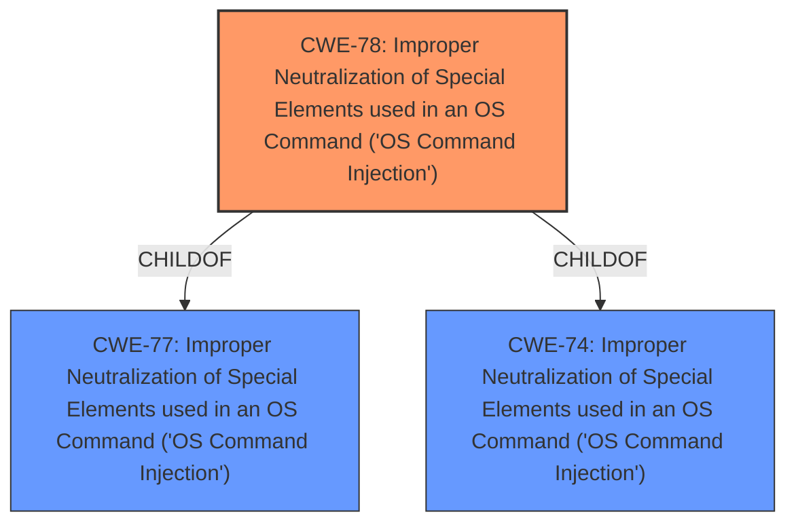

# Analysis Report for CVE-2021-41000

# Vulnerability Analysis Report: CVE-2021-41000

## Description


## Analysis (with Relationship Data)

# Summary
| CWE ID | CWE Name | Confidence | CWE Abstraction Level | CWE Vulnerability Mapping Label | CWE-Vulnerability Mapping Notes |
|---|---|---|---|---|---|
| CWE-78 | Improper Neutralization of Special Elements used in an OS Command ('OS Command Injection') | 1.0 | Base | Allowed | Primary CWE |

## Evidence and Confidence

*   **Confidence Score:** 1.0
*   **Evidence Strength:** HIGH

## Relationship Analysis
The primary relationship that impacted my decision was the ChildOf relationship between CWE-78 and its parent CWEs. While there were other potential relationships like CanPrecede and PeerOf, the evidence strongly supports CWE-78 as the root cause. The base level of abstraction is appropriate as it directly reflects the **improper neutralization** issue.



## Vulnerability Chain
The chain of weaknesses starts with the **improper neutralization** of special elements, leading to **OS Command Injection**, and ultimately resulting in **remote code execution**.

## Summary of Analysis
The initial analysis identified CWE-78 as the most likely candidate based on the vulnerability description and retriever results. The vulnerability description explicitly mentions **remote code execution** vulnerabilities in the command line interface, which aligns with the characteristics of CWE-78. The retriever results also ranked CWE-78 as the top candidate.

The evidence from the vulnerability description key phrases is:
- **weakness:** **remote code execution**
- **component:** command line interface

The graph relationships further solidify this choice, as CWE-78 is a base-level CWE that directly addresses the root cause.

I am highly confident in this assessment because the evidence directly supports the classification and the chosen CWE is at the optimal level of specificity.

Relevant CWE Information:

# Enhanced Context (25 CWEs)

## CWE-78: Improper Neutralization of Special Elements used in an OS Command ('OS Command Injection')
**Technical Explanation:** The vulnerability allows an authenticated attacker to execute arbitrary OS commands due to **improper neutralization** of special elements within the command line interface. This means that the application fails to sanitize or escape characters that have special meaning to the operating system, enabling the attacker to inject malicious commands.
**Security Implications:** This can lead to complete system compromise, allowing the attacker to gain full control of the affected device. This includes the ability to access sensitive data, modify system configurations, and potentially use the device as a launchpad for further attacks.
**Relationship:** CWE-78 is a base-level CWE that describes the core weakness of **OS Command Injection**. It is related to CWE-77 (Improper Neutralization of Special Elements used in a Command) and CWE-74 (Improper Neutralization of Special Elements in Output Used by a Downstream Component), but CWE-78 is more specific to OS commands.
**Mapping Guidance:** The MITRE mapping guidance allows the use of CWE-78 at the Base level of abstraction.
**Confidence:** 1.0

## Other CWEs Considered and Rejected:

*   **CWE-22 Improper Limitation of a Pathname to a Restricted Directory ('Path Traversal')**: While file paths might be involved, the primary issue is **command execution**, not file access.
*   **CWE-200 Exposure of Sensitive Information to an Unauthorized Actor**: The vulnerability's main impact is **code execution**, not information disclosure.
*   **CWE-345 Insufficient Verification of Data Authenticity**: This CWE is related to data integrity, whereas the described vulnerability is centered around **unvalidated commands**.
*   **CWE-1285 Improper Validation of Specified Index, Position, or Offset in Input**: This CWE is related to issues with index/offset, whereas the described vulnerability is centered around **unvalidated commands**.
*   **CWE-912 Hidden Functionality**: This CWE is related to undocumented functionality, whereas the described vulnerability is centered around **unvalidated commands**.
*   **CWE-73 External Control of File Name or Path**: While file paths might be involved, the primary issue is **command execution**, not file access.
*   **CWE-121 Stack-based Buffer Overflow**: There's no evidence to suggest a buffer overflow is the root cause.
*   **CWE-347 Improper Verification of Cryptographic Signature**: This CWE is related to signature verification, whereas the described vulnerability is centered around **unvalidated commands**.
*   **CWE-250 Execution with Unnecessary Privileges**: This CWE is related to unnecessary priviledges, whereas the described vulnerability is centered around **unvalidated commands**.


## CWE Relationship Analysis

Current CWEs represent these abstraction levels: .


### Vulnerability Chain Analysis

**Chain starting from CWE-912:**
- 912 (Hidden Functionality) - ROOT


**Chain starting from CWE-121:**
- 121 (Stack-based Buffer Overflow) - ROOT


### CWE Relationship Diagram

```mermaid
graph TD
    classDef primary fill:#f96,stroke:#333,stroke-width:2px
    classDef secondary fill:#69f,stroke:#333
    classDef tertiary fill:#9e9,stroke:#333
```


*Report generated on 2025-04-01 23:04:53*
