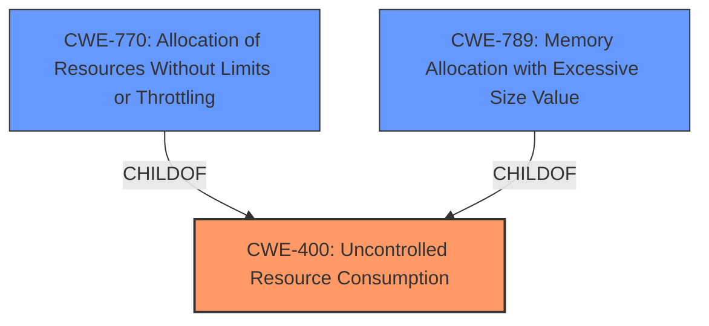

# Raw Analyzer Response for CVE-2021-41014

# Summary
| CWE ID | CWE Name | Confidence | CWE Abstraction Level | CWE Vulnerability Mapping Label | CWE-Vulnerability Mapping Notes |
|---|---|---|---|---|---|
| CWE-400 | Uncontrolled Resource Consumption | 0.9 | Class | Primary | Discouraged due to being a Class, but the best fit given available information |
| CWE-770 | Allocation of Resources Without Limits or Throttling | 0.7 | Base | Secondary | Considered, but not selected as the specific allocation mechanism isn't clear. |
| CWE-789 | Memory Allocation with Excessive Size Value | 0.6 | Variant | Secondary | Considered, but not selected as the excessive size isn't explicitly mentioned. |

## Evidence and Confidence

*   **Confidence Score:** 0.9
*   **Evidence Strength:** HIGH

## Relationship Analysis
The primary relationship considered was the parent-child relationship between CWE-400 and its potential children (CWE-770, CWE-789). While CWE-770 and CWE-789 are more specific and at a preferred abstraction level (Base/Variant), the description doesn't provide enough detail to confidently select either of them. CWE-400 is a class-level CWE, which makes it less specific but the only CWE with sufficient support in the description.

## Vulnerability Chain
The vulnerability chain involves the following steps:
1.  An unauthenticated attacker sends huge HTTP packets to the FortiWeb device.
2.  The FortiWeb's HTTP daemon does not properly handle these large packets, leading to **uncontrolled resource consumption**.
3.  This excessive resource consumption makes the httpsd daemon unresponsive, resulting in a denial of service (DoS).

The root cause is the **uncontrolled resource consumption** due to the improper handling of large HTTP packets, and the impact is the DoS.

## Summary of Analysis
Initially, the "Retriever Results" suggested CWE-400, CWE-770, and CWE-789 as potential candidates. The vulnerability description explicitly mentions "**uncontrolled resource consumption**," making CWE-400 the most relevant primary CWE. The "CVE Reference Links Content Summary" further supports this by stating that the root cause is "**uncontrolled resource consumption** due to incorrect handling of large HTTP requests."

While CWE-770 (Allocation of Resources Without Limits or Throttling) and CWE-789 (Memory Allocation with Excessive Size Value) are more specific, there isn't enough evidence to confirm the exact mechanism of resource consumption. CWE-770 would apply if the system was allocating resources without limits, and CWE-789 would apply if the memory allocation was based on an excessive size value. Since the description only mentions huge HTTP packets leading to **uncontrolled resource consumption**, it's not specific enough to choose either of these over the more general CWE-400.

Therefore, CWE-400 is selected as the primary CWE because it directly aligns with the provided evidence. While it is a Class-level CWE and thus less specific, it is the best fit based on the available information. The MITRE mapping guidance discourages the use of CWE-400 due to its high-level nature, but also suggests considering its children; however, as explained above, the children are not specific enough.

Relevant CWE Information:

# Enhanced Context (25 CWEs)
The following CWEs were identified as potentially relevant to this vulnerability:

## CWE-405: Asymmetric Resource Consumption (Amplification)
**Abstraction Level**: Class
**Similarity Score**: 0.78
**Source**: dense

**Description**:
The product does not properly control situations in which an adversary can cause the product to consume or produce excessive resources without requiring the adversary to invest equivalent work or otherwise prove authorization, i.e., the adversary's influence is "asymmetric."

**Mapping Guidance**:
- Usage: Allowed-with-Review
- Rationale: This CWE entry is a Class and might have Base-level children that would be more appropriate

## CWE-664: Improper Control of a Resource Through its Lifetime
**Abstraction Level**: Pillar
**Similarity Score**: 0.77
**Source**: dense

**Description**:
The product does not maintain or incorrectly maintains control over a resource throughout its lifetime of creation, use, and release.

**Mapping Guidance**:
- Usage: Discouraged
- Rationale: This CWE entry is high-level when lower-level children are available.

## CWE-1325: Improperly Controlled Sequential Memory Allocation
**Abstraction Level**: Base
**Similarity Score**: 0.76
**Source**: dense

**Description**:
The product manages a group of objects or resources and performs a separate memory allocation for each object, but it does not properly limit the total amount of memory that is consumed by all of the combined objects.

**Mapping Guidance**:
- Usage: Allowed
- Rationale: This CWE entry is at the Base level of abstraction, which is a preferred level of abstraction for mapping to the root causes of vulnerabilities.

## CWE-834: Excessive Iteration
**Abstraction Level**: Class
**Similarity Score**: 0.75
**Source**: dense

**Description**:
The product performs an iteration or loop without sufficiently limiting the number of times that the loop is executed.

**Mapping Guidance**:
- Usage: Discouraged
- Rationale: This CWE entry is a level-1 Class (i.e., a child of a Pillar). It might have lower-level children that would be more appropriate

## CWE-799: Improper Control of Interaction Frequency
**Abstraction Level**: Class
**Similarity Score**: 0.74
**Source**: dense

**Description**:
The product does not properly limit the number or frequency of interactions that it has with an actor, such as the number of incoming requests.

**Mapping Guidance**:
- Usage: Allowed-with-Review
- Rationale: This CWE entry is a Class and might have Base-level children that would be more appropriate

## CWE-404: Improper Resource Shutdown or Release
**Abstraction Level**: Class
**Similarity Score**: 0.74
**Source**: dense

**Description**:
The product does not release or incorrectly releases a resource before it is made available for re-use.

**Mapping Guidance**:
- Usage: Allowed-with-Review
- Rationale: This CWE entry is a Class and might have Base-level children that would be more appropriate

## CWE-226: Sensitive Information in Resource Not Removed Before Reuse
**Abstraction Level**: Base
**Similarity Score**: 0.74
**Source**: dense

**Description**:
The product releases a resource such as memory or a file so that it can be made available for reuse, but it does not clear or "zeroize" the information contained in the resource before the product performs a critical state transition or makes the resource available for reuse by other entities.

**Mapping Guidance**:
- Usage: Allowed
- Rationale: This CWE entry is at the Base level of abstraction, which is a preferred level of abstraction for mapping to the root causes of vulnerabilities.

## CWE-789: Memory Allocation with Excessive Size Value
**Abstraction Level**: Variant
**Similarity Score**: 0.73
**Source**: dense

**Description**:
The product allocates memory based on an untrusted, large size value, but it does not ensure that the size is within expected limits, allowing arbitrary amounts of memory to be allocated.

**Mapping Guidance**:
- Usage: Allowed
- Rationale: This CWE entry is at the Variant level of abstraction, which is a preferred level of abstraction for mapping to the root causes of vulnerabilities.

## CWE-407: Inefficient Algorithmic Complexity
**Abstraction Level**: Class
**Similarity Score**: 0.73
**Source**: dense

**Description**:
An algorithm in a product has an inefficient worst-case computational complexity that may be detrimental to system performance and can be triggered by an attacker, typically using crafted manipulations that ensure that the worst case is being reached.

**Mapping Guidance**:
- Usage: Allowed-with-Review
- Rationale: This CWE entry is a Class and might have Base-level children that would be more appropriate

## CWE-1176: Inefficient CPU Computation
**Abstraction Level**: Class
**Similarity Score**: 0.73
**Source**: dense

**Description**:
The product performs CPU computations using
         algorithms that are not as efficient as they could be for the
         needs of the developer, i.e., the computations can be
         optimized further.

**Mapping Guidance**:
- Usage: Allowed-with-Review
- Rationale