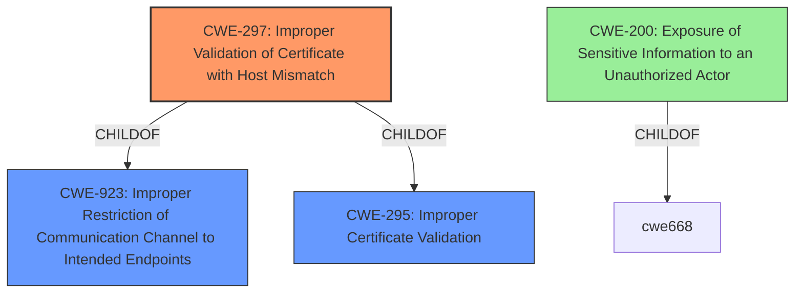

# Raw Analyzer Response for CVE-2021-41019

# Summary
| CWE ID | CWE Name | Confidence | CWE Abstraction Level | CWE Vulnerability Mapping Label | CWE-Vulnerability Mapping Notes |
|---|---|---|---|---|---|
| CWE-297 | Improper Validation of Certificate with Host Mismatch | 1 | Variant | Allowed | Primary CWE |
| CWE-295 | Improper Certificate Validation | 0.7 | Base | Allowed | Secondary Candidate |
| CWE-200 | Exposure of Sensitive Information to an Unauthorized Actor | 0.5 | Class | Discouraged | Secondary Candidate |

## Evidence and Confidence

*   **Confidence Score:** 0.9
*   **Evidence Strength:** HIGH

## Relationship Analysis
The primary CWE is CWE-297, which is a Variant of CWE-923 (Improper Restriction of Communication Channel to Intended Endpoints) and CWE-295 (Improper Certificate Validation). This hierarchical relationship suggests that the vulnerability is a specific instance of a more general certificate validation issue. CWE-297 focuses on the host mismatch aspect, providing a more precise classification than its parents.

## Vulnerability Chain
The vulnerability chain starts with the **improper validation of the certificate with host mismatch [CWE-297]**. This leads to the possibility of connecting to a malicious LDAP server, which then results in the **disclosure of sensitive information**, such as AD credentials. The chain is:

CWE-297 (Root Cause: Improper Certificate Validation) -> Information Disclosure (Impact)

## Summary of Analysis
The initial analysis focused on identifying the root cause of the vulnerability based on the provided description and reference links. The vulnerability description clearly states "**improper validation of certificate with host mismatch [CWE-297]**" as the root cause. The CVE Reference Links Content Summary further supports this by mentioning "**Root cause of vulnerability: Improper validation of the certificate with host mismatch**".

The Retriever Results also listed CWE-297 as the top combined result, reinforcing its relevance. The analysis of CWE relationships revealed that CWE-297 is a variant of CWE-295 (Improper Certificate Validation), indicating a more specific type of certificate validation failure.

The final decision to assign CWE-297 as the primary CWE is based on the explicit mention of "improper validation of certificate with host mismatch" in the vulnerability description and supporting evidence from the CVE reference links. This direct evidence, combined with the guidance that Variant-level CWEs are preferred when applicable, makes CWE-297 the most appropriate choice.

CWE-295 was considered as a secondary candidate because it is a parent of CWE-297 and represents a more general form of certificate validation failure. However, the specificity of the vulnerability description towards "host mismatch" makes CWE-297 a more precise fit.

CWE-200 (Exposure of Sensitive Information to an Unauthorized Actor) was also considered, given that the impact of the vulnerability is the disclosure of sensitive information. However, CWE-200 is a Class-level CWE and is discouraged for use as a primary mapping because it represents an impact rather than a root cause. The root cause is the certificate validation issue (CWE-297), which *leads* to the information disclosure.

Relevant CWE Information:

# Enhanced Context (25 CWEs)
The following CWEs were identified as potentially relevant to this vulnerability:

## CWE-345: Insufficient Verification of Data Authenticity
**Abstraction Level**: Class
**Similarity Score**: 0.77
**Source**: dense

**Description**:
The product does not sufficiently verify the origin or authenticity of data, in a way that causes it to accept invalid data.

**Mapping Guidance**:
- Usage: Discouraged
- Rationale: This CWE entry is a level-1 Class (i.e., a child of a Pillar). It might have lower-level children that would be more appropriate

## CWE-297: Improper Validation of Certificate with Host Mismatch
**Abstraction Level**: Variant
**Similarity Score**: 0.76
**Source**: dense

**Description**:
The product communicates with a host that provides a certificate, but the product does not properly ensure that the certificate is actually associated with that host.

**Mapping Guidance**:
- Usage: Allowed
- Rationale: This CWE entry is at the Variant level of abstraction, which is a preferred level of abstraction for mapping to the root causes of vulnerabilities.

## CWE-303: Incorrect Implementation of Authentication Algorithm
**Abstraction Level**: Base
**Similarity Score**: 0.75
**Source**: dense

**Description**:
The requirements for the product dictate the use of an established authentication algorithm, but the implementation of the algorithm is incorrect.

**Mapping Guidance**:
- Usage: Allowed
- Rationale: This CWE entry is at the Base level of abstraction, which is a preferred level of abstraction for mapping to the root causes of vulnerabilities.

## CWE-657: Violation of Secure Design Principles
**Abstraction Level**: Class
**Similarity Score**: 0.75
**Source**: dense

**Description**:
The product violates well-established principles for secure design.

**Mapping Guidance**:
- Usage: Discouraged
- Rationale: This CWE entry is a level-1 Class (i.e., a child of a Pillar). It might have lower-level children that would be more appropriate

## CWE-295: Improper Certificate Validation
**Abstraction Level**: Base
**Similarity Score**: 0.75
**Source**: dense

**Description**:
The product does not validate, or incorrectly validates, a certificate.

**Mapping Guidance**:
- Usage: Allowed
- Rationale: This CWE entry is at the Base level of abstraction, which is a preferred level of abstraction for mapping to the root causes of vulnerabilities.

## CWE-274: Improper Handling of Insufficient Privileges
**Abstraction Level**: Base
**Similarity Score**: 0.75
**Source**: dense

**Description**:
The product does not handle or incorrectly handles when it has insufficient privileges to perform an operation, leading to resultant weaknesses.

**Mapping Guidance**:
- Usage: Discouraged
- Rationale: This CWE entry could be deprecated in a future version of CWE.

## CWE-347: Improper Verification of Cryptographic Signature
**Abstraction Level**: Base
**Similarity Score**: 0.74
**Source**: dense

**Description**:
The product does not verify, or incorrectly verifies, the cryptographic signature for data.

**Mapping Guidance**:
- Usage: Allowed
- Rationale: This CWE entry is at the Base level of abstraction, which is a preferred level of abstraction for mapping to the root causes of vulnerabilities.

## CWE-1289: Improper Validation of Unsafe Equivalence in Input
**Abstraction Level**: Base
**Similarity Score**: 0.74
**Source**: dense

**Description**:
The product receives an input value that is used as a resource identifier or other type of reference, but it does not validate or incorrectly validates that the input is equivalent to a potentially-unsafe value.

**Mapping Guidance**:
- Usage: Allowed
- Rationale: This CWE entry is at the Base level of abstraction, which is a preferred level of abstraction for mapping to the root causes of vulnerabilities.

## CWE-807: Reliance on Untrusted Inputs in a Security Decision
**Abstraction Level**: Base
**Similarity Score**: 0.74
**Source**: dense

**Description**:
The product uses a protection mechanism that relies on the existence or values of an input, but the input can be modified by an untrusted actor in a way that bypasses the protection mechanism.

**Mapping Guidance**:
- Usage: Allowed
- Rationale: This CWE entry is at the Base level of abstraction, which is a preferred level of abstraction for mapping to the root causes of vulnerabilities.

## CWE-280: Improper Handling of Insufficient Permissions or Privileges
**Abstraction Level**: Base
**Similarity Score**: 0.74
**Source**: dense

**Description**:
The product does not handle or incorrectly handles when it has insufficient privileges to access resources or functionality as specified by their permissions. This may cause it to follow unexpected code paths that may leave the product in an invalid state.

**Mapping Guidance**:
- Usage: Allowed
- Rationale: This CWE entry is at the Base level of abstraction, which is a preferred level of abstraction for mapping to the root causes of vulnerabilities.