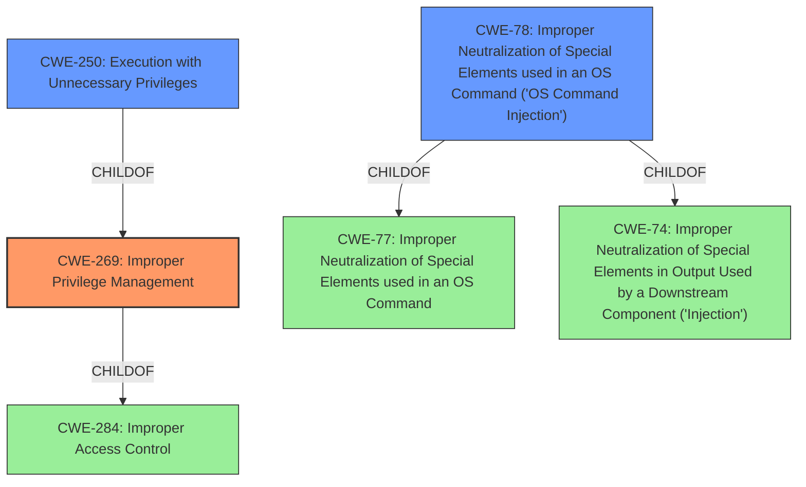

# Enhanced Analysis for CVE-2021-41022

# Summary
| CWE ID | CWE Name | Confidence | CWE Abstraction Level | CWE Vulnerability Mapping Label | CWE-Vulnerability Mapping Notes |
|---|---|---|---|---|---|
| CWE-269 | Improper Privilege Management | 1.0 | Class | Primary | Discouraged |
| CWE-250 | Execution with Unnecessary Privileges | 0.75 | Base | Secondary | Allowed |
| CWE-78 | Improper Neutralization of Special Elements used in an OS Command ('OS Command Injection') | 0.5 | Base | Secondary | Allowed |

## Evidence and Confidence

*   **Confidence Score:** 0.85
*   **Evidence Strength:** HIGH

## Relationship Analysis
The primary CWE is CWE-269 (**Improper Privilege Management**), which is a Class-level CWE. CWE-269 is a ChildOf CWE-284 (**Improper Access Control**), a Pillar-level CWE, which is too abstract. CWE-250 (**Execution with Unnecessary Privileges**) is a Base-level CWE and a ChildOf CWE-269, which makes it more specific, so it is also considered as a secondary option. CWE-78 (**Improper Neutralization of Special Elements used in an OS Command ('OS Command Injection')**) is also considered as a secondary option as it can be caused by **improper privilege management**.



## Vulnerability Chain
The vulnerability chain starts with **improper privilege management** (CWE-269), which leads to the ability to execute privileged code or commands, and OS Command Injection (CWE-78).

## Summary of Analysis
The initial analysis identified **improper privilege management** as the root cause, which aligns with CWE-269.
The vulnerability description states "A **improper privilege management** in Fortinet FortiSIEM Windows Agent version 4.1.4 and below allows attacker to execute privileged code or commands via powershell scripts".
The CVE Reference Links Content Summary section supports this by stating: "Root cause of vulnerability: **Improper privilege management** in the FortiSIEM Windows Agent."
The graph relationships show that CWE-269 is a child of CWE-284 (**Improper Access Control**), a high-level category. However, CWE-269 is the most appropriate high-level classification. While CWE-250 (**Execution with Unnecessary Privileges**) is a more specific child of CWE-269, the description more directly points to a general issue of **improper privilege management** rather than unnecessary privileges. The attacker being able to execute arbitrary commands with elevated privileges suggests OS Command Injection (CWE-78) as a possible consequence of the **improper privilege management**.

Relevant CWE Information:

### CWE-269: Improper Privilege Management
**Technical Explanation:** The Fortinet FortiSIEM Windows Agent **improperly manages privileges**, allowing an attacker to execute privileged code or commands. This means the application doesn't properly assign, modify, track, or check privileges for an actor, creating an unintended sphere of control.
**Security Implications:** An attacker can execute arbitrary code or commands with elevated privileges, potentially leading to complete system compromise.
**Relationship:** CWE-269 is a Class-level CWE and a ChildOf CWE-284 (**Improper Access Control**), which is a Pillar. The mapping guidance discourages direct mapping to CWE-269 due to its frequent misuse and recommends considering more specific children. However, in this case, the provided information is directly related to **improper privilege management**.
**Mapping Guidance Influence:** The mapping guidance for CWE-269 discourages its use when only phrases like "privilege escalation" are available, but in this case, the root cause is explicitly identified as "**improper privilege management**".
**Confidence:** 1.0

### CWE-250: Execution with Unnecessary Privileges
**Technical Explanation:** The Fortinet FortiSIEM Windows Agent might be running with higher privileges than necessary, which amplifies the consequences of the **improper privilege management** vulnerability.
**Security Implications:** Running with unnecessary privileges can expose new weaknesses and turn pre-existing weaknesses into security vulnerabilities.
**Relationship:** CWE-250 is a Base-level CWE and a ChildOf CWE-269.
**Mapping Guidance Influence:** The mapping guidance for CWE-250 encourages its use when the product performs an operation at a higher privilege level than required. Since the agent is running with elevated privileges, this CWE is relevant.
**Confidence:** 0.75

### CWE-78: Improper Neutralization of Special Elements used in an OS Command ('OS Command Injection')
**Technical Explanation:** The **improper privilege management** can allow an attacker to inject special elements into OS commands, leading to the execution of arbitrary commands.
**Security Implications:** This can lead to a vulnerability in environments where the attacker doesn't have direct access to the operating system.
**Relationship:** CWE-78 is a Base-level CWE.
**Mapping Guidance Influence:** The mapping guidance for CWE-78 encourages its use when the product constructs an OS command using externally-influenced input without proper neutralization. The attacker's ability to execute arbitrary commands via PowerShell scripts aligns with this CWE.
**Confidence:** 0.5

### CWEs Considered but Not Used:
*   CWE-284 (**Improper Access Control**): This CWE is a Pillar and too high-level. CWE-269 is a more specific child of this CWE.
*   CWE-732 (**Incorrect Permission Assignment for Critical Resource**): While related to privilege management, the description focuses on incorrect assignment rather than general **improper management**.
*   CWE-863 (**Incorrect Authorization**) and CWE-285 (**Improper Authorization**): These are related to authorization checks, but the primary issue is with the management of privileges, not just the authorization process.

The chosen CWEs provide the optimal level of specificity based on the available evidence. CWE-269 captures the core issue of **improper privilege management**, while CWE-250 and CWE-78 identify the secondary weaknesses that result from the primary weakness.


## CWE Relationship Analysis

Current CWEs represent these abstraction levels: .


### Vulnerability Chain Analysis

**Chain starting from CWE-732:**
- 732 (Incorrect Permission Assignment for Critical Resource) - ROOT


**Chain starting from CWE-284:**
- 284 (Improper Access Control) - ROOT


### CWE Relationship Diagram

```mermaid
graph TD
    classDef primary fill:#f96,stroke:#333,stroke-width:2px
    classDef secondary fill:#69f,stroke:#333
    classDef tertiary fill:#9e9,stroke:#333
```