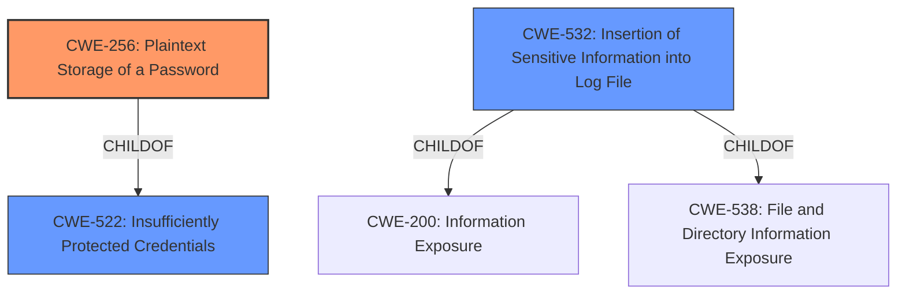

# Analysis Report for CVE-2021-41023

# Vulnerability Analysis Report: CVE-2021-41023

## Description


## Analysis (with Relationship Data)

# Summary
| CWE ID | CWE Name | Confidence | CWE Abstraction Level | CWE Vulnerability Mapping Label | CWE-Vulnerability Mapping Notes |
|---|---|---|---|---|---|
| CWE-256 | Plaintext Storage of a Password | 1.0 | Base | Allowed | Primary CWE |
| CWE-532 | Insertion of Sensitive Information into Log File | 0.7 | Base | Allowed | Secondary Candidate |
| CWE-312 | Cleartext Storage of Sensitive Information | 0.6 | Base | Allowed | Secondary Candidate |

## Evidence and Confidence

*   **Confidence Score:** 0.9
*   **Evidence Strength:** HIGH

## Relationship Analysis
The primary CWE, CWE-256, is a child of CWE-522, which indicates that storing a password in plaintext is a specific case of insufficiently protected credentials. The Retriever results also listed CWE-522 but since CWE-256 is more specific and directly addresses the vulnerability of storing passwords in plaintext, it is a more appropriate choice. Additionally, CWE-532 is related as the plaintext password was stored in a log file.



## Vulnerability Chain
The vulnerability chain starts with the **unprotected storage of credentials** (CWE-256), which leads to the **disclosure of the agent password**. The log file is the location of the **vulnerable credentials**.

## Summary of Analysis
The initial analysis focused on the **root cause**, which is the **plaintext storage of a password**. The evidence from the "CVE Reference Links Content Summary" confirms this: "**Root cause of vulnerability**: Plaintext storage of a password used by the FortiSIEM Windows Agent to register with the Supervisor." The "Vulnerability Description Key Phrases" also highlights "**unprotected storage of credentials**" as the **root cause**.

CWE-256 (Plaintext Storage of a Password) is the most specific and appropriate CWE because it directly addresses the **root cause** of the vulnerability. The MITRE mapping guidance for CWE-256 states: "This CWE entry is at the Base level of abstraction, which is a preferred level of abstraction for mapping to the root causes of vulnerabilities." The "**impact**: disclosure agent password" indicates that an authenticated user can access the plaintext password, leading to potential unauthorized access.

CWE-532 (Insertion of Sensitive Information into Log File) was also considered because the plaintext password was stored in a log file. However, CWE-256 more accurately describes the core issue, while CWE-532 describes where the password was stored. CWE-532 can be considered as a secondary CWE, as it describes the context of the vulnerability.

CWE-312 (Cleartext Storage of Sensitive Information) was also considered as a secondary issue. This is a more general case of storing sensitive information in cleartext, but CWE-256 is more specific to the storage of passwords.

CWE-798 (Use of Hard-coded Credentials) was not selected because the password was not hard-coded into the application, but rather stored in plaintext in a log file.

CWE-256 is at the optimal level of specificity because it directly describes the **root cause** (plaintext storage of password) without being overly broad or too narrow. The vulnerability description and the CVE reference summary both explicitly mention plaintext storage, making this a well-supported and precise mapping.


## CWE Relationship Analysis

Current CWEs represent these abstraction levels: .


### Vulnerability Chain Analysis

**Chain starting from CWE-312:**
- 312 (Cleartext Storage of Sensitive Information) - ROOT


**Chain starting from CWE-538:**
- 538 (Insertion of Sensitive Information into Externally-Accessible File or Directory) - ROOT


### CWE Relationship Diagram

```mermaid
graph TD
    classDef primary fill:#f96,stroke:#333,stroke-width:2px
    classDef secondary fill:#69f,stroke:#333
    classDef tertiary fill:#9e9,stroke:#333
```


*Report generated on 2025-04-02 11:22:58*
