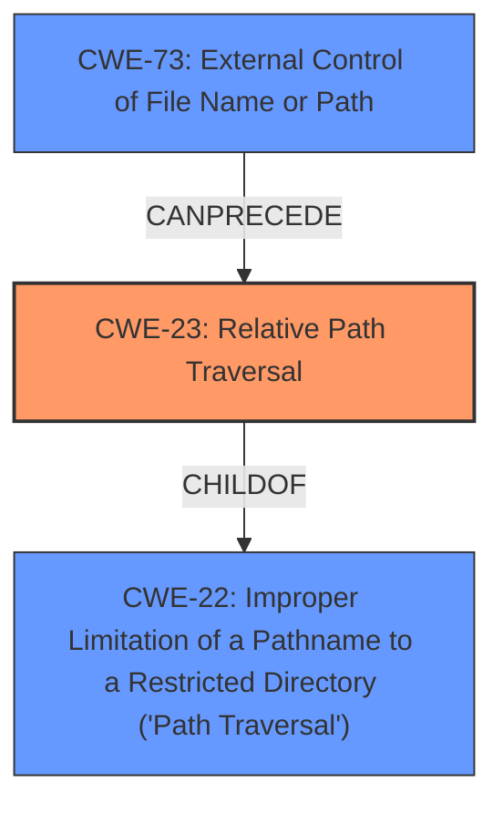

# Raw Analyzer Response for CVE-2021-41024

# Summary
| CWE ID | CWE Name | Confidence | CWE Abstraction Level | CWE Vulnerability Mapping Label | CWE-Vulnerability Mapping Notes |
|---|---|---|---|---|---|
| CWE-23 | Relative Path Traversal | 1.0 | Base | Allowed | Primary CWE |
| CWE-22 | Improper Limitation of a Pathname to a Restricted Directory ('Path Traversal') | 0.7 | Base | Allowed | Secondary Candidate |
| CWE-73 | External Control of File Name or Path | 0.6 | Base | Allowed | Secondary Candidate |

## Evidence and Confidence

*   **Confidence Score:** 0.9
*   **Evidence Strength:** HIGH

## Relationship Analysis
The primary CWE, CWE-23, is a child of CWE-22, which represents a broader category of path traversal vulnerabilities. CWE-73 is related as it describes external control of file names or paths, which often precedes path traversal issues.

## Vulnerability Chain
The vulnerability chain starts with external control over a file path, leading to **improper** neutralization of path traversal sequences, and ultimately resulting in information disclosure.
  - CWE-73: External Control of File Name or Path (External Input)
  - CWE-23: Relative Path Traversal (**Improper Neutralization**)
  - Information Disclosure (Impact)

## Summary of Analysis
The initial assessment identified CWE-23 as the primary weakness, which aligns directly with the "**relative path traversal**" vulnerability described. This assessment is based directly on the vulnerability description, which mentions "**relative path traversal**" and its corresponding CWE. The CVE Reference Links Content Summary also explicitly states that "The vulnerability is a relative path traversal (CWE-23)". The relationship graph confirms the hierarchical relationship between CWE-23 and CWE-22, with CWE-23 being a more specific case of path traversal. The confidence level is high due to the clear and direct evidence available.

Relevant CWE Information:

# Enhanced Context (25 CWEs)
The following CWEs were identified as potentially relevant to this vulnerability:

## CWE-23: Relative Path Traversal
**Abstraction Level**: Base
**Similarity Score**: 0.82
**Source**: dense

**Description**:
The product uses external input to construct a pathname that should be within a restricted directory, but it does not properly neutralize sequences such as ".." that can resolve to a location that is outside of that directory.

**Mapping Guidance**:
- Usage: Allowed
- Rationale: This CWE entry is at the Base level of abstraction, which is a preferred level of abstraction for mapping to the root causes of vulnerabilities.

## CWE-22: Improper Limitation of a Pathname to a Restricted Directory ('Path Traversal')
**Abstraction Level**: Base
**Similarity Score**: 7430.44
**Source**: sparse

**Description**:
The product uses external input to construct a pathname that is intended to identify a file or directory that is located underneath a restricted parent directory, but the product does not properly neutralize special elements within the pathname that can cause the pathname to resolve to a location that is outside of the restricted directory.

**Mapping Guidance**:
- Usage: Allowed
- Rationale: This CWE entry is at the Base level of abstraction, which is a preferred level of abstraction for mapping to the root causes of vulnerabilities.

## CWE-73: External Control of File Name or Path
**Abstraction Level**: Base
**Similarity Score**: 6746.10
**Source**: sparse

**Description**:
The product allows user input to control or influence paths or file names that are used in filesystem operations.

**Mapping Guidance**:
- Usage: Allowed
- Rationale: This CWE entry is at the Base level of abstraction, which is a preferred level of abstraction for mapping to the root causes of vulnerabilities.

CWE-22 was considered as a broader classification, but CWE-23 is more specific and accurately describes the vulnerability. CWE-73 was also considered because external control of the file name or path is often a prerequisite for path traversal vulnerabilities. However, CWE-23 directly addresses the **improper neutralization** aspect, making it the more relevant primary CWE.

The selected CWEs are at the optimal level of specificity, with CWE-23 being a Base level CWE that directly maps to the **relative path traversal** vulnerability.