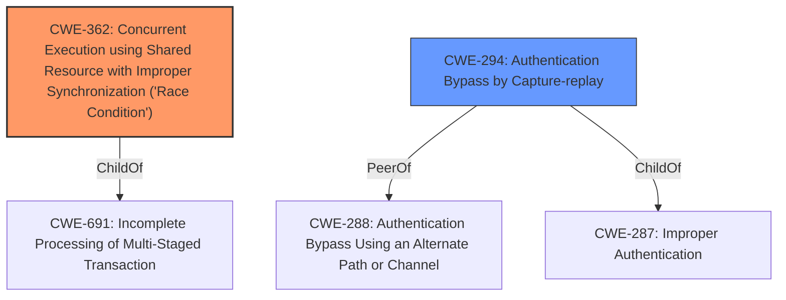

# Analysis Report for CVE-2021-41025

# Vulnerability Analysis Report: CVE-2021-41025

## Description


## Analysis (with Relationship Data)

# Summary
| CWE ID | CWE Name | Confidence | CWE Abstraction Level | CWE Vulnerability Mapping Label | CWE-Vulnerability Mapping Notes |
|---|---|---|---|---|---|
| CWE-362 | Concurrent Execution using Shared Resource with Improper Synchronization ('Race Condition') | 1 | Class | Allowed-with-Review | Primary CWE |
| CWE-294 | Authentication Bypass by Capture-replay | 0.9 | Base | Not Listed | Secondary CWE |

## Evidence and Confidence

*   **Confidence Score:** 0.95
*   **Evidence Strength:** HIGH

## Relationship Analysis
The primary relationship impacting the decision is the presence of **concurrent execution using shared resource with improper synchronization** (CWE-362). CWE-362 is a Class-level CWE, and the description aligns well with the vulnerability description. The secondary relationship is the authentication bypass due to capture-replay, which is a more specific instance of authentication issues.



## Vulnerability Chain
The vulnerability chain starts with **concurrent execution using shared resource with improper synchronization** (CWE-362), leading to an authentication bypass by capture-replay. The improper synchronization allows an attacker to interfere with the authentication process, eventually leading to a successful bypass.

## Summary of Analysis
The initial assessment identified CWE-362 as the primary weakness due to the explicit mention of **concurrent execution using shared resource with improper synchronization** in both the vulnerability description and the CVE reference. Additionally, authentication bypass by capture-replay is also mentioned.

The final assessment confirms CWE-362 as the primary CWE due to the **root cause** being the race condition. The secondary CWE is CWE-294: Authentication Bypass by Capture-replay, as stated in the CVE Reference Links Content Summary, which is a direct consequence of the authentication mechanism weaknesses.

The selection of CWE-362 is at the Class level of abstraction, which is appropriate given the information available. While more specific Base-level CWEs could potentially exist, there is not enough information to justify a more specific mapping.

Relevant CWE Information:

# Enhanced Context (25 CWEs)
The following CWEs were identified as potentially relevant to this vulnerability:

## CWE-405: Asymmetric Resource Consumption (Amplification)
**Abstraction Level**: Class

## CWE-404: Improper Resource Shutdown or Release
**Abstraction Level**: Class

## CWE-664: Improper Control of a Resource Through its Lifetime
**Abstraction Level**: Pillar

## CWE-668: Exposure of Resource to Wrong Sphere
**Abstraction Level**: Class

## CWE-799: Improper Control of Interaction Frequency
**Abstraction Level**: Class

## CWE-226: Sensitive Information in Resource Not Removed Before Reuse
**Abstraction Level**: Base

## CWE-610: Externally Controlled Reference to a Resource in Another Sphere
**Abstraction Level**: Class

## CWE-274: Improper Handling of Insufficient Privileges
**Abstraction Level**: Base

## CWE-410: Insufficient Resource Pool
**Abstraction Level**: Base

## CWE-280: Improper Handling of Insufficient Permissions or Privileges 
**Abstraction Level**: Base

## CWE-668: Exposure of Resource to Wrong Sphere
**Abstraction Level**: Class

## CWE-863: Incorrect Authorization
**Abstraction Level**: Class

## CWE-23: Relative Path Traversal
**Abstraction Level**: Base

## CWE-287: Improper Authentication
**Abstraction Level**: Class

## CWE-22: Improper Limitation of a Pathname to a Restricted Directory ('Path Traversal')
**Abstraction Level**: Base

## CWE-476: NULL Pointer Dereference
**Abstraction Level**: base

## CWE-59: Improper Link Resolution Before File Access ('Link Following')
**Abstraction Level**: base

## CWE-73: External Control of File Name or Path
**Abstraction Level**: base

## CWE-1284: Improper Validation of Specified Quantity in Input
**Abstraction Level**: base

## CWE-770: Allocation of Resources Without Limits or Throttling
**Abstraction Level**: base

## CWE-613: Insufficient Session Expiration
**Abstraction Level**: base

## CWE-22: Improper Limitation of a Pathname to a Restricted Directory ('Path Traversal')
**Abstraction Level**: base

## CWE-416: Use After Free
**Abstraction Level**: variant

## CWE-190: Integer Overflow or Wraparound
**Abstraction Level**: base

## CWE-420: Unprotected Alternate Channel
**Abstraction Level**: base

# Technical Details for CWE Selection

### CWE-362: Concurrent Execution using Shared Resource with Improper Synchronization ('Race Condition')
*   **Match:** The vulnerability description explicitly mentions **"concurrent execution using shared resource with improper synchronization."** This directly aligns with the CWE's description of a race condition where a timing window exists for a shared resource to be modified concurrently.
*   **Implication:** This weakness can allow an attacker to manipulate the authentication process by exploiting the race condition, potentially bypassing security measures.
*   **Relationship:** CWE-362 is a Class-level CWE.
*   **Guidance:** The MITRE mapping guidance suggests reviewing children of this entry for a better fit, but given the explicit mention of the race condition, CWE-362 is deemed appropriate.
*   **Primary/Secondary:** Primary

### CWE-294: Authentication Bypass by Capture-replay
*   **Match:** The vulnerability description mentions "authentication bypass by capture-replay." This directly aligns with the concept of capturing and replaying authentication data to circumvent the authentication process.
*   **Implication:** An attacker can capture valid authentication data and reuse it to gain unauthorized access, bypassing the intended authentication mechanism.
*   **Relationship:** CWE-294 is related to authentication issues and can be seen as a specific type of authentication bypass.
*   **Guidance:** The MITRE mapping guidance doesn't directly address CWE-294 in this context, but it aligns with the general principles of identifying the most specific CWE.
*   **Primary/Secondary:** Secondary

### Considered but Not Used

*   **CWE-306: Missing Authentication for Critical Function:** While the vulnerability leads to authentication bypass, the **root cause** is the race condition (CWE-362) and the capture-replay (CWE-294) rather than a complete lack of authentication.
*   **CWE-287: Improper Authentication:** This is a broader category, and CWE-294 is more specific to the vulnerability.
*   **CWE-285: Improper Authorization:** This is not directly related since the issue is about bypassing authentication, not about lacking authorization after authentication.
*   **CWE-23: Relative Path Traversal:** This is not relevant to the vulnerability description.
*   **CWE-288: Authentication Bypass Using an Alternate Path or Channel:** This is a valid candidate, however, the exploit is due to capture-replay rather than an alternate path.
*   **CWE-613: Insufficient Session Expiration:** This is not relevant to the vulnerability description.
*   **CWE-668: Exposure of Resource to Wrong Sphere:** This is too broad and doesn't accurately describe the specific weakness.
*   **CWE-522: Insufficiently Protected Credentials:** This is not relevant to the vulnerability description.
*   **CWE-400: Uncontrolled Resource Consumption:** This is not relevant to the vulnerability description.


## CWE Relationship Analysis

Current CWEs represent these abstraction levels: .


### Vulnerability Chain Analysis

**Chain starting from CWE-691:**
- 691 (Insufficient Control Flow Management) - ROOT


**Chain starting from CWE-288:**
- 288 (Authentication Bypass Using an Alternate Path or Channel) - ROOT


### CWE Relationship Diagram

```mermaid
graph TD
    classDef primary fill:#f96,stroke:#333,stroke-width:2px
    classDef secondary fill:#69f,stroke:#333
    classDef tertiary fill:#9e9,stroke:#333
```


*Report generated on 2025-04-02 05:07:09*
