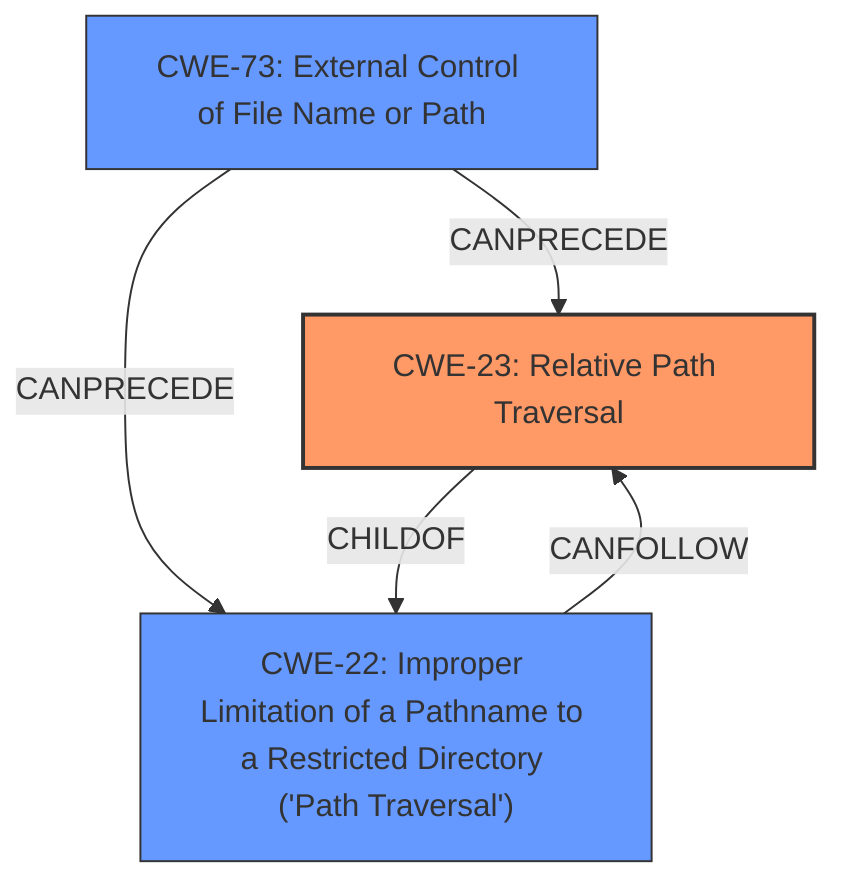

# Analysis for CVE-2021-41026

# Summary
| CWE ID | CWE Name | Confidence | CWE Abstraction Level | CWE Vulnerability Mapping Label | CWE-Vulnerability Mapping Notes |
|---|---|---|---|---|---|
| CWE-23 | Relative Path Traversal | 1.0 | Base | Allowed | Primary CWE |
| CWE-22 | Improper Limitation of a Pathname to a Restricted Directory ('Path Traversal') | 0.7 | Base | Allowed | Secondary Candidate |
| CWE-73 | External Control of File Name or Path | 0.6 | Base | Allowed | Secondary Candidate |

## Evidence and Confidence

*   **Confidence Score:** 0.8
*   **Evidence Strength:** HIGH

## Relationship Analysis
The primary CWE is CWE-23, which is a child of CWE-22. This indicates that CWE-23 is a more specific type of path traversal. CWE-73 can precede CWE-23 and CWE-22, indicating that external control of the file name or path can lead to path traversal vulnerabilities. The relationships show a hierarchical structure with increasing specificity from CWE-73 to CWE-22 to CWE-23. The Base abstraction levels are appropriate for identifying the root cause of this vulnerability.

## Vulnerability Chain
The vulnerability chain starts with an authenticated attacker crafting a web request that contains a **relative path traversal** sequence. The FortiWeb application **fails to properly neutralize this sequence**, allowing the attacker to retrieve arbitrary files from the underlying filesystem.
  - Root Cause: **Improper neutralization of path traversal sequences**
  - Weakness: Relative Path Traversal (CWE-23)
  - Impact: Retrieval of arbitrary files

## Summary of Analysis
The initial analysis and criticism resulted in the selection of CWE-23 as the primary CWE, with CWE-22 and CWE-73 as secondary candidates. This decision is based on the evidence provided in the vulnerability description and the retriever results, which both highlight the presence of a **relative path traversal** vulnerability.

The vulnerability description states, "A **relative path traversal** in FortiWeb versions 6.4.1, 6.4.0, and 6.3.0 through 6.3.15 may allow an authenticated attacker to retrieve arbitrary files from the underlying filesystem via specially crafted web requests." This statement provides direct evidence of a **relative path traversal** vulnerability. The "CVE Reference Links Content Summary" section further supports this by stating, "Root cause of vulnerability: Multiple relative path traversal vulnerabilities in the API of FortiWeb" and "Weaknesses/vulnerabilities present: Path traversal (CWE-23)."

The graph relationships influenced the final selection by providing context on the hierarchical structure of path traversal vulnerabilities. CWE-23 is a child of CWE-22, indicating that it is a more specific type of path traversal. CWE-73 can precede both CWE-22 and CWE-23, indicating that external control of the file name or path can lead to these vulnerabilities.

The selected CWEs are at the optimal level of specificity because they accurately represent the **root cause** and nature of the vulnerability. CWE-23 specifically describes **relative path traversal**, which is the identified weakness. CWE-22 is a broader category that encompasses various types of path traversal, and CWE-73 describes the external control aspect, which can contribute to path traversal vulnerabilities.

CWE-20, CWE-25, CWE-36, CWE-59, CWE-98, CWE-113, CWE-363 were considered but not used.
- CWE-20 (Improper Input Validation) is too broad and doesn't specifically address path traversal.
- CWE-25 (Path Traversal: '/../filedir') is a specific variant of relative path traversal, but the vulnerability description doesn't explicitly mention this specific sequence.
- CWE-36 (Absolute Path Traversal) is not applicable because the vulnerability description mentions **relative path traversal**.
- CWE-59 (Improper Link Resolution Before File Access ('Link Following')) is not applicable because the vulnerability description doesn't mention link following.
- CWE-98 (Improper Control of Filename for Include/Require Statement in PHP Program ('PHP Remote File Inclusion')) is specific to PHP applications and file inclusion, which is not mentioned in the vulnerability description.
- CWE-113 (Improper Neutralization of CRLF Sequences in HTTP Headers ('HTTP Request/Response Splitting')) is related to HTTP header manipulation, which is not the primary focus of the vulnerability.
- CWE-363 (Race Condition Enabling Link Following) involves race conditions and link following, which are not mentioned in the vulnerability description.
Relevant CWE Information:

# Enhanced Context (25 CWEs)
The following CWEs were identified as potentially relevant to this vulnerability:

## CWE-113: Improper Neutralization of CRLF Sequences in HTTP Headers ('HTTP Request/Response Splitting')
**Abstraction Level**: Variant
**Similarity Score**: 0.80
**Source**: dense

**Description**:
The product receives data from an HTTP agent/component (e.g., web server, proxy, browser, etc.), but it does not neutralize or incorrectly neutralizes CR and LF characters before the data is included in outgoing HTTP headers.

**Mapping Guidance**:
- Usage: Allowed
- Rationale: This CWE entry is at the Variant level of abstraction, which is a preferred level of abstraction for mapping to the root causes of vulnerabilities.

## CWE-41: Improper Resolution of Path Equivalence
**Abstraction Level**: Base
**Similarity Score**: 0.76
**Source**: dense

**Description**:
The product is vulnerable to file system contents disclosure through path equivalence. Path equivalence involves the use of special characters in file and directory names. The associated manipulations are intended to generate multiple names for the same object.

**Mapping Guidance**:
- Usage: Allowed
- Rationale: This CWE entry is at the Base level of abstraction, which is a preferred level of abstraction for mapping to the root causes of vulnerabilities.

## CWE-23: Relative Path Traversal
**Abstraction Level**: Base
**Similarity Score**: 0.75
**Source**: dense

**Description**:
The product uses external input to construct a pathname that should be within a restricted directory, but it does not properly neutralize sequences such as ".." that can resolve to a location that is outside of that directory.

**Mapping Guidance**:
- Usage: Allowed
- Rationale: This CWE entry is at the Base level of abstraction, which is a preferred level of abstraction for mapping to the root causes of vulnerabilities.

## CWE-444: Inconsistent Interpretation of HTTP Requests ('HTTP Request/Response Smuggling')
**Abstraction Level**: Base
**Similarity Score**: 0.75
**Source**: dense

**Description**:
The product acts as an intermediary HTTP agent
         (such as a proxy or firewall) in the data flow between two
         entities such as a client and server, but it does not
         interpret malformed HTTP requests or responses in ways that
         are consistent with how the messages will be processed by
         those entities that are at the ultimate destination.

**Mapping Guidance**:
- Usage: Allowed
- Rationale: This CWE entry is at the Base level of abstraction, which is a preferred level of abstraction for mapping to the root causes of vulnerabilities.

## CWE-73: External Control of File Name or Path
**Abstraction Level**: Base
**Similarity Score**: 0.73
**Source**: dense

**Description**:
The product allows user input to control or influence paths or file names that are used in filesystem operations.

**Mapping Guidance**:
- Usage: Allowed
- Rationale: This CWE entry is at the Base level of abstraction, which is a preferred level of abstraction for mapping to the root causes of vulnerabilities.

## CWE-74: Improper Neutralization of Special Elements in Output Used by a Downstream Component ('Injection')
**Abstraction Level**: Class
**Similarity Score**: 0.73
**Source**: dense

**Description**:
The product constructs all or part of a command, data structure, or record using externally-influenced input from an upstream component, but it does not neutralize or incorrectly neutralizes special elements that could modify how it is parsed or interpreted when it is sent to a downstream component.

**Mapping Guidance**:
- Usage: Discouraged
- Rationale: CWE-74 is high-level and often misused when lower-level weaknesses are more appropriate.

## CWE-184: Incomplete List of Disallowed