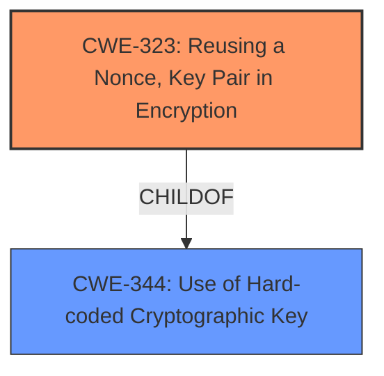

# Enhanced Analysis for CVE-2021-41061

# Summary

| CWE ID | CWE Name | Confidence | CWE Abstraction Level | CWE Vulnerability Mapping Label | CWE-Vulnerability Mapping Notes |
|---|---|---|---|---|---|
| CWE-323 | Reusing a Nonce, Key Pair in Encryption | 1.0 | Base | Allowed | Primary CWE |

## Evidence and Confidence

*   **Confidence Score:** 1.0
*   **Evidence Strength:** HIGH

## Relationship Analysis
The primary CWE, CWE-323 [Reusing a Nonce, Key Pair in Encryption], is a Base level CWE. It is a child of CWE-344 [Use of Hard-coded Cryptographic Key]. The Retriever Results also suggest other potential CWEs, such as CWE-1204 [Generation of Weak Initialization Vector (IV)], but the core issue is the **reuse** of the nonce, not necessarily its weakness.



## Vulnerability Chain
The vulnerability chain involves the following:
1.  **Root Cause:** **Nonce reuse** due to the frame counter being reset on reboot.
2.  **Weakness:** The **reuse** of the same (nonce, key) breaks confidentiality guarantees.
3.  **Impact:** Break encryption.

## Summary of Analysis
The initial analysis indicates that CWE-323 [Reusing a Nonce, Key Pair in Encryption] is the most appropriate CWE. The vulnerability description clearly states "**nonce reuse**" as the root cause. The CVE Reference Links Content Summary confirms this by stating, "As the key is flashed into the device in ieee802154_security's normal operation, and the sender LL address is constant per device, the same nonce (varying only through the resetting frame counter) is used in the AES encryption multiple times. **Reuse** of the same (nonce, key) breaks confidentiality guarantees."

CWE-323 is a Base level CWE, which is the preferred level of abstraction. The mapping guidance for CWE-323 indicates that its usage is "Allowed" and the rationale states that it is at the Base level of abstraction.

CWE-1204 [Generation of Weak Initialization Vector (IV)] was considered but ultimately rejected because the primary issue is the **reuse** of the nonce and key pair, not the weakness of the IV itself, although a weak IV could exacerbate the issue. The provided evidence focuses on the **reuse**.

CWE-327 [Use of a Broken or Risky Cryptographic Algorithm] was also considered but rejected because the problem is not necessarily with the cryptographic algorithm itself, but with the improper use of a nonce and key pair.

Therefore, CWE-323 [Reusing a Nonce, Key Pair in Encryption] is the most accurate and specific CWE for this vulnerability.


## CWE Relationship Analysis

Current CWEs represent these abstraction levels: .


### Vulnerability Chain Analysis

**Chain starting from CWE-1204:**
- 1204 (Generation of Weak Initialization Vector (IV)) - ROOT


**Chain starting from CWE-327:**
- 327 (Use of a Broken or Risky Cryptographic Algorithm) - ROOT


### CWE Relationship Diagram

```mermaid
graph TD
    classDef primary fill:#f96,stroke:#333,stroke-width:2px
    classDef secondary fill:#69f,stroke:#333
    classDef tertiary fill:#9e9,stroke:#333
```