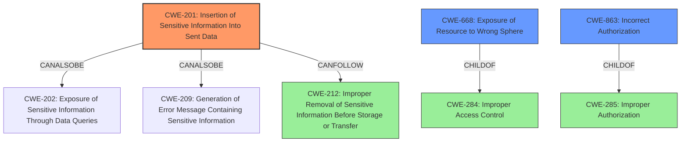

# Raw Analyzer Response for CVE-2021-41077

# Summary
| CWE ID | CWE Name | Confidence | CWE Abstraction Level | CWE Vulnerability Mapping Label | CWE-Vulnerability Mapping Notes |
|---|---|---|---|---|---|
| CWE-201 | Insertion of Sensitive Information Into Sent Data | 0.9 | Base | Primary CWE | Allowed |
| CWE-668 | Exposure of Resource to Wrong Sphere | 0.7 | Class | Secondary Candidate | Discouraged |
| CWE-863 | Incorrect Authorization | 0.6 | Class | Secondary Candidate | Allowed-with-Review |

## Evidence and Confidence

*   **Confidence Score:** 0.8
*   **Evidence Strength:** HIGH

## Relationship Analysis
The primary relationship influencing the selection was the direct matching of CWE-201 to the **secret data sharing** and **public access to customer-specific secret environment data** described in the vulnerability. Additionally, the relationship between CWE-201 and CWE-212 (Improper Removal of Sensitive Information Before Storage or Transfer) was considered, but CWE-201 was deemed a better fit due to the explicit mention of data being *sent* to an unauthorized actor. CWE-668 and CWE-863 were considered as higher-level classifications but ultimately deemed less specific than CWE-201. The abstraction levels (Base for CWE-201, Class for CWE-668 and CWE-863) influenced the decision to prefer CWE-201 for its higher granularity.

## Vulnerability Chain
The chain of events leading to the vulnerability is as follows:
1.  A public repository is forked.
2.  A pull request is created from the forked repository to the original repository.
3.  The pull request triggers a build in Travis CI.
4.  Due to **unexpected secret data sharing**, the secrets of the original repository are exposed in the build environment.
5.  An attacker can access the secrets by printing files during the build process, leading to **public access to customer-specific secret environment data**.

The root cause is the **unexpected secret data sharing** within Travis CI, resulting in the impact of sensitive data being exposed.

## Summary of Analysis
Initially, the analysis focused on identifying the core weakness that led to the vulnerability. The description explicitly mentions **unexpected secret data sharing**, which strongly suggests a failure in properly isolating sensitive information. The CVE Reference Links Content Summary confirmed this, stating that the vulnerability stemmed from how Travis CI handled pull requests, leading to the exposure of secrets.

CWE-201 (Insertion of Sensitive Information Into Sent Data) emerged as the most suitable candidate because it directly addresses the scenario where sensitive information is transmitted to an unauthorized actor. The fact that secrets were exposed in the build environment of forked repositories aligns perfectly with this CWE's description.

Other CWEs, such as CWE-668 (Exposure of Resource to Wrong Sphere) and CWE-863 (Incorrect Authorization), were considered. However, these were deemed less specific. CWE-668 is a high-level class that could apply to various exposure scenarios, but it doesn't pinpoint the act of sending sensitive data. CWE-863, while relevant, focuses on authorization checks, which isn't the primary issue here. The core problem is the **weakness** of **unexpected secret data sharing** rather than a failure in authorization.

The decision to prioritize CWE-201 was heavily influenced by the need for specificity, as well as the MITRE mapping guidance which recommends choosing the most detailed CWE that accurately represents the weakness. The evidence from the vulnerability description and CVE reference links strongly supports this choice.

Relevant CWE Information:
*   **CWE-201: Insertion of Sensitive Information Into Sent Data**: This was chosen as the primary CWE. The vulnerability allows for secret data to be revealed to an unauthorized actor.  The description of the CWE states "The code transmits data to another actor, but a portion of the data includes sensitive information that should not be accessible to that actor." The evidence for this is "secret data could be revealed to an unauthorized actor who forked a public repository and printed files during a build process."
*   **CWE-668: Exposure of Resource to Wrong Sphere**: This was considered because the vulnerability involves exposing secrets (a resource) to forked repositories (the wrong sphere). However, CWE-201 is more specific to the act of sending the data. The rationale for discouraging CWE-668 is that it is high-level.
*   **CWE-863: Incorrect Authorization**: This was considered because the vulnerability could be seen as a failure to properly authorize access to the secrets. However, the core issue is the **unexpected secret data sharing**, not necessarily an authorization failure. The description of the CWE states "The product performs an authorization check when an actor attempts to access a resource or perform an action, but it does not correctly perform the check.". The evidence for this is "the desired behavior (if .travis.yml has been created locally by a customer, and added to git) is for a Travis service to perform builds in a way that prevents public access to customer-specific secret environment data such as signing keys, access credentials, and API tokens."