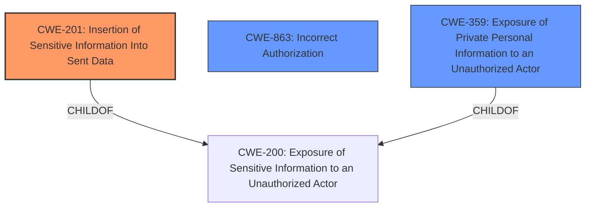

# Raw Analyzer Response for CVE-2021-41082

# Summary
| CWE ID | CWE Name | Confidence | CWE Abstraction Level | CWE Vulnerability Mapping Label | CWE-Vulnerability Mapping Notes |
|---|---|---|---|---|---|
| **CWE-201** | **Insertion of Sensitive Information Into Sent Data** | 0.9 | Base | Primary | Allowed |
| CWE-863 | Incorrect Authorization | 0.6 | Class | Secondary | Allowed-with-Review |
| CWE-359 | Exposure of Private Personal Information to an Unauthorized Actor | 0.6 | Base | Secondary | Allowed |

## Evidence and Confidence

*   **Confidence Score:** 0.7
*   **Evidence Strength:** MEDIUM

## Relationship Analysis
The primary weakness is CWE-201 **Insertion of Sensitive Information Into Sent Data**, which is a base-level CWE and a child of CWE-200. While CWE-200 is broader and discouraged, CWE-201 is more specific and allowed. CWE-863 **Incorrect Authorization** is also considered, as the vulnerability involves a flaw in access control, however, the core issue is the exposure of the data, not necessarily an outright bypass of authorization. CWE-359 **Exposure of Private Personal Information to an Unauthorized Actor** is another possible candidate, being a more specific instance of CWE-200, focusing on personal information.

## Vulnerability Chain
The vulnerability chain starts with a flawed performance optimization that led to incorrect SQL queries. This resulted in the **insertion of sensitive information (private message titles and participants)** into data sent to unauthorized users. This can be summarized as:
1.  Flawed Performance Optimization leading to
2.  Incorrect SQL queries leading to
3.  **Insertion of Sensitive Information Into Sent Data (CWE-201)**

## Summary of Analysis
The initial analysis focused on identifying the root cause of the vulnerability. The evidence from the CVE description points to a flaw in the SQL queries that aimed to improve performance. This flaw resulted in the exposure of private message titles and participants to unauthorized users.

The core of the vulnerability is that sensitive data, specifically the titles and participants of private messages, was sent to users who should not have had access to it. This aligns perfectly with CWE-201 **Insertion of Sensitive Information Into Sent Data**.

The evidence supporting this decision comes from the following:

*   "any private message that includes a group had its title and participating user exposed to users that do not have access to the private messages."
*   "The vulnerability stemmed from a commit (`ddb4583`) that aimed to improve the query performance for fetching all inbox private messages... However, this optimization inadvertently exposed group private message titles and participating users to unauthorized users."

While CWE-863 **Incorrect Authorization** and CWE-359 **Exposure of Private Personal Information to an Unauthorized Actor** were considered, the primary issue is not a complete bypass of authorization (CWE-863), nor is it simply about exposing private information (CWE-359) without the context of it being sent as data, but rather the inclusion of sensitive data in what was sent. Therefore, CWE-201 is the most accurate and specific representation of the vulnerability. The selection of CWE-201 is at the optimal level of specificity, as it directly addresses the root cause – the **insertion of sensitive information into sent data** – rather than a more general issue of information exposure.

Relevant CWE Information: