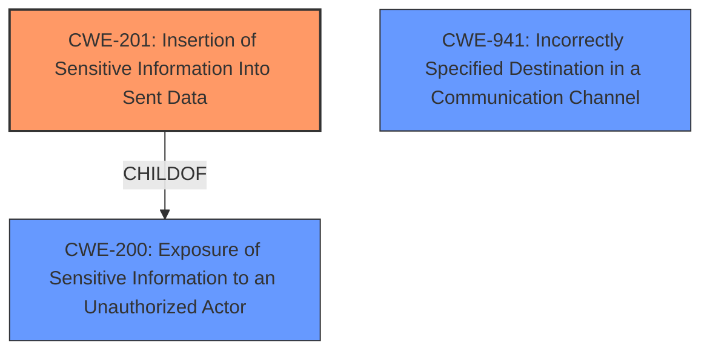

# Analysis Report for CVE-2021-41092

# Vulnerability Analysis Report: CVE-2021-41092

## Description


## Analysis (with Relationship Data)

# Summary

| CWE ID  | CWE Name                                                     | Confidence | CWE Abstraction Level | CWE Vulnerability Mapping Label | CWE-Vulnerability Mapping Notes |
| :-------- | :----------------------------------------------------------- | :--------- | :---------------------- | :---------------------------- | :------------------------------ |
| CWE-201   | Insertion of Sensitive Information Into Sent Data          | 0.85       | Base                    | Primary CWE                  | Allowed                       |
| CWE-941   | Incorrectly Specified Destination in a Communication Channel | 0.75       | Base                    | Secondary Candidate              | Allowed                       |

## Evidence and Confidence

*   **Confidence Score:** 0.80
*   **Evidence Strength:** HIGH

## Relationship Analysis

The primary relationship that influenced the decision was the parent-child relationship between CWE-200 and CWE-201, where CWE-201 is a child of CWE-200. This indicates that CWE-201 provides more specific details about sensitive information being sent to unintended parties, aligning well with the vulnerability description. CWE-941, while relevant, was considered a secondary factor, as it focuses on communication channel destinations.



## Vulnerability Chain

The chain of events in this vulnerability is as follows:

1.  **Root Cause:** A **misconfigured configuration file** in Docker CLI.
2.  Weakness: The Docker CLI **does not correctly** handle the `credsStore` or `credHelpers` entries when they are misconfigured.
3.  Impact: Credentials are sent to an unintended registry (`registry-1.docker.io`), leading to potential exposure of sensitive information.

## Summary of Analysis

The initial analysis focused on identifying the **root cause** and the resulting impact. The vulnerability description clearly states that the **misconfigured configuration file** leads to credentials being sent to the wrong registry.

The **CVE Reference Links Content Summary** confirms that the root cause of the vulnerability is a misconfiguration in the Docker CLI, specifically in how it handles `credsStore` or `credHelpers`, leading to credentials being sent to the wrong registry. The weaknesses section of the CVE summary lists "CWE-200: Exposure of Sensitive Information to an Unauthorized Actor".

Based on the vulnerability description and the provided CWE specifications, CWE-201 is the most appropriate choice. It accurately describes the scenario where sensitive information (credentials) is sent to an unintended actor due to the **misconfigured configuration**. The fact that CWE-201 is a child of CWE-200 further strengthens this mapping, as it provides a more specific classification.

CWE-941 was also considered because it addresses the **incorrect specification of a destination in a communication channel**. While this is relevant, the primary issue is the exposure of sensitive information, making CWE-201 the more direct and accurate classification.

The selection of CWE-201 is based on the evidence: "credentials being sent to `registry-1.docker.io` rather than the intended private registry" and "Misconfiguration in the Docker CLI when handling `credsStore` or `credHelpers` leading to credentials being sent to the wrong registry." These excerpts directly support the assertion that sensitive information is being sent to an unintended destination due to the misconfiguration.

The chosen CWEs are at the optimal level of specificity. CWE-201 is a Base-level CWE, providing a detailed description of the vulnerability, and CWE-941 provides further context about the communication channel but is secondary to the primary weakness.

Relevant CWE Information:

# Enhanced Context (25 CWEs)

## CWE-668: Exposure of Resource to Wrong Sphere
**Abstraction Level**: Class
**Similarity Score**: 0.78
**Source**: dense

**Description**:
The product exposes a resource to the wrong control sphere, providing unintended actors with inappropriate access to the resource.
**Rationale:** CWE-668 is too high-level.

## CWE-226: Sensitive Information in Resource Not Removed Before Reuse
**Abstraction Level**: Base
**Similarity Score**: 0.77
**Source**: dense

**Description**:
The product releases a resource such as memory or a file so that it can be made available for reuse, but it does not clear or "zeroize" the information contained in the resource before the product performs a critical state transition or makes the resource available for reuse by other entities.
**Rationale:** This vulnerability is about sending data to unintended sphere, not about reusing uncleared resources.

## CWE-280: Improper Handling of Insufficient Permissions or Privileges
**Abstraction Level**: Base
**Similarity Score**: 0.77
**Source**: dense

**Description**:
The product does not handle or incorrectly handles when it has insufficient privileges to access resources or functionality as specified by their permissions. This may cause it to follow unexpected code paths that may leave the product in an invalid state.
**Rationale:** There is no mention of permissions or privileges in the vulnerability description.

## CWE-941: Incorrectly Specified Destination in a Communication Channel
**Abstraction Level**: Base
**Similarity Score**: 0.77
**Source**: dense

**Description**:
The product creates a communication channel to initiate an outgoing request to an actor, but it does not correctly specify the intended destination for that actor.
**Rationale:** While this is relevant as a secondary factor, the primary issue is the exposure of sensitive information.
**Justification:** The vulnerability involves credentials being sent to the wrong registry, which fits this description.

## CWE-653: Improper Isolation or Compartmentalization
**Abstraction Level**: Class
**Similarity Score**: 0.77
**Source**: dense

**Description**:
The product does not properly compartmentalize or isolate functionality, processes, or resources that require different privilege levels, rights, or permissions.
**Rationale:** Not relevant.

## CWE-274: Improper Handling of Insufficient Privileges
**Abstraction Level**: Base
**Similarity Score**: 0.77
**Source**: dense

**Description**:
The product does not handle or incorrectly handles when it has insufficient privileges to perform an operation, leading to resultant weaknesses.
**Rationale:** Not relevant.

## CWE-212: Improper Removal of Sensitive Information Before Storage or Transfer
**Abstraction Level**: Base
**Similarity Score**: 0.77
**Source**: dense

**Description**:
The product stores, transfers, or shares a resource that contains sensitive information, but it does not properly remove that information before the product makes the resource available to unauthorized actors.
**Rationale:** This is about sending sensitive information without sanitizing.

## CWE-807: Reliance on Untrusted Inputs in a Security Decision
**Abstraction Level**: Base
**Similarity Score**: 0.76
**Source**: dense

**Description**:
The product uses a protection mechanism that relies on the existence or values of an input, but the input can be modified by an untrusted actor in a way that bypasses the protection mechanism.
**Rationale:** Not relevant.

## CWE-319: Cleartext Transmission of Sensitive Information
**Abstraction Level**: Base
**Similarity Score**: 0.76
**Source**: dense

**Description**:
The product transmits sensitive or security-critical data in cleartext in a communication channel that can be sniffed by unauthorized actors.
**Rationale:** Not relevant - this is about sending data to the wrong place, not about sending it in cleartext.

## CWE-404: Improper Resource Shutdown or Release
**Abstraction Level**: Class
**Similarity Score**: 0.76
**Source**: dense

**Description**:
The product does not release or incorrectly releases a resource before it is made available for re-use.
**Rationale:** Not relevant.

## CWE-923: Improper Restriction of Communication Channel to Intended Endpoints
**Abstraction Level**: Class
**Similarity Score**: 4483.61
**Source**: sparse

**Description**:
The product establishes a communication channel to (or from) an endpoint for privileged or protected operations, but it does not properly ensure that it is communicating with the correct endpoint.
**Rationale:** Not relevant.

## CWE-863: Incorrect Authorization
**Abstraction Level**: Class
**Similarity Score**: 4475.49
**Source**: sparse

**Description**:
The product performs an authorization check when an actor attempts to access a resource or perform an action, but it does not correctly perform the check.
**Rationale:** Not relevant.

## CWE-226: Sensitive Information in Resource Not Removed Before Reuse
**Abstraction Level**: Base
**Similarity Score**: 4425.55
**Source**: sparse

**Description**:
The product releases a resource such as memory or


## CWE Relationship Analysis

Current CWEs represent these abstraction levels: .


### Vulnerability Chain Analysis

**Chain starting from CWE-404:**
- 404 (Improper Resource Shutdown or Release) - ROOT


**Chain starting from CWE-201:**
- 201 (Insertion of Sensitive Information Into Sent Data) - ROOT


### CWE Relationship Diagram

```mermaid
graph TD
    classDef primary fill:#f96,stroke:#333,stroke-width:2px
    classDef secondary fill:#69f,stroke:#333
    classDef tertiary fill:#9e9,stroke:#333
```


*Report generated on 2025-04-02 01:29:56*
