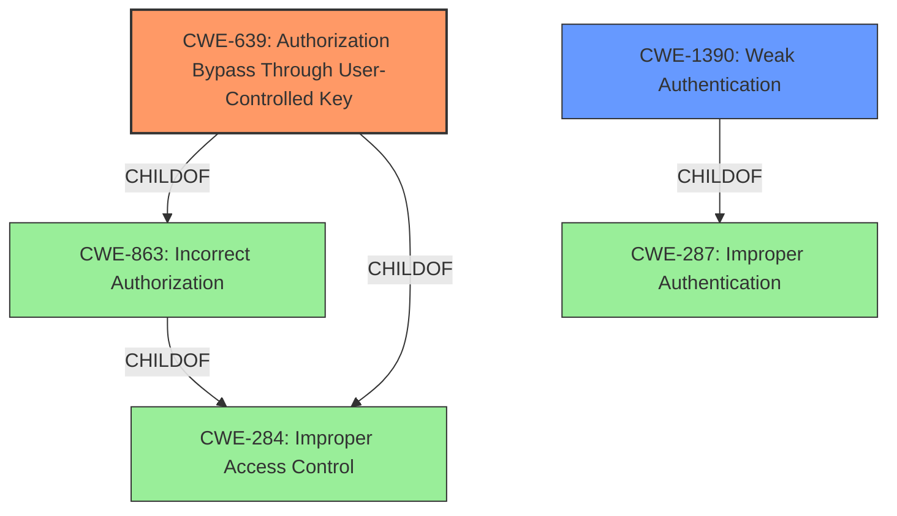

# Raw Analyzer Response for CVE-2021-41093

# Summary
| CWE ID    | CWE Name                                                               | Confidence | CWE Abstraction Level | CWE Vulnerability Mapping Label | CWE-Vulnerability Mapping Notes |
| --------- | ---------------------------------------------------------------------- | ---------- | ----------------------- | ------------------------------- | ----------------------------- |
| CWE-639   | Authorization Bypass Through User-Controlled Key                     | 0.8        | Base                    | Allowed                         | Primary CWE                   |
| CWE-1390  | Weak Authentication                                                      | 0.6        | Class                   | Allowed-with-Review             | Secondary Candidate           |

## Evidence and Confidence

*   **Confidence Score:** 0.7
*   **Evidence Strength:** MEDIUM

## Relationship Analysis
The primary CWE is CWE-639, which is a child of CWE-863 (Incorrect Authorization) and CWE-284 (Improper Access Control). CWE-1390 (Weak Authentication) is a child of CWE-287 (Improper Authentication). The vulnerability involves using an **old but valid access token** to change an email, effectively bypassing authorization. CWE-639 directly addresses authorization bypass through user-controlled keys, fitting the vulnerability's root cause. While CWE-1390 is relevant, the specific mechanism of using an old token to bypass authorization is more accurately described by CWE-639.

## Vulnerability Chain
The vulnerability chain starts with the **use of an old but valid access token**, leading to the **bypass of authorization** and ultimately resulting in **account takeover** by changing the email address associated with the account.

## Summary of Analysis
The initial analysis identified several potential CWEs, including CWE-201, CWE-863, and CWE-1390. However, after carefully reviewing the vulnerability description and the provided CWE specifications, CWE-639 (Authorization Bypass Through User-Controlled Key) emerges as the most appropriate primary CWE. The vulnerability explicitly describes how an attacker can use an **old but valid access token** (a key value under user control) to bypass authorization and take over an account. The fact that an old access token can still be used to change email indicates a flaw in the authorization mechanism.

CWE-1390 (Weak Authentication) is a relevant secondary CWE because the vulnerability involves an access token that remains valid for too long, which suggests a weakness in the authentication process. However, the core issue is the authorization bypass, making CWE-639 the primary focus.

The evidence supporting this decision comes directly from the vulnerability description: "if the an attacker gets an **old but valid access token** they can take over an account by changing the email." This statement aligns perfectly with the description of CWE-639, which states: "The system's authorization functionality does not prevent one user from gaining access to another user's data or record by modifying the key value identifying the data."

The selected CWEs are at the optimal level of specificity. CWE-639 is a Base-level CWE, which is preferred for mapping to root causes. CWE-1390 is a Class-level CWE and could potentially have a more specific child, but it accurately reflects the weakness in the token management.

Relevant CWE Information:

# Enhanced Context (25 CWEs)
The following CWEs were identified as potentially relevant to this vulnerability:

## CWE-303: Incorrect Implementation of Authentication Algorithm
**Abstraction Level**: Base
**Similarity Score**: 0.78
**Source**: dense

**Description**:
The requirements for the product dictate the use of an established authentication algorithm, but the implementation of the algorithm is incorrect.

**Mapping Guidance**:
- Usage: Allowed
- Rationale: This CWE entry is at the Base level of abstraction, which is a preferred level of abstraction for mapping to the root causes of vulnerabilities.

## CWE-807: Reliance on Untrusted Inputs in a Security Decision
**Abstraction Level**: Base
**Similarity Score**: 0.77
**Source**: dense

**Description**:
The product uses a protection mechanism that relies on the existence or values of an input, but the input can be modified by an untrusted actor in a way that bypasses the protection mechanism.

**Mapping Guidance**:
- Usage: Allowed
- Rationale: This CWE entry is at the Base level of abstraction, which is a preferred level of abstraction for mapping to the root causes of vulnerabilities.

## CWE-1390: Weak Authentication
**Abstraction Level**: Class
**Similarity Score**: 0.77
**Source**: dense

**Description**:
The product uses an authentication mechanism to restrict access to specific users or identities, but the mechanism does not sufficiently prove that the claimed identity is correct.

**Mapping Guidance**:
- Usage: Allowed-with-Review
- Rationale: This CWE entry is a Class and might have Base-level children that would be more appropriate

## CWE-212: Improper Removal of Sensitive Information Before Storage or Transfer
**Abstraction Level**: Base
**Similarity Score**: 0.77
**Source**: dense

**Description**:
The product stores, transfers, or shares a resource that contains sensitive information, but it does not properly remove that information before the product makes the resource available to unauthorized actors.

**Mapping Guidance**:
- Usage: Allowed
- Rationale: This CWE entry is at the Base level of abstraction, which is a preferred level of abstraction for mapping to the root causes of vulnerabilities.

## CWE-639: Authorization Bypass Through User-Controlled Key
**Abstraction Level**: Base
**Similarity Score**: 0.77
**Source**: dense

**Description**:
The system's authorization functionality does not prevent one user from gaining access to another user's data or record by modifying the key value identifying the data.

**Mapping Guidance**:
- Usage: Allowed
- Rationale: This CWE entry is at the Base level of abstraction, which is a preferred level of abstraction for mapping to the root causes of vulnerabilities.

## CWE-74: Improper Neutralization of Special Elements in Output Used by a Downstream Component ('Injection')
**Abstraction Level**: Class
**Similarity Score**: 0.77
**Source**: dense

**Description**:
The product constructs all or part of a command, data structure, or record using externally-influenced input from an upstream component, but it does not neutralize or incorrectly neutralizes special elements that could modify how it is parsed or interpreted when it is sent to a downstream component.

**Mapping Guidance**:
- Usage: Discouraged
- Rationale: CWE-74 is high-level and often misused when lower-level weaknesses are more appropriate.

## CWE-274: Improper Handling of Insufficient Privileges
**Abstraction Level**: Base
**Similarity Score**: 0.76
**Source**: dense

**Description**:
The product does not handle or incorrectly handles when it has insufficient privileges to perform an operation, leading to resultant weaknesses.

**Mapping Guidance**:
- Usage: Discouraged
- Rationale: This CWE entry could be deprecated in a future version of CWE.

## CWE-204: Observable Response Discrepancy
**Abstraction Level**: Base
**Similarity Score**: 0.76
**Source**: dense

**Description**:
The product provides different responses to incoming requests in a way that reveals internal state information to an unauthorized actor outside of the intended control sphere.

**Mapping Guidance**:
- Usage: Allowed
- Rationale: This CWE entry is at the Base level of abstraction, which is a preferred level of abstraction for mapping to the root causes of vulnerabilities.

## CWE-90: Improper Neutralization of Special Elements used in an LDAP Query ('LDAP Injection')
**Abstraction Level**: Base
**Similarity Score**: 0.76
**Source**: dense

**Description**:
The product constructs all or part of an LDAP query using externally-influenced input from an upstream component, but it does not neutralize or incorrectly neutralizes special elements that could modify the intended LDAP query when it is sent to a downstream component.

**Mapping Guidance**:
- Usage: Allowed
- Rationale: This CWE entry is at the Base level of abstraction, which is a preferred level of abstraction for mapping to the root causes of vulnerabilities.

## CWE-668: Exposure of Resource to Wrong Sphere
**Abstraction Level**: