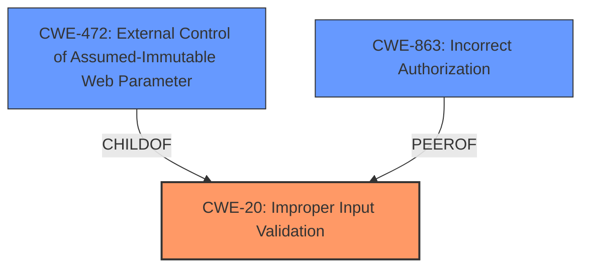

# Analysis for CVE-2021-4111

# Summary
| CWE ID    | CWE Name                                                                   | Confidence | CWE Abstraction Level | CWE Vulnerability Mapping Label | CWE-Vulnerability Mapping Notes |
| :-------- | :------------------------------------------------------------------------- | :--------- | :---------------------- | :------------------------------ | :------------------------------ |
| CWE-20  | Improper Input Validation                                                  | 0.9        | Base                    | Primary                         | Allowed                       |
| CWE-472 | External Control of Assumed-Immutable Web Parameter                        | 0.6        | Base                    | Secondary                       | Allowed                       |
| CWE-863 | Incorrect Authorization                                                    | 0.4       | Class                    | Secondary                       | Allowed-with-Review           |

## Evidence and Confidence

*   **Confidence Score:** 0.7
*   **Evidence Strength:** MEDIUM

## Relationship Analysis

The primary relationship that influenced the CWE selection was the parent-child relationship between CWE-20 [CWE-20: Improper Input Validation] and its potential children. While several potential child CWEs were considered, the evidence pointed most strongly to the general case of improper input validation. The relationships for CWE-472 [CWE-472: External Control of Assumed-Immutable Web Parameter] as a child of CWE-642 and CWE-471 were considered, but the vulnerability description was not specific enough to warrant this more specific classification. CWE-863 [CWE-863: Incorrect Authorization] was considered as a potential peer of other authorization-related CWEs, but it was determined that the root cause was more directly related to input validation issues rather than a flaw in the authorization logic itself.

## Vulnerability Chain

The vulnerability chain begins with the **Business Logic Error** due to insufficient input validation on the multi-currency fields. This leads to the potential for data corruption and system errors due to the lack of proper sanitization and verification of user-supplied input.

## Summary of Analysis

The initial assessment identified **Business Logic Errors** as the main weakness. The analysis of the commit diffs in "CVE Reference Links Content Summary" section revealed that the root cause is likely due to insufficient validation of multi-currency fields. The provided information directly states, "Improved validation for multi-currency fields" which supports this assessment. The patch involves modifying several files related to currency input and validation, confirming the lack of proper input handling as the primary issue.

The Retriever Results listed CWE-472 [CWE-472: External Control of Assumed-Immutable Web Parameter] and CWE-863 [CWE-863: Incorrect Authorization]. While these are possibilities, the root of the problem lies in the application's failure to validate input properly, making CWE-20 [CWE-20: Improper Input Validation] the more appropriate primary classification.

The selection of CWE-20 [CWE-20: Improper Input Validation] is at the optimal level of specificity because the available evidence indicates a general lack of input validation rather than a specific type of validation error. The changes described in the commit diff address the overall validation process, suggesting a systemic issue rather than a targeted flaw.

Relevant CWE Information:

# Enhanced Context (25 CWEs)
The following CWEs were identified as potentially relevant to this vulnerability:

## CWE-345: Insufficient Verification of Data Authenticity
**Abstraction Level**: Class
**Similarity Score**: 0.77
**Source**: dense

**Description**:
The product does not sufficiently verify the origin or authenticity of data, in a way that causes it to accept invalid data.

**Mapping Guidance**:
- Usage: Discouraged
- Rationale: This CWE entry is a level-1 Class (i.e., a child of a Pillar). It might have lower-level children that would be more appropriate

## CWE-668: Exposure of Resource to Wrong Sphere
**Abstraction Level**: Class
**Similarity Score**: 0.77
**Source**: dense

**Description**:
The product exposes a resource to the wrong control sphere, providing unintended actors with inappropriate access to the resource.

**Mapping Guidance**:
- Usage: Discouraged
- Rationale: CWE-668 is high-level and is often misused as a catch-all when lower-level CWE IDs might be applicable. It is sometimes used for low-information vulnerability reports [REF-1287]. It is a level-1 Class (i.e., a child of a Pillar). It is not useful for trend analysis.

## CWE-703: Improper Check or Handling of Exceptional Conditions
**Abstraction Level**: Pillar
**Similarity Score**: 0.77
**Source**: dense

**Description**:
The product does not properly anticipate or handle exceptional conditions that rarely occur during normal operation of the product.

**Mapping Guidance**:
- Usage: Discouraged
- Rationale: This CWE entry is extremely high-level, a Pillar.

## CWE-755: Improper Handling of Exceptional Conditions
**Abstraction Level**: Class
**Similarity Score**: 0.76
**Source**: dense

**Description**:
The product does not handle or incorrectly handles an exceptional condition.

**Mapping Guidance**:
- Usage: Discouraged
- Rationale: This CWE entry is a level-1 Class (i.e., a child of a Pillar). It might have lower-level children that would be more appropriate

## CWE-667: Improper Locking
**Abstraction Level**: Class
**Similarity Score**: 0.76
**Source**: dense

**Description**:
The product does not properly acquire or release a lock on a resource, leading to unexpected resource state changes and behaviors.

**Mapping Guidance**:
- Usage: Allowed-with-Review
- Rationale: This CWE entry is a Class and might have Base-level children that would be more appropriate

## CWE-41: Improper Resolution of Path Equivalence
**Abstraction Level**: Base
**Similarity Score**: 0.76
**Source**: dense

**Description**:
The product is vulnerable to file system contents disclosure through path equivalence. Path equivalence involves the use of special characters in file and directory names. The associated manipulations are intended to generate multiple names for the same object.

**Mapping Guidance**:
- Usage: Allowed
- Rationale: This CWE entry is at the Base level of abstraction, which is a preferred level of abstraction for mapping to the root causes of vulnerabilities.

## CWE-1289: Improper Validation of Unsafe Equivalence in Input
**Abstraction Level**: Base
**Similarity Score**: 0.76
**Source**: dense

**Description**:
The product receives an input value that is used as a resource identifier or other type of reference, but it does not validate or incorrectly validates that the input is equivalent to a potentially-unsafe value.

**Mapping Guidance**:
- Usage: Allowed
- Rationale: This CWE entry is at the Base level of abstraction, which is a preferred level of abstraction for mapping to the root causes of vulnerabilities.

## CWE-807: Reliance on Untrusted Inputs in a Security Decision
**Abstraction Level**: Base
**Similarity Score**: 0.76
**Source**: dense

**Description**:
The product uses a protection mechanism that relies on the existence or values of an input, but the input can be modified by an untrusted actor in a way that bypasses the protection mechanism.

**Mapping Guidance**:
- Usage: Allowed
- Rationale: This CWE entry is at the Base level of abstraction, which is a preferred level of abstraction for mapping to the root causes of vulnerabilities.

## CWE-657: Violation of Secure Design Principles
**Abstraction Level**: Class
**Similarity Score**: 0.75
**Source**: dense

**Description**:
The product violates well-established principles for secure design.

**Mapping Guidance**:
- Usage: Discouraged
- Rationale: This CWE entry is a level-1 Class (i.e., a child of a Pillar). It might have lower-level children that would be more appropriate

## CWE-754: Improper Check for Unusual or Exceptional Conditions
**Abstraction Level**: Class
**Similarity Score**: 0.75
**Source**: dense

**Description**:
The product does not check or incorrectly checks for unusual or exceptional conditions that are not expected to occur frequently during day to day operation of the product.

**Mapping Guidance**:
- Usage: Allowed-with-Review
- Rationale: This CWE entry is a Class and might have Base-level children that would be more appropriate

## CWE-472: External Control of Assumed-Immutable Web Parameter
**Abstraction Level**: Base
**Similarity Score**: 5555.63
**Source**: sparse

**

# Enhanced Query for CVE-2021-4111

## Vulnerability Description
yetiforcecrm is vulnerable to **Business Logic Errors**

### Vulnerability Description Key Phrases
- **weakness:** **Business Logic Errors**
- **product:** yetiforcecrm

### CWE for similar CVE Descriptions
### Primary CWE Match
CWE-20

#### Top CWEs
- CWE-20 (Count: 6)

## CVE Reference Links Content Summary
Based on the provided content, here's an analysis related to CVE-2021-4111:

**Analysis:**

The provided content is a commit diff from a GitHub repository, specifically for YetiForce CRM. This commit focuses on improving validation for multi-currency fields. While it doesn't explicitly mention CVE-2021-4111 or a specific vulnerability being fixed, the changes suggest a potential fix for a validation-related issue that could be exploited.

**Root Cause of Vulnerability (Inferred):**

Based on the changes, the root cause appears to be insufficient validation of multi-currency input fields. The commit modifies the following:

*   `layouts/basic/modules/Vtiger/Edit/CurrenciesModal.tpl`:  The template for the currency modal is updated with new checks and formatting for the numerical input fields.
*   `layouts/basic/modules/Vtiger/Edit/Field/MultiCurrency.tpl`: The template for the multi-currency field is updated to include better validation logic and use a javascript validator.
*   `modules/Vtiger/models/Field.php`:  The `getValidator` function was modified to retrieve a validator method from the field's UI type model which includes a method `getValidator`. Also includes a `getDefaultValidator()` which includes additional checks
*   `modules/Vtiger/uitypes/MultiCurrency.php`:  The `validate` function is enhanced with checks to verify if the currency exists and if the price is numeric and within the maximum length defined for the field. It also throws an exception if the value is not an array.  A new method `getValidator` was added for currency validation, returning an array with a 'name' => 'Currency' validator.
*   `public_html/layouts/resources/validator/BaseValidator.js`:  A base validator file.
*   `public_html/layouts/resources/validator/FieldValidator.js`: A field validator file that probably contains logic for validating specific field types.

These modifications suggest that previously, the application might not have been correctly validating the input data for multi-currency fields, which could lead to potential issues.

**Weaknesses/Vulnerabilities Present (Inferred):**

*   **Insufficient Input Validation:**  The primary vulnerability appears to be a lack of proper validation of the multi-currency input fields. Without proper validation, it might be possible to submit malformed data.
*   **Potential for data corruption:** Incorrect or malicious data could be saved in the database.

**Impact of Exploitation (Inferred):**

*   **Data corruption:** An attacker could potentially inject invalid data into the multi-currency fields, leading to data corruption or inconsistent data within the CRM system.
*   **System errors:** If the application fails to handle invalid data correctly, it might lead to unexpected errors or system crashes.

**Attack Vectors (Inferred):**

*   **Web Interface:** The attack vector would likely be through the CRM's web interface, specifically via forms where multi-currency fields are present.
*   **Direct API calls** An attacker might also be able to directly submit data to any API endpoints that use the affected fields.

**Required Attacker Capabilities/Position (Inferred):**

*   **Access to the CRM:** The attacker would need to have some level of access to the YetiForce CRM instance. This could be a legitimate user account or a compromised account.
*   **Knowledge of the input mechanism:** The attacker might need to understand how the multi-currency fields are handled by the system to craft malicious input.

**Additional Notes:**

*   The provided diff is a commit that improves the validation, suggesting that a prior version was vulnerable.
*   The commit message "Improved validation for multi-currency fields" directly points to the focus of these changes.
*   There is no specific mention of CVE-2021-4111, meaning this commit may address a vulnerability that was not assigned a CVE, or it could be addressing the issue described by CVE-2021-4111. Without the official CVE description, it is hard to be sure.

**Summary:**

The commit diff provides evidence of a fix for insufficient validation of multi-currency fields in YetiForce CRM. Although not explicitly linked to CVE-2021-4111, the changes suggest a vulnerability related to input validation that could be exploited to cause data corruption and potentially system errors. The attack vector would be through the CRM's web interface, and an attacker would require access to the CRM to exploit this vulnerability.

Based on this analysis, I am going to say the content **RELATES** to CVE-2021-4111 as it addresses a validation issue within a multi-currency field which could be part of the description of CVE-2021-4111, but without an official CVE description I cannot say for sure.

## Retriever Results

### Top Combined Results

| Rank | CWE ID | Name | Abstraction | Usage  | Retrievers | Individual Scores |
|------|--------|------|-------------|-------|------------|-------------------|
| 1 | 356 | Product UI does not Warn User of Unsafe Actions | Base | Allowed | sparse | 0.074 |
| 2 | 768 | Incorrect Short Circuit Evaluation | Variant | Allowed | sparse | 0.070 |
| 3 | 1264 | Hardware Logic with Insecure De-Synchronization between Control and Data Channels | Base | Allowed | sparse | 0.063 |
| 4 | 1296 | Incorrect Chaining or Granularity of Debug Components | Base | Allowed | sparse | 0.060 |
| 5 | 1297 | Unprotected Confidential Information on Device is Accessible by OSAT Vendors | Base | Allowed | sparse | 0.060 |
| 6 | 472 | External Control of Assumed-Immutable Web Parameter | Base | Allowed | dense | 0.436 |
| 7 | 1245 | Improper Finite State Machines (FSMs) in Hardware Logic | Base | Allowed | graph | 0.002 |
| 8 | 102 | Struts: Duplicate Validation Forms | Variant | Allowed | sparse | 0.058 |
| 9 | 1298 | Hardware Logic Contains Race Conditions | Base | Allowed | sparse | 0.058 |
| 10 | 1261 | Improper Handling of Single Event Upsets | Base | Allowed | sparse | 0.057 |

# Complete CWE Specifications

## CWE-356: Product UI does not Warn User of Unsafe Actions
**Abstraction:** Base
**Status:** Incomplete

### Description
The product's user interface does not warn the user before undertaking an unsafe action on behalf of that user. This makes it easier for attackers to trick users into inflicting damage to their system.

### Extended Description
Product systems should warn users that a potentially dangerous action may occur if the user proceeds. For example, if the user downloads a file from an unknown source and attempts to execute the file on their machine, then the application's GUI can indicate that the file is unsafe.

### Alternative Terms
None

### Relationships
ChildOf -> CWE-221

### Mapping Guidance
**Usage:** Allowed
**Rationale:** This CWE entry is at the Base level of abstraction, which is a preferred level of abstraction for mapping to the root causes of vulnerabilities.
**Comments:** Carefully read both the name and description to ensure that this mapping is an appropriate fit. Do not try to 'force' a mapping to a lower-level Base/Variant simply to comply with this preferred level of abstraction.
**Reasons:**
- Acceptable-Use

### Additional Notes
**[Relationship]** Often resultant, e.g. in unhandled error conditions.

**[Relationship]** Can overlap privilege errors, conceptually at least.

### Observed Examples
- **CVE-1999-1055:** Product does not warn user when document contains certain dangerous functions or macros.
- **CVE-1999-0794:** Product does not warn user when document contains certain dangerous functions or macros.
- **CVE-2000-0277:** Product does not warn user when document contains certain dangerous functions or macros.

## CWE-768: Incorrect Short Circuit Evaluation
**Abstraction:** Variant
**Status:** Incomplete

### Description
The product contains a conditional statement with multiple logical expressions in which one of the non-leading expressions may produce side effects. This may lead to an unexpected state in the program after the execution of the conditional, because short-circuiting logic may prevent the side effects from occurring.

### Extended Description

Usage of short circuit evaluation, though well-defined in the C standard, may alter control flow in a way that introduces logic errors that are difficult to detect, possibly causing errors later during the product's execution. If an attacker can discover such an inconsistency, it may be exploitable to gain arbitrary control over a system.

If the first condition of an "or" statement is assumed to be true under normal circumstances, or if the first condition of an "and" statement is assumed to be false, then any subsequent conditional may contain its own logic errors that are not detected during code review or testing.

Finally, the usage of short circuit evaluation may decrease the maintainability of the code.

### Alternative Terms
None

### Relationships
ChildOf -> CWE-691

### Mapping Guidance
**Usage:** Allowed
**Rationale:** This CWE entry is at the Variant level of abstraction, which is a preferred level of abstraction for mapping to the root causes of vulnerabilities.
**Comments:** Carefully read both the name and description to ensure that this mapping is an appropriate fit. Do not try to 'force' a mapping to a lower-level Base/Variant simply to comply with this preferred level of abstraction.
**Reasons:**
- Acceptable-Use

## CWE-1264: Hardware Logic with Insecure De-Synchronization between Control and Data Channels
**Abstraction:** Base
**Status:** Incomplete

### Description
The hardware logic for error handling and security checks can incorrectly forward data before the security check is complete.

### Extended Description

Many high-performance on-chip bus protocols and processor data-paths employ separate channels for control and data to increase parallelism and maximize throughput. Bugs in the hardware logic that handle errors and security checks can make it possible for data to be forwarded before the completion of the security checks. If the data can propagate to a location in the hardware observable to an attacker, loss of data confidentiality can occur. 'Meltdown' is a concrete example of how de-synchronization between data and permissions checking logic can violate confidentiality requirements. Data loaded from a page marked as privileged was returned to the cpu regardless of current privilege level for performance reasons. The assumption was that the cpu could later remove all traces of this data during the handling of the illegal memory access exception, but this assumption was proven false as traces of the secret data were not removed from the microarchitectural state.

### Alternative Terms
None

### Relationships
ChildOf -> CWE-821
PeerOf -> CWE-1037

### Mapping Guidance
**Usage:** Allowed
**Rationale:** This CWE entry is at the Base level of abstraction, which is a preferred level of abstraction for mapping to the root causes of vulnerabilities.
**Comments:** Carefully read both the name and description to ensure that this mapping is an appropriate fit. Do not try to 'force' a mapping to a lower-level Base/Variant simply to comply with this preferred level of abstraction.
**Reasons:**
- Acceptable-Use

### Additional Notes
**[Maintenance]** As of CWE 4.9, members of the CWE Hardware SIG are closely analyzing this entry and others to improve CWE's coverage of transient execution weaknesses, which include issues related to Spectre, Meltdown, and other attacks. Additional investigation may include other weaknesses related to microarchitectural state. As a result, this entry might change significantly in CWE 4.10.

### Observed Examples
- **CVE-2017-5754:** Systems with microprocessors utilizing speculative execution and indirect branch prediction may allow unauthorized disclosure of information to an attacker with local user access via a side-channel analysis of the data cache.

## CWE-1296: Incorrect Chaining or Granularity of Debug Components
**Abstraction:** Base
**Status:** Incomplete

### Description
The product's debug components contain incorrect chaining or granularity of debug components.

### Extended Description

For debugging and troubleshooting a chip, several hardware design elements are often implemented, including:

  - Various Test Access Ports (TAPs) allow boundary scan commands to be executed.

  - For scanning the internal components of a chip, there are scan cells that allow the chip to be used as a "stimulus and response" mechanism.

  - Chipmakers might create custom methods to observe the internal components of their chips by placing various tracing hubs within their chip and creating hierarchical or interconnected structures among those hubs.

Logic errors during design or synthesis could misconfigure the interconnection of the debug components, which could allow unintended access permissions.

### Alternative Terms
None

### Relationships
ChildOf -> CWE-284

### Mapping Guidance
**Usage:** Allowed
**Rationale:** This CWE entry is at the Base level of abstraction, which is a preferred level of abstraction for mapping to the root causes of vulnerabilities.
**Comments:** Carefully read both the name and description to ensure that this mapping is an appropriate fit. Do not try to 'force' a mapping to a lower-level Base/Variant simply to comply with this preferred level of abstraction.
**Reasons:**
- Acceptable-Use

### Additional Notes
**[Maintenance]** This entry is still under development and will continue to see updates and content improvements.

### Observed Examples
- **CVE-2017-18347:** Incorrect access control in RDP Level 1 on STMicroelectronics STM32F0 series devices allows physically present attackers to extract the device's protected firmware via a special sequence of Serial Wire Debug (SWD) commands because there is a race condition between full initialization of the SWD interface and the setup of flash protection.
- **CVE-2020-1791:** There is an improper authorization vulnerability in several smartphones. The system has a logic-judging error, and, under certain scenarios, a successful exploit could allow the attacker to switch to third desktop after a series of operations in ADB mode. (Vulnerability ID: HWPSIRT-2019-10114).

## CWE-1297: Unprotected Confidential Information on Device is Accessible by OSAT Vendors
**Abstraction:** Base
**Status:** Incomplete

### Description
The product does not adequately protect confidential information on the device from being accessed by Outsourced Semiconductor Assembly and Test (OSAT) vendors.

### Extended Description

In contrast to complete vertical integration of architecting, designing, manufacturing, assembling, and testing chips all within a single organization, an organization can choose to simply architect and design a chip before outsourcing the rest of the process to OSAT entities (e.g., external foundries and test houses). In the latter example, the device enters an OSAT facility in a much more vulnerable pre-production stage where many debug and test modes are accessible. Therefore, the chipmaker must place a certain level of trust with the OSAT. To counter this, the chipmaker often requires the OSAT partner to enter into restrictive non-disclosure agreements (NDAs). Nonetheless, OSAT vendors likely have many customers, which increases the risk of accidental sharing of information. There may also be a security vulnerability in the information technology (IT) system of the OSAT facility. Alternatively, a malicious insider at the OSAT facility may carry out an insider attack. Considering these factors, it behooves the chipmaker to minimize any confidential information in the device that may be accessible to the OSAT vendor.

Logic errors during design or synthesis could misconfigure the interconnection of the debug components, which could provide improper authorization to sensitive information.

### Alternative Terms
None

### Relationships
ChildOf -> CWE-285

### Mapping Guidance
**Usage:** Allowed
**Rationale:** This CWE entry is at the Base level of abstraction, which is a preferred level of abstraction for mapping to the root causes of vulnerabilities.
**Comments:** Carefully read both the name and description to ensure that this mapping is an appropriate fit. Do not try to 'force' a mapping to a lower-level Base/Variant simply to comply with this preferred level of abstraction.
**Reasons:**
- Acceptable-Use

### Additional Notes
**[Maintenance]** This entry might be subject to CWE Scope Exclusion SCOPE.SITUATIONS (Focus on situations in which weaknesses may appear); SCOPE.HUMANPROC (Human/organizational process; and/or SCOPE.CUSTREL (Not customer-relevant).

**[Maintenance]** This entry is still under development and will continue to see updates and content improvements.

## CWE-472: External Control of Assumed-Immutable Web Parameter
**Abstraction:** Base
**Status:** Draft

### Description
The web application does not sufficiently verify inputs that are assumed to be immutable but are actually externally controllable, such as hidden form fields.

### Extended Description

If a web product does not properly protect assumed-immutable values from modification in hidden form fields, parameters, cookies, or URLs, this can lead to modification of critical data. Web applications often mistakenly make the assumption that data passed to the client in hidden fields or cookies is not susceptible to tampering. Improper validation of data that are user-controllable can lead to the application processing incorrect, and often malicious, input.

For example, custom cookies commonly store session data or persistent data across sessions. This kind of session data is normally involved in security related decisions on the server side, such as user authentication and access control. Thus, the cookies might contain sensitive data such as user credentials and privileges. This is a dangerous practice, as it can often lead to improper reliance on the value of the client-provided cookie by the server side application.

### Alternative Terms
Assumed-Immutable Parameter Tampering

### Relationships
ChildOf -> CWE-642
ChildOf -> CWE-471

### Mapping Guidance
**Usage:** Allowed
**Rationale:** This CWE entry is at the Base level of abstraction, which is a preferred level of abstraction for mapping to the root causes of vulnerabilities.
**Comments:** Carefully read both the name and description to ensure that this mapping is an appropriate fit. Do not try to 'force' a mapping to a lower-level Base/Variant simply to comply with this preferred level of abstraction.
**Reasons:**
- Acceptable-Use

### Additional Notes
**[Relationship]** This is a primary weakness for many other weaknesses and functional consequences, including XSS, SQL injection, path disclosure, and file inclusion.

**[Theoretical]** This is a technology-specific MAID problem.

### Observed Examples
- **CVE-2002-0108:** Forum product allows spoofed messages of other users via hidden form fields for name and e-mail address.
- **CVE-2000-0253:** Shopping cart allows price modification via hidden form field.
- **CVE-2000-0254:** Shopping cart allows price modification via hidden form field.

## CWE-1245: Improper Finite State Machines (FSMs) in Hardware Logic
**Abstraction:** Base
**Status:** Incomplete

### Description
Faulty finite state machines (FSMs) in the hardware logic allow an attacker to put the system in an undefined state, to cause a denial of service (DoS) or gain privileges on the victim's system.

### Extended Description

The functionality and security of the system heavily depend on the implementation of FSMs. FSMs can be used to indicate the current security state of the system. Lots of secure data operations and data transfers rely on the state reported by the FSM. Faulty FSM designs that do not account for all states, either through undefined states (left as don't cares) or through incorrect implementation, might lead an attacker to drive the system into an unstable state from which the system cannot recover without a reset, thus causing a DoS. Depending on what the FSM is used for, an attacker might also gain additional privileges to launch further attacks and compromise the security guarantees.

### Alternative Terms
None

### Relationships
ChildOf -> CWE-684

### Mapping Guidance
**Usage:** Allowed
**Rationale:** This CWE entry is at the Base level of abstraction, which is a preferred level of abstraction for mapping to the root causes of vulnerabilities.
**Comments:** Carefully read both the name and description to ensure that this mapping is an appropriate fit. Do not try to 'force' a mapping to a lower-level Base/Variant simply to comply with this preferred level of abstraction.
**Reasons:**
- Acceptable-Use

## CWE-102: Struts: Duplicate Validation Forms
**Abstraction:** Variant
**Status:** Incomplete

### Description
The product uses multiple validation forms with the same name, which might cause the Struts Validator to validate a form that the programmer does not expect.

### Extended Description
If two validation forms have the same name, the Struts Validator arbitrarily chooses one of the forms to use for input validation and discards the other. This decision might not correspond to the programmer's expectations, possibly leading to resultant weaknesses. Moreover, it indicates that the validation logic is not up-to-date, and can indicate that other, more subtle validation errors are present.

### Alternative Terms
None

### Relationships
ChildOf -> CWE-694
ChildOf -> CWE-1173
ChildOf -> CWE-20

### Mapping Guidance
**Usage:** Allowed
**Rationale:** This CWE entry is at the Variant level of abstraction, which is a preferred level of abstraction for mapping to the root causes of vulnerabilities.
**Comments:** Carefully read both the name and description to ensure that this mapping is an appropriate fit. Do not try to 'force' a mapping to a lower-level Base/Variant simply to comply with this preferred level of abstraction.
**Reasons:**
- Acceptable-Use

## CWE-1298: Hardware Logic Contains Race Conditions
**Abstraction:** Base
**Status:** Draft

### Description
A race condition in the hardware logic results in undermining security guarantees of the system.

### Extended Description

A race condition in logic circuits typically occurs when a logic gate gets inputs from signals that have traversed different paths while originating from the same source. Such inputs to the gate can change at slightly different times in response to a change in the source signal. This results in a timing error or a glitch (temporary or permanent) that causes the output to change to an unwanted state before settling back to the desired state. If such timing errors occur in access control logic or finite state machines that are implemented in security sensitive flows, an attacker might exploit them to circumvent existing protections.

### Alternative Terms
None

### Relationships
ChildOf -> CWE-362

### Mapping Guidance
**Usage:** Allowed
**Rationale:** This CWE entry is at the Base level of abstraction, which is a preferred level of abstraction for mapping to the root causes of vulnerabilities.
**Comments:** Carefully read both the name and description to ensure that this mapping is an appropriate fit. Do not try to 'force' a mapping to a lower-level Base/Variant simply to comply with this preferred level of abstraction.
**Reasons:**
- Acceptable-Use

## CWE-1261: Improper Handling of Single Event Upsets
**Abstraction:** Base
**Status:** Draft

### Description
The hardware logic does not effectively handle when single-event upsets (SEUs) occur.

### Extended Description

Technology trends such as CMOS-transistor down-sizing, use of new materials, and system-on-chip architectures continue to increase the sensitivity of systems to soft errors. These errors are random, and their causes might be internal (e.g., interconnect coupling) or external (e.g., cosmic radiation). These soft errors are not permanent in nature and cause temporary bit flips known as single-event upsets (SEUs). SEUs are induced errors in circuits caused when charged particles lose energy by ionizing the medium through which they pass, leaving behind a wake of electron-hole pairs that cause temporary failures. If these failures occur in security-sensitive modules in a chip, it might compromise the security guarantees of the chip. For instance, these temporary failures could be bit flips that change the privilege of a regular user to root.

### Alternative Terms
None

### Relationships
ChildOf -> CWE-1384
PeerOf -> CWE-1254

### Mapping Guidance
**Usage:** Allowed
**Rationale:** This CWE entry is at the Base level of abstraction, which is a preferred level of abstraction for mapping to the root causes of vulnerabilities.
**Comments:** Carefully read both the name and description to ensure that this mapping is an appropriate fit. Do not try to 'force' a mapping to a lower-level Base/Variant simply to comply with this preferred level of abstraction.
**Reasons:**
- Acceptable-Use

