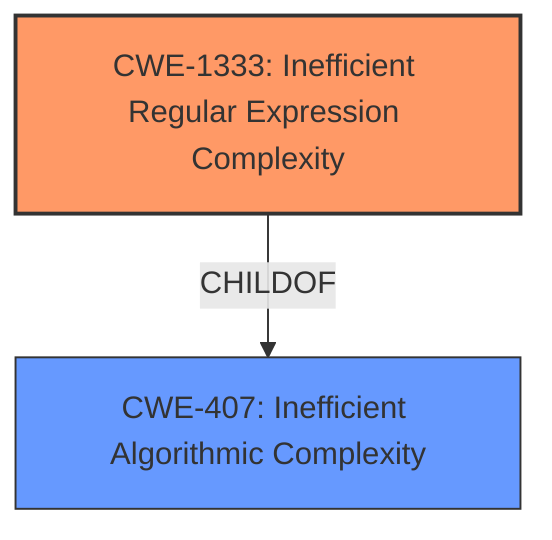

# Analysis Report for CVE-2021-41118

# Vulnerability Analysis Report: CVE-2021-41118

## Description


## Analysis (with Relationship Data)

# Summary
| CWE ID | CWE Name | Confidence | CWE Abstraction Level | CWE Vulnerability Mapping Label | CWE-Vulnerability Mapping Notes |
|---|---|---|---|---|---|
| CWE-1333 | Inefficient Regular Expression Complexity | 0.9 | Base | Allowed | Primary CWE |
| CWE-407 | Inefficient Algorithmic Complexity | 0.7 | Class | Allowed-with-Review | Secondary Candidate |

## Evidence and Confidence

*   **Confidence Score:** 0.9
*   **Evidence Strength:** HIGH

## Relationship Analysis
The primary relationship influencing the CWE selection is the ChildOf relationship between CWE-1333 and CWE-407. CWE-1333 is a more specific instance of CWE-407, detailing inefficient algorithmic complexity specifically related to regular expressions. Since the vulnerability description explicitly mentions "regular expression date" and "ReDoS (Regex Denial of Service)", CWE-1333 is the more appropriate and specific choice.



## Vulnerability Chain
The vulnerability chain consists of the **unsanitised input of regular expression date**, which leads to **ReDoS (Regex Denial of Service)**.

## Summary of Analysis
The analysis strongly supports the selection of CWE-1333 as the primary CWE. The vulnerability description explicitly mentions "unsanitised input of regular expression date" which allows "ReDoS (Regex Denial of Service)." The "CVE Reference Links Content Summary" states the **root cause** as: "The vulnerability stems from **unsanitized input of regular expression dates** within the parameters of the DynamicPageList3 (DPL) parser function." It also notes the **weaknesses/vulnerabilities** as: "The primary vulnerability is a ReDoS (Regular Expression Denial of Service) vulnerability."

CWE-1333, "Inefficient Regular Expression Complexity," directly addresses this scenario. The CWE description states: "The product uses a regular expression with an inefficient, possibly exponential worst-case computational complexity that consumes excessive CPU cycles." This aligns perfectly with the ReDoS vulnerability described.

The relationship graph shows that CWE-1333 is a child of CWE-407, "Inefficient Algorithmic Complexity." While CWE-407 is a broader category, CWE-1333 provides the necessary specificity for this vulnerability.

Therefore, CWE-1333 is the optimal choice due to its specific focus on regular expression-related denial-of-service vulnerabilities. The evidence and relationships support this decision, making it a high-confidence mapping.

Other CWEs Considered but Not Used:

*   CWE-407: Considered but deemed too general. CWE-1333 is a more specific child that better describes the vulnerability.
*   CWE-79, CWE-94, CWE-1321, CWE-1284: These CWEs relate to different types of vulnerabilities (XSS, code injection, prototype pollution, input validation), and the provided vulnerability description does not contain any information related to these other vulnerability types.
*   CWE-184: While an incomplete list of disallowed inputs *could* relate to unsanitized input, the core issue is about the complexity of the regular expression itself, not a failure to disallow specific characters.
*   CWE-863: Incorrect authorization is not relevant because the vulnerability stems from processing unsanitized input, not a failure to check permissions.
*   CWE-201: Insertion of Sensitive Information Into Sent Data is not relevant. There is no mention of sensitive data being leaked.
*   CWE-674: Uncontrolled recursion is not directly linked to the regular expression issue. While ReDoS can lead to excessive resource consumption, the root cause is the inefficient regex.
*   CWE-400 was listed in the CVE, but per the CWE specifications, this is very high level and should be avoided if a better match can be made.

Relevant CWE Information:

## CWE-184: Incomplete List of Disallowed Inputs
**Abstraction Level**: Base
**Similarity Score**: 0.78
**Source**: dense

**Description**:
The product implements a protection mechanism that relies on a list of inputs (or properties of inputs) that are not allowed by policy or otherwise require other action to neutralize before additional processing takes place, but the list is incomplete.

**Mapping Guidance**:
- Usage: Allowed
- Rationale: This CWE entry is at the Base level of abstraction, which is a preferred level of abstraction for mapping to the root causes of vulnerabilities.


## CWE-1289: Improper Validation of Unsafe Equivalence in Input
**Abstraction Level**: Base
**Similarity Score**: 0.77
**Source**: dense

**Description**:
The product receives an input value that is used as a resource identifier or other type of reference, but it does not validate or incorrectly validates that the input is equivalent to a potentially-unsafe value.

**Mapping Guidance**:
- Usage: Allowed
- Rationale: This CWE entry is at the Base level of abstraction, which is a preferred level of abstraction for mapping to the root causes of vulnerabilities.


## CWE-74: Improper Neutralization of Special Elements in Output Used by a Downstream Component ('Injection')
**Abstraction Level**: Class
**Similarity Score**: 0.77
**Source**: dense

**Description**:
The product constructs all or part of a command, data structure, or record using externally-influenced input from an upstream component, but it does not neutralize or incorrectly neutralizes special elements that could modify how it is parsed or interpreted when it is sent to a downstream component.

**Mapping Guidance**:
- Usage: Discouraged
- Rationale: CWE-74 is high-level and often misused when lower-level weaknesses are more appropriate.


## CWE-138: Improper Neutralization of Special Elements
**Abstraction Level**: Class
**Similarity Score**: 0.77
**Source**: dense

**Description**:
The product receives input from an upstream component, but it does not neutralize or incorrectly neutralizes special elements that could be interpreted as control elements or syntactic markers when they are sent to a downstream component.

**Mapping Guidance**:
- Usage: Discouraged
- Rationale: This CWE entry is a level-1 Class (i.e., a child of a Pillar). It might have lower-level children that would be more appropriate


## CWE-407: Inefficient Algorithmic Complexity
**Abstraction Level**: Class
**Similarity Score**: 0.77
**Source**: dense

**Description**:
An algorithm in a product has an inefficient worst-case computational complexity that may be detrimental to system performance and can be triggered by an attacker, typically using crafted manipulations that ensure that the worst case is being reached.

**Mapping Guidance**:
- Usage: Allowed-with-Review
- Rationale: This CWE entry is a Class and might have Base-level children that would be more appropriate


## CWE-799: Improper Control of Interaction Frequency
**Abstraction Level**: Class
**Similarity Score**: 0.77
**Source**: dense

**Description**:
The product does not properly limit the number or frequency of interactions that it has with an actor, such as the number of incoming requests.

**Mapping Guidance**:
- Usage: Allowed-with-Review
- Rationale: This CWE entry is a Class and might have Base-level children that would be more appropriate


## CWE-668: Exposure of Resource to Wrong Sphere
**Abstraction Level**: Class
**Similarity Score**: 0.76
**Source**: dense

**Description**:
The product exposes a resource to the wrong control sphere, providing unintended actors with inappropriate access to the resource.

**Mapping Guidance**:
- Usage: Discouraged
- Rationale: CWE-668 is high-level and is often misused as a catch-all when lower-level CWE IDs might be applicable. It is sometimes used for low-information vulnerability reports [REF-1287]. It is a level-1 Class (i.e., a child of a Pillar). It is not useful for trend analysis.


## CWE-41: Improper Resolution of Path Equivalence
**Abstraction Level**: Base
**Similarity Score**: 0.76
**Source**: dense

**Description**:
The product is vulnerable to file system contents disclosure through path equivalence. Path equivalence involves the use of special characters in file and directory names. The associated manipulations are intended to generate multiple names for the same object.

**Mapping Guidance**:
- Usage: Allowed
- Rationale: This CWE entry is at the Base level of abstraction, which is a preferred level of abstraction for mapping to the root causes of vulnerabilities.


## CWE-472: External Control of Assumed-Immutable Web Parameter
**Abstraction Level**: Base
**Similarity Score**: 0.76
**Source**: dense

**Description**:
The web application does not sufficiently verify inputs


## CWE Relationship Analysis

Current CWEs represent these abstraction levels: .


### Vulnerability Chain Analysis

**Chain starting from CWE-79:**
- 79 (Improper Neutralization of Input During Web Page Generation ('Cross-site Scripting')) - ROOT


**Chain starting from CWE-674:**
- 674 (Uncontrolled Recursion) - ROOT


### CWE Relationship Diagram

```mermaid
graph TD
    classDef primary fill:#f96,stroke:#333,stroke-width:2px
    classDef secondary fill:#69f,stroke:#333
    classDef tertiary fill:#9e9,stroke:#333
```


*Report generated on 2025-04-02 04:22:55*
