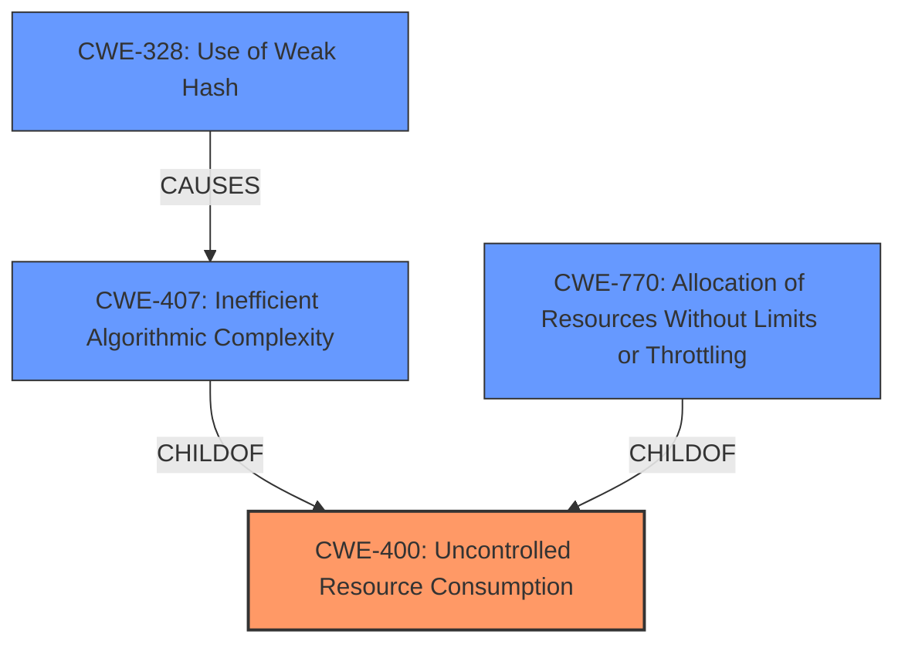

# Enhanced Analysis for CVE-2021-41119

# Summary
| CWE ID  | CWE Name  | Confidence | CWE Abstraction Level | CWE Vulnerability Mapping Label | CWE-Vulnerability Mapping Notes |
|---|---|---|---|---|---|
| CWE-400 | Uncontrolled Resource Consumption | 1.0 | Class | Primary | Allowed-with-Review |
| CWE-770 | Allocation of Resources Without Limits or Throttling | 0.9 | Base | Secondary | Allowed |
| CWE-407 | Inefficient Algorithmic Complexity | 0.8 | Class | Secondary | Allowed-with-Review |
| CWE-328 | Use of Weak Hash | 0.7 | Base | Secondary | Allowed |

## Evidence and Confidence

*   **Confidence Score:** 0.9
*   **Evidence Strength:** HIGH

## Relationship Analysis
The primary weakness is the uncontrolled resource consumption, which can be attributed to inefficient algorithmic complexity due to a hash collision. The use of a weak hash contributes to the hash collision, leading to the inefficient algorithm. The allocation of resources without limits or throttling further exacerbates the uncontrolled resource consumption, ultimately leading to a **denial of service**.



## Vulnerability Chain
The chain of events is:
1.  Use of a **weak hash** (CWE-328)
2.  Leads to **hash collision**
3.  Causes **inefficient algorithmic complexity** (CWE-407)
4.  Results in **uncontrolled resource consumption** (CWE-400) due to **allocation of resources without limits or throttling** (CWE-770)
5.  Culminates in a **denial of service**.

## Summary of Analysis
The initial assessment considered CWE-407, CWE-770, and CWE-328. After reviewing the vulnerability description and the CVE Reference Links Content Summary, the root cause is a **hash collision** due to a **weak hash function**, leading to **inefficient processing** and ultimately a **denial of service**.

The primary CWE is CWE-400 (Uncontrolled Resource Consumption) because the vulnerability ultimately results in the consumption of excessive resources, leading to a **denial of service**. This is directly supported by the vulnerability description stating that a crafted object causing a **hash collision** leads to the server spending quadratic time parsing it, which can lead to a **denial of service**.

CWE-770 (Allocation of Resources Without Limits or Throttling) is a contributing factor as the server allocates resources without properly limiting or throttling them, which exacerbates the impact of the hash collision.

CWE-407 (Inefficient Algorithmic Complexity) is relevant because the **hash collision** leads to the server spending an excessive amount of time parsing the crafted object, indicating an inefficiency in the algorithm's complexity.

CWE-328 (Use of Weak Hash) is also relevant as the root cause because the vulnerability stems from the use of the FNV hash function, which is **vulnerable to hash collisions**, as stated in the CVE Reference Links Content Summary.

The graph relationships helped clarify the chain of events, starting from the **weak hash** to the eventual **denial of service**.

The selected CWEs are at an appropriate level of specificity, with CWE-400 being a class-level CWE that accurately represents the overall impact, while CWE-770, CWE-407, and CWE-328 provide more specific details about the underlying causes and contributing factors.

Relevant CWE Information:

# Enhanced Context (25 CWEs)
The following CWEs were identified as potentially relevant to this vulnerability:

## CWE-407: Inefficient Algorithmic Complexity
**Abstraction Level**: Class
**Similarity Score**: 0.80
**Source**: dense

**Description**:
An algorithm in a product has an inefficient worst-case computational complexity that may be detrimental to system performance and can be triggered by an attacker, typically using crafted manipulations that ensure that the worst case is being reached.

**Mapping Guidance**:
- Usage: Allowed-with-Review
- Rationale: This CWE entry is a Class and might have Base-level children that would be more appropriate

## CWE-226: Sensitive Information in Resource Not Removed Before Reuse
**Abstraction Level**: Base
**Similarity Score**: 0.79
**Source**: dense

**Description**:
The product releases a resource such as memory or a file so that it can be made available for reuse, but it does not clear or "zeroize" the information contained in the resource before the product performs a critical state transition or makes the resource available for reuse by other entities.

**Mapping Guidance**:
- Usage: Allowed
- Rationale: This CWE entry is at the Base level of abstraction, which is a preferred level of abstraction for mapping to the root causes of vulnerabilities.

## CWE-789: Memory Allocation with Excessive Size Value
**Abstraction Level**: Variant
**Similarity Score**: 0.78
**Source**: dense

**Description**:
The product allocates memory based on an untrusted, large size value, but it does not ensure that the size is within expected limits, allowing arbitrary amounts of memory to be allocated.

**Mapping Guidance**:
- Usage: Allowed
- Rationale: This CWE entry is at the Variant level of abstraction, which is a preferred level of abstraction for mapping to the root causes of vulnerabilities.

## CWE-405: Asymmetric Resource Consumption (Amplification)
**Abstraction Level**: Class
**Similarity Score**: 0.78
**Source**: dense

**Description**:
The product does not properly control situations in which an adversary can cause the product to consume or produce excessive resources without requiring the adversary to invest equivalent work or otherwise prove authorization, i.e., the adversary's influence is "asymmetric."

**Mapping Guidance**:
- Usage: Allowed-with-Review
- Rationale: This CWE entry is a Class and might have Base-level children that would be more appropriate

## CWE-404: Improper Resource Shutdown or Release
**Abstraction Level**: Class
**Similarity Score**: 0.77
**Source**: dense

**Description**:
The product does not release or incorrectly releases a resource before it is made available for re-use.

**Mapping Guidance**:
- Usage: Allowed-with-Review
- Rationale: This CWE entry is a Class and might have Base-level children that would be more appropriate

## CWE-328: Use of Weak Hash
**Abstraction Level**: Base
**Similarity Score**: 0.77
**Source**: dense

**Description**:
The product uses an algorithm that produces a digest (output value) that does not meet security expectations for a hash function that allows an adversary to reasonably determine the original input (preimage attack), find another input that can produce the same hash (2nd preimage attack), or find multiple inputs that evaluate to the same hash (birthday attack).

**Mapping Guidance**:
- Usage: Allowed
- Rationale: This CWE entry is at the Base level of abstraction, which is a preferred level of abstraction for mapping to the root causes of vulnerabilities.

## CWE-799: Improper Control of Interaction Frequency
**Abstraction Level**: Class
**Similarity Score**: 0.76
**Source**: dense

**Description**:
The product does not properly limit the number or frequency of interactions that it has with an actor, such as the number of incoming requests.

**Mapping Guidance**:
- Usage: Allowed-with-Review
- Rationale: This CWE entry is a Class and might have Base-level children that would be more appropriate

## CWE-668: Exposure of Resource to Wrong Sphere
**Abstraction Level**: Class
**Similarity Score**: 0.76
**Source**: dense

**Description**:
The product exposes a resource to the wrong control sphere, providing unintended actors with inappropriate access to the resource.

**Mapping Guidance**:
- Usage: Discouraged
- Rationale: CWE-668 is high-level and is often misused as a catch-all when lower-level CWE IDs might be applicable. It is sometimes used for low-information vulnerability reports [REF-1287]. It is a level-1 Class (i.e., a child of a Pillar). It is not useful for trend analysis.

## CWE-755: Improper Handling of Exceptional Conditions
**Abstraction Level**: Class
**Similarity Score**: 0.75
**Source**: dense


## CWE Relationship Analysis

Current CWEs represent these abstraction levels: .


### Vulnerability Chain Analysis

**Chain starting from CWE-404:**
- 404 (Improper Resource Shutdown or Release) - ROOT


**Chain starting from CWE-755:**
- 755 (Improper Handling of Exceptional Conditions) - ROOT


### CWE Relationship Diagram

```mermaid
graph TD
    classDef primary fill:#f96,stroke:#333,stroke-width:2px
    classDef secondary fill:#69f,stroke:#333
    classDef tertiary fill:#9e9,stroke:#333
```