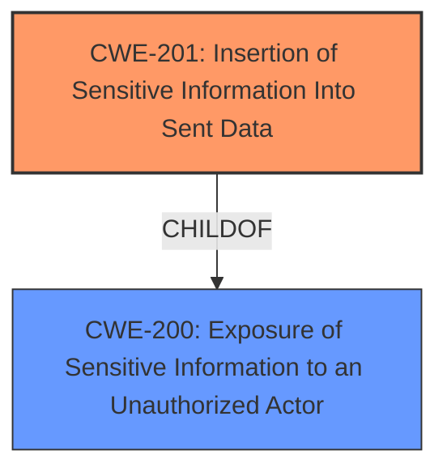

# Analysis Report for CVE-2021-41124

# Vulnerability Analysis Report: CVE-2021-41124

## Description


## Analysis (with Relationship Data)

# Summary
| CWE ID    | CWE Name                                                           | Confidence | CWE Abstraction Level | CWE Vulnerability Mapping Label | CWE-Vulnerability Mapping Notes |
| :-------- | :----------------------------------------------------------------- | :--------- | :---------------------- | :------------------------------ | :------------------------------ |
| CWE-201   | Insertion of Sensitive Information Into Sent Data                  | 0.9        | Base                    | Allowed                         | Primary CWE                     |
| CWE-200   | Exposure of Sensitive Information to an Unauthorized Actor         | 0.7        | Class                   | Discouraged                     | Secondary Candidate             |

## Evidence and Confidence

*   **Confidence Score:** 0.8
*   **Evidence Strength:** HIGH

## Relationship Analysis
The primary relationship that influenced the selection was the parent-child relationship between CWE-200 and CWE-201. CWE-201 is a more specific case of CWE-200, where the **sensitive information** is specifically being inserted into sent data. The vulnerability description clearly indicates that credentials are being sent in requests, which aligns well with CWE-201.



## Vulnerability Chain
The vulnerability chain starts with **improper configuration** of the `HttpAuthMiddleware`, leading to the **exposure of credentials** in requests, and ultimately, the **unauthorized access** to the Splash server.

## Summary of Analysis
The initial analysis identified several potential CWEs, including CWE-200, CWE-201, and CWE-212. However, after carefully reviewing the vulnerability description and the provided context, I concluded that CWE-201 is the most appropriate mapping. This decision is based on the fact that the vulnerability involves the **insertion of sensitive information** (credentials) into requests, which directly aligns with the description of CWE-201.

The vulnerability description explicitly states that the `HttpAuthMiddleware` **incorrectly** adds authentication credentials to all requests, including those not intended for the Splash server. This means that the credentials are being **inserted into sent data**, which is the core characteristic of CWE-201.

The MITRE mapping guidance for CWE-201 allows its usage and states, "This CWE entry is at the Base level of abstraction, which is a preferred level of abstraction for mapping to the root causes of vulnerabilities." This further supports the selection of CWE-201.

While CWE-200 could also be considered, it is a more general class of weakness. Since the evidence strongly supports the specific case of credentials being inserted into sent data, CWE-201 is the more precise and informative mapping.

The evidence to support this is found in the **Vulnerability Description Key Phrases**:
- **rootcause:** **insecure authentication**
- **impact:** expose credentials to the request target

And also in the **CVE Reference Links Content Summary**:
- **Credential Exposure:** When `HttpAuthMiddleware` is used with `http_user` and `http_pass` spider attributes for Splash authentication, these credentials are added to the headers of every request. This includes non-Splash requests such as those to `robots.txt` when `ROBOTSTXT_OBEY` is enabled, potentially leaking the Splash server's authentication details to unintended targets.

Relevant CWE Information:

# Enhanced Context (25 CWEs)

## CWE-226: Sensitive Information in Resource Not Removed Before Reuse
**Abstraction Level**: Base
**Similarity Score**: 0.77
**Source**: dense

**Description**:
The product releases a resource such as memory or a file so that it can be made available for reuse, but it does not clear or "zeroize" the information contained in the resource before the product performs a critical state transition or makes the resource available for reuse by other entities.

**Mapping Guidance**:
- Usage: Allowed
- Rationale: This CWE entry is at the Base level of abstraction, which is a preferred level of abstraction for mapping to the root causes of vulnerabilities.

*This CWE was considered but rejected because the vulnerability does not involve reusing a resource without clearing sensitive information. Instead, it involves including sensitive information in network requests.*

## CWE-668: Exposure of Resource to Wrong Sphere
**Abstraction Level**: Class
**Similarity Score**: 0.75
**Source**: dense

**Description**:
The product exposes a resource to the wrong control sphere, providing unintended actors with inappropriate access to the resource.

**Mapping Guidance**:
- Usage: Discouraged
- Rationale: CWE-668 is high-level and is often misused as a catch-all when lower-level CWE IDs might be applicable. It is sometimes used for low-information vulnerability reports [REF-1287]. It is a level-1 Class (i.e., a child of a Pillar). It is not useful for trend analysis.

*This CWE was considered but rejected as it is too high level and is discouraged according to its mapping guidance.*

## CWE-212: Improper Removal of Sensitive Information Before Storage or Transfer
**Abstraction Level**: Base
**Similarity Score**: 0.75
**Source**: dense

**Description**:
The product stores, transfers, or shares a resource that contains sensitive information, but it does not properly remove that information before the product makes the resource available to unauthorized actors.

**Mapping Guidance**:
- Usage: Allowed
- Rationale: This CWE entry is at the Base level of abstraction, which is a preferred level of abstraction for mapping to the root causes of vulnerabilities.

*This CWE was considered but not selected because the vulnerability is not about failing to remove **sensitive information** before storage or transfer. The problem is that **sensitive information** is being added in transit.*

## CWE-404: Improper Resource Shutdown or Release
**Abstraction Level**: Class
**Similarity Score**: 0.75
**Source**: dense

**Description**:
The product does not release or incorrectly releases a resource before it is made available for re-use.

**Mapping Guidance**:
- Usage: Allowed-with-Review
- Rationale: This CWE entry is a Class and might have Base-level children that would be more appropriate

*This CWE was not selected because the vulnerability does not involve improper resource shutdown or release.*

## CWE-41: Improper Resolution of Path Equivalence
**Abstraction Level**: Base
**Similarity Score**: 0.75
**Source**: dense

**Description**:
The product is vulnerable to file system contents disclosure through path equivalence. Path equivalence involves the use of special characters in file and directory names. The associated manipulations are intended to generate multiple names for the same object.

**Mapping Guidance**:
- Usage: Allowed
- Rationale: This CWE entry is at the Base level of abstraction, which is a preferred level of abstraction for mapping to the root causes of vulnerabilities.

*This CWE was not selected because the vulnerability does not involve path equivalence issues.*

## CWE-74: Improper Neutralization of Special Elements in Output Used by a Downstream Component ('Injection')
**Abstraction Level**: Class
**Similarity Score**: 0.75
**Source**: dense

**Description**:
The product constructs all or part of a command, data structure, or record using externally-influenced input from an upstream component, but it does not neutralize or incorrectly neutralizes special elements that could modify how it is parsed or interpreted when it is sent to a downstream component.

**Mapping Guidance**:
- Usage: Discouraged
- Rationale: CWE-74 is high-level and often misused when lower-level weaknesses are more appropriate.

*This CWE was not selected because the vulnerability does not involve injection of special elements.*

## CWE-665: Improper Initialization
**Abstraction Level**: Class
**Similarity Score**: 0.75
**Source**: dense

**Description**:
The product does not initialize or incorrectly initializes a resource, which might leave the resource in an unexpected state when it is accessed or used.

**Mapping Guidance**:
- Usage: Discouraged
- Rationale: This CWE entry is a level-1 Class (i.e., a child of a Pillar). It might have lower-level children that would be more appropriate

*This CWE was considered but not selected. While the **insecure authentication** could be linked to **improper initialization**, CWE-201 directly addresses the core issue of **sensitive data insertion**.*

## CWE-807: Reliance on Untrusted Inputs in a Security Decision
**Abstraction Level**: Base
**Similarity Score**: 0.75
**Source**: dense

**Description**:
The product uses a protection mechanism that relies on the existence or values of an input, but the input can be modified by an untrusted actor in a way that bypasses the protection mechanism.

**Mapping Guidance**:
- Usage: Allowed
- Rationale: This CWE entry is at the Base level of abstraction, which is a preferred level of abstraction for mapping to the root causes of vulnerabilities.

*This CWE was not selected because the vulnerability does not involve reliance on untrusted inputs


## CWE Relationship Analysis

Current CWEs represent these abstraction levels: .


### Vulnerability Chain Analysis

**Chain starting from CWE-404:**
- 404 (Improper Resource Shutdown or Release) - ROOT


**Chain starting from CWE-41:**
- 41 (Improper Resolution of Path Equivalence) - ROOT


### CWE Relationship Diagram

```mermaid
graph TD
    classDef primary fill:#f96,stroke:#333,stroke-width:2px
    classDef secondary fill:#69f,stroke:#333
    classDef tertiary fill:#9e9,stroke:#333
```


*Report generated on 2025-04-02 03:28:50*
