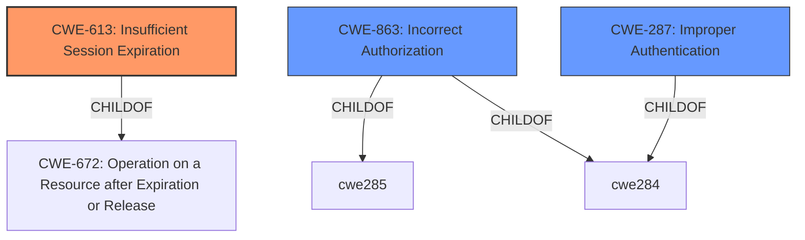

# Raw Analyzer Response for CVE-2021-41126

# Summary
| CWE ID | CWE Name | Confidence | CWE Abstraction Level | CWE Vulnerability Mapping Label | CWE-Vulnerability Mapping Notes |
|---|---|---|---|---|---|
| CWE-613 | Insufficient Session Expiration | 0.8 | Base | Allowed | Primary CWE |
| CWE-863 | Incorrect Authorization | 0.7 | Class | Allowed-with-Review | Secondary Candidate |
| CWE-287 | Improper Authentication | 0.6 | Class | Discouraged | Secondary Candidate |

## Evidence and Confidence

*   **Confidence Score:** 0.8
*   **Evidence Strength:** HIGH

## Relationship Analysis
The primary CWE selected is CWE-613, which is a Base level CWE, offering specificity. It is a child of CWE-672. CWE-863 and CWE-287 were also considered due to their relevance to authorization and authentication issues, but ultimately deemed less specific than CWE-613 in addressing the root cause of the vulnerability.

## Vulnerability Chain
The vulnerability chain begins with the **failure to properly invalidate sessions** upon account deletion. This leads to the ability for deleted accounts to still authenticate and gain access to the backend, resulting in potential data breaches and unauthorized actions.

## Summary of Analysis
Initially, several CWEs were considered, including CWE-863 (**Incorrect Authorization**) and CWE-287 (**Improper Authentication**). However, after a more thorough review, CWE-613 (**Insufficient Session Expiration**) was determined to be the most accurate representation of the vulnerability's root cause. The vulnerability description and CVE details highlight that the core issue is the **failure to properly expire sessions** or invalidate authentication tokens associated with deleted accounts.

The "CVE Reference Links Content Summary" section states: "The vulnerability stems from a flaw in the authentication logic of October CMS where deleted administrator accounts could still sign in to the admin interface, provided they had prior access." Further, it states: "**Insufficient Session Management:** The system failed to properly invalidate or revoke authentication tokens/sessions associated with deleted administrator accounts."

This statement provides direct evidence supporting the selection of CWE-613. While CWE-863 and CWE-287 are related to authorization and authentication, they do not specifically address the problem of sessions not being properly terminated after an account is deleted. Therefore, CWE-613 offers the most precise and relevant mapping.

Relevant CWE Information:

# Enhanced Context (25 CWEs)

## CWE-613: Insufficient Session Expiration
**Abstraction Level**: base
**Similarity Score**: 4.33
**Source**: graph

**Description**:
CWE-613: Insufficient Session Expiration

**Mapping Guidance**:
- Usage: Allowed
- Rationale: This CWE entry is at the Base level of abstraction, which is a preferred level of abstraction for mapping to the root causes of vulnerabilities.

**Relationships**:
- REQUIREDBY -> CWE-352
- CANPRECEDE -> CWE-287
- CHILDOF -> CWE-672
- CHILDOF -> CWE-672
- PARENTOF -> CWE-613

**CWE-613** is selected because it directly addresses the **root cause** of the vulnerability: the system's **failure to properly invalidate sessions** for deleted accounts. This allows these accounts to regain access even after they should have been revoked. The CWE description, "Insufficient Session Expiration," accurately describes the weakness. The Usage is Allowed, and its abstraction level is Base.

**CWE-863 (Incorrect Authorization)** was considered because the vulnerability leads to unauthorized access. However, the root cause is not an error in the authorization check itself but rather the continued validity of sessions after account deletion. Therefore, authorization is a consequence of the session management issue, not the primary weakness. The Usage is Allowed-with-Review, and its abstraction level is Class, which is less specific.

**CWE-287 (Improper Authentication)** was also considered, as the deleted accounts are still able to authenticate. However, the authentication mechanism itself might not be flawed. The problem lies in the **failure to terminate the session** upon deletion, allowing the old credentials to remain valid. Therefore, CWE-287 is not as precise as CWE-613. The Usage is Discouraged, and its abstraction level is Class, which is less specific.

Other CWEs like CWE-303, CWE-74, CWE-807, CWE-1390, CWE-1289, CWE-639, CWE-184, CWE-1391, CWE-472, CWE-41, CWE-1336, CWE-116, CWE-22, CWE-78, CWE-79, CWE-434, CWE-94, CWE-98, CWE-178 and CWE-917 were considered and ruled out as they were not relevant to the vulnerability description.