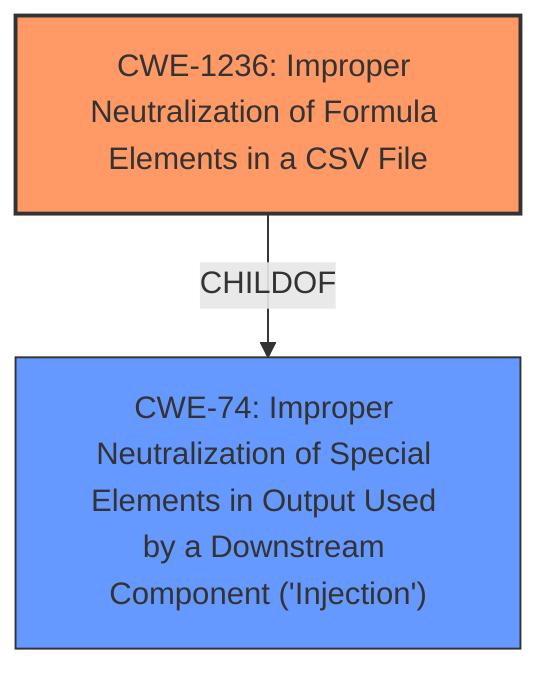

# Analysis for CVE-2021-41128

# Summary

| CWE ID  | CWE Name                                                                                           | Confidence | CWE Abstraction Level | CWE Vulnerability Mapping Label | CWE-Vulnerability Mapping Notes |
| :-------- | :------------------------------------------------------------------------------------------------- | :---------- | :---------------------- | :-------------------------------- | :------------------------------ |
| CWE-1236  | Improper Neutralization of Formula Elements in a CSV File                                        | 1          | Base                    | Primary                           | Allowed                         |
| CWE-74 | Improper Neutralization of Special Elements in Output Used by a Downstream Component ('Injection') | 0.6         | Class                    | Secondary                         | Discouraged                     |

## Evidence and Confidence

*   **Confidence Score:** 0.9
*   **Evidence Strength:** HIGH

## Relationship Analysis

The primary CWE identified is CWE-1236, which is a base-level CWE focusing on the specific issue of formula injection in CSV files. This is a child of the more general CWE-74 (Improper Neutralization of Special Elements in Output Used by a Downstream Component ('Injection')). While CWE-74 is a broader class, CWE-1236 directly addresses the vulnerability described.

## Vulnerability Chain

The vulnerability chain starts with the **lack of sanitization** of user-provided input. This leads to the ability to inject formulas into CSV files. When the CSV file is opened, the spreadsheet software executes these formulas, potentially leading to code execution or data exfiltration.

## Summary of Analysis

The initial assessment identified **CSV injection** as the primary issue, supported by the "Vulnerability Description Key Phrases" section. The "CVE Reference Links Content Summary" further confirms this, detailing the **lack of proper sanitization** as the root cause.

The Retriever results strongly suggest CWE-1236 (Improper Neutralization of Formula Elements in a CSV File), with a score of 1.000. This CWE precisely matches the vulnerability description, focusing on the failure to neutralize special elements in CSV files that can be interpreted as commands.

CWE-74 (Improper Neutralization of Special Elements in Output Used by a Downstream Component ('Injection')) was considered as a more general classification, but given the specificity of the vulnerability to CSV files, CWE-1236 is more appropriate. The mapping guidance for CWE-74 advises against its use when lower-level weaknesses are more fitting.

Therefore, the final decision is to classify this vulnerability as CWE-1236, with a confidence score of 1.0. The selection is based on the vulnerability description, CVE details, Retriever results, and CWE specifications. The evidence supports this classification, as it accurately captures the root cause and nature of the vulnerability.

Relevant CWE Information:

# Enhanced Context (25 CWEs)

## CWE-1236: Improper Neutralization of Formula Elements in a CSV File
**Abstraction Level**: Base
**Similarity Score**: 0.75
**Source**: dense

**Description**:
The product saves user-provided information into a Comma-Separated Value (CSV) file, but it does not neutralize or incorrectly neutralizes special elements that could be interpreted as a command when the file is opened by a spreadsheet product.

### Technical Explanation for CWE-1236
The vulnerability occurs because the application fails to sanitize user input before exporting it to a CSV file. Spreadsheet programs interpret certain characters (e.g., `=`, `+`, `-`, `@`) at the beginning of a cell as the start of a formula. An attacker can inject malicious formulas that, when executed by the spreadsheet program, can lead to arbitrary code execution or information disclosure. This matches the CWE description which states "the product saves user-provided information into a Comma-Separated Value (CSV) file, but it does not neutralize or incorrectly neutralizes special elements that could be interpreted as a command when the file is opened by a spreadsheet product."

*   **Security Implications and Potential Impact:** This can lead to arbitrary code execution, data exfiltration, or other malicious activities when a user opens the CSV file with a vulnerable spreadsheet program.
*   **Parent-Child Relationships:** CWE-1236 is a child of CWE-74, making it a more specific type of injection vulnerability.
*   **Primary/Secondary:** This is the primary weakness.
*   **MITRE Mapping Guidance:** The usage is "Allowed," which supports using this CWE.

### Technical Explanation for CWE-74
CWE-74 is a broad category that covers cases where a product uses external input to construct a command, data structure, or record but fails to neutralize special elements that could modify how it's parsed or interpreted by a downstream component. While CSV injection technically falls under this umbrella, CWE-1236 is a more precise classification. The vulnerability description states "The product constructs all or part of a command, data structure, or record using externally-influenced input from an upstream component, but it does not neutralize or incorrectly neutralizes special elements that could modify how it is parsed or interpreted when it is sent to a downstream component."

*   **Security Implications and Potential Impact:** Can lead to various injection attacks, depending on the downstream component.
*   **Parent-Child Relationships:** CWE-74 is a parent to numerous injection-related CWEs.
*   **Primary/Secondary:** Secondary, as CWE-1236 is more specific.
*   **MITRE Mapping Guidance:** The usage is "Discouraged," suggesting the use of a more specific CWE.

### Considered but Not Used
CWE-79 (Improper Neutralization of Input During Web Page Generation ('Cross-site Scripting')): While the vulnerability involves injecting code, it's not directly related to web page generation. The context is a CSV file, not a web page.

CWE-138 (Improper Neutralization of Special Elements): This is a class-level CWE and too general compared to CWE-1236, which directly addresses the CSV injection issue.

CWE-116 (Improper Encoding or Escaping of Output): While encoding/escaping is a potential mitigation, the core issue is the lack of neutralization of formula elements, making CWE-1236 more accurate.

CWE-94 (Improper Control of Generation of Code ('Code Injection')): Code injection is a potential impact, but the root cause is the improper handling of formula elements in a CSV file, making CWE-1236 a better fit.

CWE-89 (Improper Neutralization of Special Elements used in an SQL Command ('SQL Injection')): Not relevant as the vulnerability is not related to SQL commands.

CWE-113 (Improper Neutralization of CRLF Sequences in HTTP Headers ('HTTP Request/Response Splitting')): Not relevant as the vulnerability is not related to HTTP headers.

CWE-1336 (Improper Neutralization of Special Elements Used in a Template Engine): Not relevant as the vulnerability is not related to template engines.

CWE-201 (Insertion of Sensitive Information Into Sent Data): Not relevant as the vulnerability is not focused on the insertion of sensitive information.

CWE-789 (Memory Allocation with Excessive Size Value): Not relevant as the vulnerability is not focused on memory allocation.