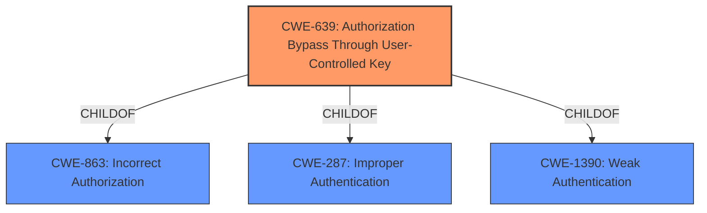

# Raw Analyzer Response for CVE-2021-41129

# Summary
| CWE ID | CWE Name | Confidence | CWE Abstraction Level | CWE Vulnerability Mapping Label | CWE-Vulnerability Mapping Notes |
|---|---|---|---|---|---|
| CWE-639 | Authorization Bypass Through User-Controlled Key | 0.9 | Base | Allowed | Primary CWE |
| CWE-287 | Improper Authentication | 0.7 | Class | Discouraged | Secondary Candidate |
| CWE-1390 | Weak Authentication | 0.6 | Class | Allowed-with-Review | Secondary Candidate |

## Evidence and Confidence

*   **Confidence Score:** 0.8
*   **Evidence Strength:** HIGH

## Relationship Analysis
The primary CWE selected is CWE-639, a Base level CWE. This has parent relationship to CWE-863 (Incorrect Authorization). CWE-287 and CWE-1390 are also parents to CWE-639. The analysis favored a base level CWE over Class level CWEs such as CWE-287 and CWE-1390.

## Vulnerability Chain
The vulnerability chain starts with a **validation flaw in the logic handling user authentication during the two-factor authentication process**. This leads to an **authentication bypass** where an attacker can modify the `confirmation_token` to reference arbitrary cache values. The final impact is the ability to authenticate as a random user.

## Summary of Analysis
The initial assessment identified CWE-639 as the primary candidate based on the **root cause** and the vulnerability description. The vulnerability involves manipulating a `confirmation_token` to reference an arbitrary cache value, effectively bypassing authorization checks and allowing access to another user's account.

The evidence from the vulnerability description includes: "Due to a **validation flaw in the logic handling user authentication during the two-factor authentication process** a malicious user can trick the system into loading credentials for an arbitrary user by modifying the token sent to the server." This clearly indicates a user-controlled key (the `confirmation_token`) being used to bypass authorization.

The CVE Reference Links Content Summary further supports this: "The vulnerability stems from a flaw in the two-factor authentication process where the `LoginCheckpointController` uses a user-controlled `confirmation_token` to retrieve a user ID from the cache. This token is expected to be a random string referencing a cached user ID. However, the system doesn't validate that the token is associated with the current login attempt, allowing an attacker to manipulate the token and reference other cached integer values, potentially corresponding to different user IDs."

The graph relationships reinforce the selection of CWE-639, as it is a more specific Base CWE compared to the broader Class CWEs like CWE-287 and CWE-1390. The selection is at the optimal level of specificity, accurately representing the weakness where a user-controlled key is used to bypass authorization.

CWE-287 (Improper Authentication) was considered but deemed less specific. While the vulnerability does lead to an authentication bypass, the root cause is the improper use of a user-controlled key in the authorization process, making CWE-639 a more accurate representation.

CWE-1390 (Weak Authentication) was also considered, but it is also a more general Class-level CWE. The vulnerability is not merely a weak authentication mechanism but a specific flaw where authorization is bypassed due to the lack of validation of a user-controlled key.

CWE-798 (Use of Hard-coded Credentials) and CWE-259 (Use of Hard-coded Password) were not selected because the vulnerability does not involve hard-coded credentials. The issue is related to the improper handling of a user-controlled key in the authorization process.

Relevant CWE Information:

# Enhanced Context (25 CWEs)
The following CWEs were identified as potentially relevant to this vulnerability:

## CWE-1391: Use of Weak Credentials
**Abstraction Level**: Class
**Similarity Score**: 0.79
**Source**: dense

**Description**:
The product uses weak credentials (such as a default key or hard-coded password) that can be calculated, derived, reused, or guessed by an attacker.

**Mapping Guidance**:
- Usage: Allowed-with-Review
- Rationale: This CWE entry is a Class and might have Base-level children that would be more appropriate

## CWE-303: Incorrect Implementation of Authentication Algorithm
**Abstraction Level**: Base
**Similarity Score**: 0.79
**Source**: dense

**Description**:
The requirements for the product dictate the use of an established authentication algorithm, but the implementation of the algorithm is incorrect.

**Mapping Guidance**:
- Usage: Allowed
- Rationale: This CWE entry is at the Base level of abstraction, which is a preferred level of abstraction for mapping to the root causes of vulnerabilities.

## CWE-345: Insufficient Verification of Data Authenticity
**Abstraction Level**: Class
**Similarity Score**: 0.78
**Source**: dense

**Description**:
The product does not sufficiently verify the origin or authenticity of data, in a way that causes it to accept invalid data.

**Mapping Guidance**:
- Usage: Discouraged
- Rationale: This CWE entry is a level-1 Class (i.e., a child of a Pillar). It might have lower-level children that would be more appropriate

## CWE-1240: Use of a Cryptographic Primitive with a Risky Implementation
**Abstraction Level**: Base
**Similarity Score**: 0.78
**Source**: dense

**Description**:
To fulfill the need for a cryptographic primitive, the product implements a cryptographic algorithm using a non-standard, unproven, or disallowed/non-compliant cryptographic implementation.

**Mapping Guidance**:
- Usage: Allowed
- Rationale: This CWE entry is at the Base level of abstraction, which is a preferred level of abstraction for mapping to the root causes of vulnerabilities.

## CWE-1390: Weak Authentication
**Abstraction Level**: Class
**Similarity Score**: 0.77
**Source**: dense

**Description**:
The product uses an authentication mechanism to restrict access to specific users or identities, but the mechanism does not sufficiently prove that the claimed identity is correct.

**Mapping Guidance**:
- Usage: Allowed-with-Review
- Rationale: This CWE entry is a Class and might have Base-level children that would be more appropriate

## CWE-798: Use of Hard-coded Credentials
**Abstraction Level**: Base
**Similarity Score**: 0.77
**Source**: dense

**Description**:
The product contains hard-coded credentials, such as a password or cryptographic key.

**Mapping Guidance**:
- Usage: Allowed
- Rationale: This CWE entry is at the Base level of abstraction, which is a preferred level of abstraction for mapping to the root causes of vulnerabilities.

## CWE-807: Reliance on Untrusted Inputs in a Security Decision
**Abstraction Level**: Base
**Similarity Score**: 0.77
**Source**: dense

**Description**:
The product uses a protection mechanism that relies on the existence or values of an input, but the input can be modified by an untrusted actor in a way that bypasses the protection mechanism.

**Mapping Guidance**:
- Usage: Allowed
- Rationale: This CWE entry is at the Base level of abstraction, which is a preferred level of abstraction for mapping to the root causes of vulnerabilities.

## CWE-328: Use of Weak Hash
**Abstraction Level**: Base
**Similarity Score**: 0.77
**Source**: dense

**Description**:
The product uses an algorithm that produces a digest (output value) that does not meet security expectations for a hash function that allows an adversary to reasonably determine the original input (preimage attack), find another input that can produce the same hash (2nd preimage attack), or find multiple inputs that evaluate to the same hash (birthday attack).

**Mapping Guidance**:
- Usage: Allowed
- Rationale: This CWE entry is at the Base level of abstraction, which is a preferred level of abstraction for mapping to the root causes of vulnerabilities.

## CWE-330: Use of Insufficiently Random Values
**Abstraction Level**: Class
**Similarity Score**: 0.77
**Source**: dense

**Description**:
The product uses insufficiently random numbers or values in a security context that depends on unpredictable numbers.

**Mapping Guidance**:
- Usage: Discouraged
- Rationale: This CWE entry is a level-1 Class (