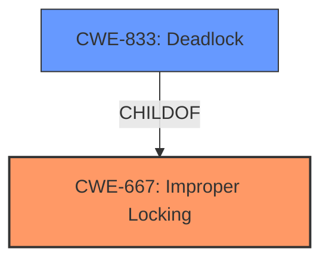

# Enhanced Analysis for CVE-2021-41141

# Summary
| CWE ID  | CWE Name                      | Confidence | CWE Abstraction Level | CWE Vulnerability Mapping Label | CWE-Vulnerability Mapping Notes |
|---------|-------------------------------|------------|-----------------------|---------------------------------|---------------------------------|
| CWE-667 | Improper Locking           | 1.0        | Class                 | Primary CWE                      | Allowed-with-Review             |
| CWE-833 | Deadlock                      | 0.8        | Base                  | Secondary CWE                    | Allowed                         |

## Evidence and Confidence

*   **Confidence Score:** 0.9
*   **Evidence Strength:** HIGH

## Relationship Analysis
The primary CWE is CWE-667, which is a Class-level CWE for Improper Locking. The vulnerability description clearly indicates that the **weakness** is that "**function returns without releasing held locks**". CWE-833 Deadlock is a child of CWE-667. The chain relationship is that improper locking (CWE-667) can lead to a deadlock (CWE-833).



## Vulnerability Chain
The chain of events is as follows:
1.  Error/failure occurs.
2.  Function returns without releasing held locks (**Improper Locking**, CWE-667).
3.  System deadlock occurs (**Deadlock**, CWE-833).
4.  Denial of service occurs.

## Summary of Analysis
The initial analysis strongly points to CWE-667 (**Improper Locking**) as the primary **weakness**, because the **function returns without releasing held locks**. The **impact** is a system deadlock leading to a denial of service. The retriever results also list CWE-667 as the top match. CWE-833 (**Deadlock**) is also a good match as this is the resulting state from the failure to release the locks. Given the direct evidence of **improper locking** and its resulting **deadlock**, the selection of CWE-667 and CWE-833 is at the optimal level of specificity, with CWE-667 representing the root cause and CWE-833 representing the immediate consequence.
Relevant evidence from the vulnerability description includes:

*   "**weakness:** **function returns without releasing held locks**"
*   "**impact:** system deadlock, denial of service"
*   "The vulnerability stems from missing lock releases in various parts of the PJSIP library when errors or failures occur. Specifically, functions return without releasing previously acquired locks upon encountering an issue."
*   "**Unreleased Locks:** The core issue is the failure to release held mutex locks when a function encounters an error or failure condition and returns early."
*   "**System Deadlock:** The primary impact is the potential for a system deadlock."

CWE-754 (**Improper Check for Unusual or Exceptional Conditions**) was considered but rejected because the core issue is not the lack of checking for error conditions, but the failure to release locks upon encountering those conditions.
CWE-401 (**Missing Release of Memory after Effective Lifetime**) was considered but rejected because the problem is with locks and not memory.
CWE-770 (**Allocation of Resources Without Limits or Throttling**) was considered but rejected because the problem is not related to resource limits or throttling, but the failure to release locks.


## CWE Relationship Analysis

Current CWEs represent these abstraction levels: .


### Vulnerability Chain Analysis

**Chain starting from CWE-667:**
- 667 (Improper Locking) - ROOT


**Chain starting from CWE-754:**
- 754 (Improper Check for Unusual or Exceptional Conditions) - ROOT


### CWE Relationship Diagram

```mermaid
graph TD
    classDef primary fill:#f96,stroke:#333,stroke-width:2px
    classDef secondary fill:#69f,stroke:#333
    classDef tertiary fill:#9e9,stroke:#333
```