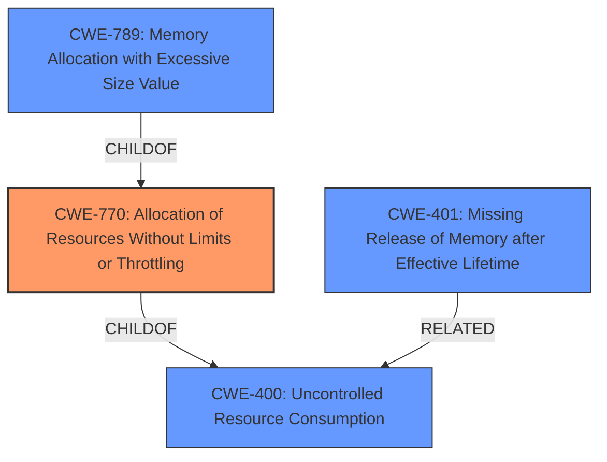

# Analysis for CVE-2021-41145

# Summary
| CWE ID | CWE Name | Confidence | CWE Abstraction Level | CWE Vulnerability Mapping Label | CWE-Vulnerability Mapping Notes |
|---|---|---|---|---|---|
| CWE-770 | Allocation of Resources Without Limits or Throttling | 0.9 | Base | Allowed | Primary CWE |
| CWE-400 | Uncontrolled Resource Consumption | 0.6 | Class | Discouraged | Secondary Candidate |
| CWE-789 | Memory Allocation with Excessive Size Value | 0.6 | Variant | Allowed | Secondary Candidate |
| CWE-401 | Missing Release of Memory after Effective Lifetime | 0.6 | Variant | Allowed | Secondary Candidate |

## Evidence and Confidence

*   **Confidence Score:** 0.8
*   **Evidence Strength:** HIGH

## Relationship Analysis
The primary CWE is CWE-770, which describes the **allocation of resources without limits or throttling**. This is related to CWE-400 (Uncontrolled Resource Consumption) as CWE-770 is a child of CWE-400. CWE-789 (Memory Allocation with Excessive Size Value) is also related, as it is a child of CWE-770. CWE-401 is related to CWE-400 as well since **missing release of memory** is one way to exhaust resources. The relationships between these CWEs highlight the progression from a general resource consumption issue to a more specific problem of memory allocation without limits, and how failure to release memory can contribute to resource exhaustion.

## Vulnerability Chain
The vulnerability chain starts with the FreeSWITCH software's **uncontrolled allocation of memory** when processing SIP messages. This **lack of limits** leads to excessive memory consumption and ultimately results in **memory exhaustion**, causing the FreeSWITCH instance to crash and leading to a denial of service.
  - **Root Cause:** **Uncontrolled memory allocation** in `su_home_new` function within Sofia-SIP library.
  - **Weakness:** **Memory exhaustion** due to SIP flooding.
  - **Impact:** Denial of Service (DoS).

## Summary of Analysis
The initial assessment identified a **memory exhaustion** issue due to SIP flooding. The analysis of the vulnerability description, CVE reference links, and retriever results led to the selection of CWE-770 (Allocation of Resources Without Limits or Throttling) as the primary CWE. The CVE reference links content summary explicitly mentions **memory exhaustion** due to uncontrolled memory allocation within the `su_home_new` function, which aligns directly with CWE-770's description of allocating resources without imposing restrictions. The relationship graph shows how CWE-770 relates to the more general CWE-400 (Uncontrolled Resource Consumption) and how CWE-789 (Memory Allocation with Excessive Size Value) and CWE-401 (Missing Release of Memory after Effective Lifetime) can further specify the cause.

The evidence from the CVE reference links content summary ("large amounts of memory are allocated within the `su_home_new` function of the Sofia-SIP library, leading to the exhaustion of available memory") supports this selection.

The selection is based on the optimal level of specificity as it focuses on the **uncontrolled allocation** rather than just the general resource consumption.

Relevant CWE Information:

# Enhanced Context (25 CWEs)
The following CWEs were identified as potentially relevant to this vulnerability:

## CWE-405: Asymmetric Resource Consumption (Amplification)
**Abstraction Level**: Class
**Similarity Score**: 0.77

**Description**:
The product does not properly control situations in which an adversary can cause the product to consume or produce excessive resources without requiring the adversary to invest equivalent work or otherwise prove authorization, i.e., the adversary's influence is "asymmetric."

**Mapping Guidance**:
- Usage: Allowed-with-Review
- Rationale: This CWE entry is a Class and might have Base-level children that would be more appropriate

*This CWE was not selected because it is more focused on amplification where the attacker's resources are less than the consumption.*

## CWE-789: Memory Allocation with Excessive Size Value
**Abstraction Level**: Variant
**Similarity Score**: 0.76

**Description**:
The product allocates memory based on an untrusted, large size value, but it does not ensure that the size is within expected limits, allowing arbitrary amounts of memory to be allocated.

**Mapping Guidance**:
- Usage: Allowed
- Rationale: This CWE entry is at the Variant level of abstraction, which is a preferred level of abstraction for mapping to the root causes of vulnerabilities.

*This CWE was considered but not selected as the primary because the description does not indicate that the size value is untrusted or excessive, but rather that memory is allocated without any limits.*

## CWE-404: Improper Resource Shutdown or Release
**Abstraction Level**: Class
**Similarity Score**: 0.76

**Description**:
The product does not release or incorrectly releases a resource before it is made available for re-use.

**Mapping Guidance**:
- Usage: Allowed-with-Review
- Rationale: This CWE entry is a Class and might have Base-level children that would be more appropriate

*This CWE was not selected as the primary as it refers to shutdown and release of resources, whereas the vulnerability is due to lack of limits on allocation.*

## CWE-1325: Improperly Controlled Sequential Memory Allocation
**Abstraction Level**: Base
**Similarity Score**: 0.75

**Description**:
The product manages a group of objects or resources and performs a separate memory allocation for each object, but it does not properly limit the total amount of memory that is consumed by all of the combined objects.

**Mapping Guidance**:
- Usage: Allowed
- Rationale: This CWE entry is at the Base level of abstraction, which is a preferred level of abstraction for mapping to the root causes of vulnerabilities.

*This CWE was not selected as there is no evidence of sequential allocation from the description.*

## CWE-799: Improper Control of Interaction Frequency
**Abstraction Level**: Class
**Similarity Score**: 0.75

**Description**:
The product does not properly limit the number or frequency of interactions that it has with an actor, such as the number of incoming requests.

**Mapping Guidance**:
- Usage: Allowed-with-Review
- Rationale: This CWE entry is a Class and might have Base-level children that would be more appropriate

*This CWE was considered but not selected as the primary because the vulnerability is more specifically about resource allocation without limits rather than the frequency of interactions.*

## CWE-664: Improper Control of a Resource Through its Lifetime
**Abstraction Level**: Pillar
**Similarity Score**: 0.75

**Description**:
The product does not maintain or incorrectly maintains control over a resource throughout its lifetime of creation, use, and release.

**Mapping Guidance**:
- Usage: Discouraged
- Rationale: This CWE entry is high-level when lower-level children are available.

*This CWE was not selected as it is a high-level pillar, and more specific CWEs are available.*

## CWE-226: Sensitive Information in Resource Not Removed Before Reuse
**Abstraction Level**: Base
**Similarity Score**: 0.75

**Description**:
The product releases a resource such as memory or a file so that it can be made available for reuse, but it does not clear or "zeroize" the information contained in the resource before the product performs a critical state transition or makes the resource available for reuse by other entities.

*This CWE was not selected as there is no evidence about sensitive information.*

## CWE-130: Improper Handling of Length Parameter Inconsistency
**Abstraction Level**: Base
**Similarity Score**: 0.74

**Description**:
The product parses a formatted message or structure, but it does not handle or incorrectly handles a length field that is inconsistent with the actual length of the associated data.

*This CWE was not selected as there is no evidence about parsing messages with length inconsistencies.*

## CWE-410: Insufficient Resource Pool
**Abstraction Level**: Base
**Similarity Score**: 0.74

**Description**:
The product's resource pool is not large enough to handle peak demand, which allows an attacker to prevent others from accessing the resource by using a (relatively) large number of requests for resources.

*This CWE was not selected as the issue is not about the pool size being