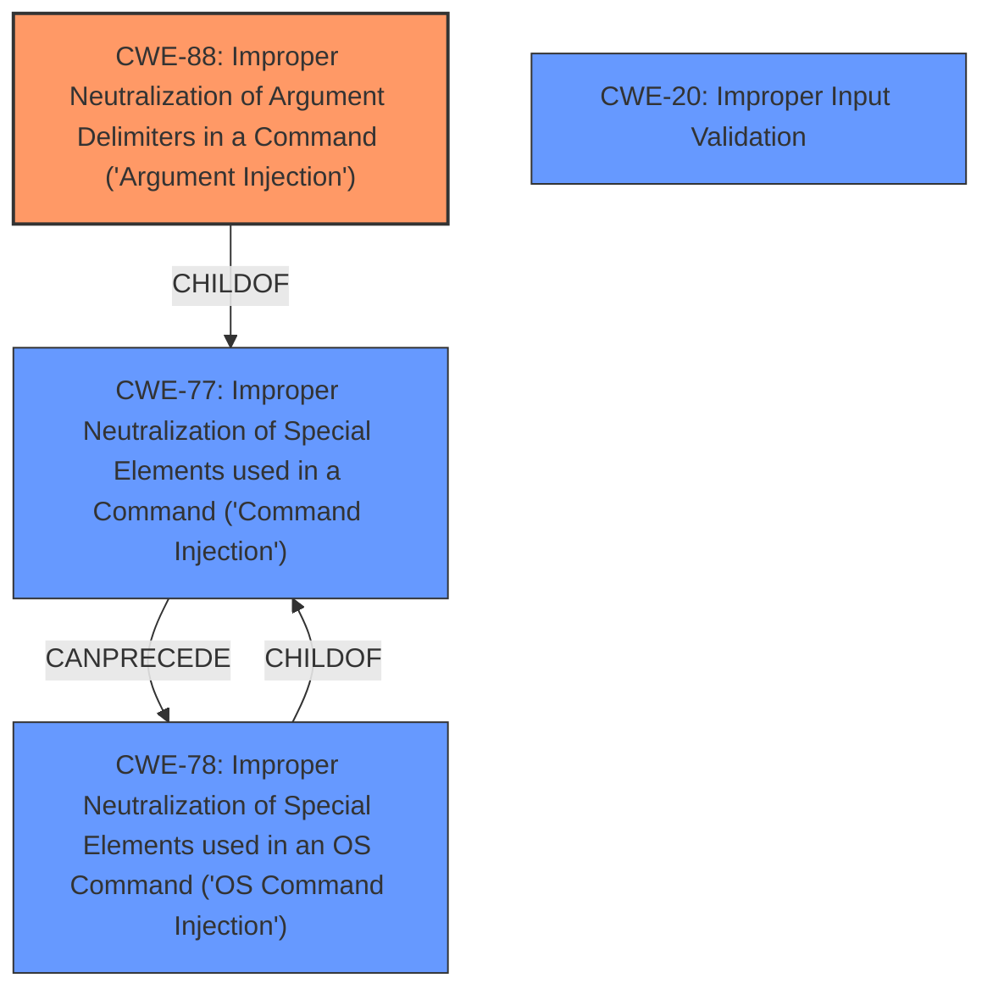

# Analysis Report for CVE-2021-41146

# Vulnerability Analysis Report: CVE-2021-41146

## Description


## Analysis (with Relationship Data)

# Summary
| CWE ID | CWE Name | Confidence | CWE Abstraction Level | CWE Vulnerability Mapping Label | CWE-Vulnerability Mapping Notes |
|---|---|---|---|---|---|
| **CWE-88** | **Improper Neutralization of Argument Delimiters in a Command ('Argument Injection')** | 1.0 | Base | Primary | Allowed |
| CWE-78 | Improper Neutralization of Special Elements used in an OS Command ('OS Command Injection') | 0.7 | Base | Secondary | Allowed |
| CWE-20 | Improper Input Validation | 0.5 | Class | Secondary | Discouraged |

## Evidence and Confidence

*   **Confidence Score:** 0.9
*   **Evidence Strength:** HIGH

## Relationship Analysis
The primary CWE is CWE-88, which is a Base level CWE. The weakness is the **improper neutralization of argument delimiters**, allowing for **argument injection**. CWE-88 is a child of CWE-77, which is **command injection**. CWE-20 is a Class level CWE, and it is a very general weakness.



## Vulnerability Chain
The chain of events is:
1.  **Improper neutralization of argument delimiters** (CWE-88) in the URL handler on Windows.
2.  This leads to **argument injection**, where attackers can inject arbitrary command-line arguments.
3.  This allows **arbitrary code execution** via commands such as `spawn` or `debug-pyeval`.

The root cause is the **improper neutralization of argument delimiters**. The final impact is arbitrary code execution.

## Summary of Analysis
The primary weakness is the **improper neutralization of argument delimiters** (CWE-88), leading to **argument injection** and ultimately arbitrary code execution.

The vulnerability description and CVE Reference Links Content Summary clearly indicate that the root cause is the **improper handling of URL arguments** passed to qutebrowser via the registered URL handler on Windows. The application fails to properly delimit the arguments, allowing an attacker to inject arbitrary commands.

The CVE Reference Links Content Summary states: "The vulnerability stems from how qutebrowser handles URL scheme registrations on Windows. When registered as a URL handler, qutebrowser processes the provided URL string as command-line arguments without proper sanitization." and "The core issue is that qutebrowser, when launched via a URL handler, is susceptible to argument injection. By including a quote character in the URL, attackers can append arbitrary command-line parameters to the qutebrowser process."

CWE-88 (Improper Neutralization of Argument Delimiters in a Command ('Argument Injection')) is the most appropriate CWE because it directly addresses the **root cause of the vulnerability**. The description of CWE-88 states: "The product constructs a string for a command to be executed by a separate component in another control sphere, but it does not properly delimit the intended arguments, options, or switches within that command string." This aligns perfectly with the vulnerability description, where qutebrowser constructs a command using the URL arguments without proper delimitation, allowing for **argument injection**.

CWE-78 (Improper Neutralization of Special Elements used in an OS Command ('OS Command Injection')) is a secondary candidate because the injected arguments can lead to OS command execution via `spawn` or `debug-pyeval`.

CWE-20 (Improper Input Validation) is a more general weakness and less specific than CWE-88. While the application does not validate the input from the URL handler, the core issue is the **improper handling of argument delimiters**, making CWE-88 a more accurate classification.

I am confident in the selection of CWE-88 as the primary CWE, as it directly addresses the root cause of the vulnerability, the **improper handling of argument delimiters**, which allows for **argument injection** and arbitrary code execution.

Relevant CWE Information:

# Enhanced Context (25 CWEs)
The following CWEs were identified as potentially relevant to this vulnerability:

## CWE-625: Permissive Regular Expression
**Abstraction Level**: Base
**Similarity Score**: 0.73
**Source**: dense

**Description**:
The product uses a regular expression that does not sufficiently restrict the set of allowed values.

**Mapping Guidance**:
- Usage: Allowed
- Rationale: This CWE entry is at the Base level of abstraction, which is a preferred level of abstraction for mapping to the root causes of vulnerabilities.

## CWE-1289: Improper Validation of Unsafe Equivalence in Input
**Abstraction Level**: Base
**Similarity Score**: 0.73
**Source**: dense

**Description**:
The product receives an input value that is used as a resource identifier or other type of reference, but it does not validate or incorrectly validates that the input is equivalent to a potentially-unsafe value.

**Mapping Guidance**:
- Usage: Allowed
- Rationale: This CWE entry is at the Base level of abstraction, which is a preferred level of abstraction for mapping to the root causes of vulnerabilities.

## CWE-185: Incorrect Regular Expression
**Abstraction Level**: Class
**Similarity Score**: 0.72
**Source**: dense

**Description**:
The product specifies a regular expression in a way that causes data to be improperly matched or compared.

**Mapping Guidance**:
- Usage: Allowed-with-Review
- Rationale: This CWE entry is a Class and might have Base-level children that would be more appropriate

## CWE-799: Improper Control of Interaction Frequency
**Abstraction Level**: Class
**Similarity Score**: 0.72
**Source**: dense

**Description**:
The product does not properly limit the number or frequency of interactions that it has with an actor, such as the number of incoming requests.

**Mapping Guidance**:
- Usage: Allowed-with-Review
- Rationale: This CWE entry is a Class and might have Base-level children that would be more appropriate

## CWE-407: Inefficient Algorithmic Complexity
**Abstraction Level**: Class
**Similarity Score**: 0.71
**Source**: dense

**Description**:
An algorithm in a product has an inefficient worst-case computational complexity that may be detrimental to system performance and can be triggered by an attacker, typically using crafted manipulations that ensure that the worst case is being reached.

**Mapping Guidance**:
- Usage: Allowed-with-Review
- Rationale: This CWE entry is a Class and might have Base-level children that would be more appropriate

## CWE-186: Overly Restrictive Regular Expression
**Abstraction Level**: Base
**Similarity Score**: 0.71
**Source**: dense

**Description**:
A regular expression is overly restrictive, which prevents dangerous values from being detected.

**Mapping Guidance**:
- Usage: Allowed
- Rationale: This CWE entry is at the Base level of abstraction, which is a preferred level of abstraction for mapping to the root causes of vulnerabilities.

## CWE-405: Asymmetric Resource Consumption (Amplification)
**Abstraction Level**: Class
**Similarity Score**: 0.70
**Source**: dense

**Description**:
The product does not properly control situations in which an adversary can cause the product to consume or produce excessive resources without requiring the adversary to invest equivalent work or otherwise prove authorization, i.e., the adversary's influence is "asymmetric."

**Mapping Guidance**:
- Usage: Allowed-with-Review
- Rationale: This CWE entry is a Class and might have Base-level children that would be more appropriate

## CWE-184: Incomplete List of Disallowed Inputs
**Abstraction Level**: Base
**Similarity Score**: 0.70
**Source**: dense

**Description**:
The product implements a protection mechanism that relies on a list of inputs (or properties of inputs) that are not allowed by policy or otherwise require other action to neutralize before additional processing takes place, but the list is incomplete.

**Mapping Guidance**:
- Usage: Allowed
- Rationale: This CWE entry is at the Base level of abstraction, which is a preferred level of abstraction for mapping to the root causes of vulnerabilities.

## CWE-807: Reliance on Untrusted Inputs in a Security Decision
**Abstraction Level**: Base
**Similarity Score**: 0.70
**Source**: dense

**Description**:
The product uses a protection mechanism that relies on the existence or values of an input, but the input can be modified by an untrusted actor in a way


## CWE Relationship Analysis

Current CWEs represent these abstraction levels: .


### Vulnerability Chain Analysis

**Chain starting from CWE-186:**
- 186 (Overly Restrictive Regular Expression) - ROOT


**Chain starting from CWE-185:**
- 185 (Incorrect Regular Expression) - ROOT


### CWE Relationship Diagram

```mermaid
graph TD
    classDef primary fill:#f96,stroke:#333,stroke-width:2px
    classDef secondary fill:#69f,stroke:#333
    classDef tertiary fill:#9e9,stroke:#333
```


*Report generated on 2025-04-02 04:50:59*
