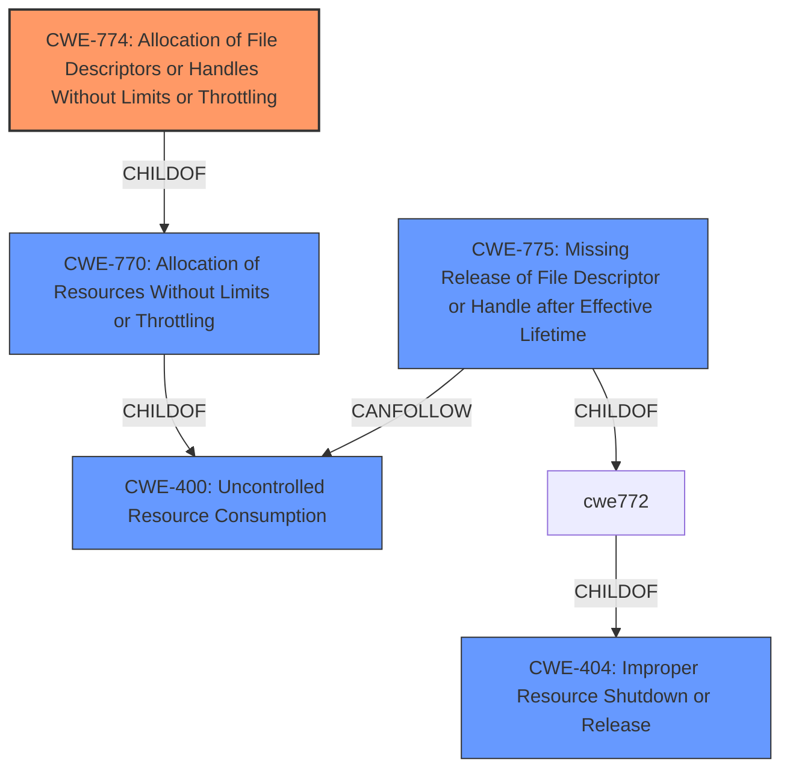

# Raw Analyzer Response for CVE-2021-4115

# Summary
| CWE ID | CWE Name | Confidence | CWE Abstraction Level | CWE Vulnerability Mapping Label | CWE-Vulnerability Mapping Notes |
|---|---|---|---|---|---|
| CWE-774 | Allocation of File Descriptors or Handles Without Limits or Throttling | 1.0 | Variant | Allowed | Primary CWE |
| CWE-775 | Missing Release of File Descriptor or Handle after Effective Lifetime | 0.7 | Variant | Allowed | Secondary CWE |
| CWE-400 | Uncontrolled Resource Consumption | 0.5 | Class | Discouraged | Secondary CWE |

## Evidence and Confidence

*   **Confidence Score:** 0.8
*   **Evidence Strength:** HIGH

## Relationship Analysis
The primary CWE is CWE-774, a Variant of CWE-770 and related to CWE-400.
CWE-775 is also related as a type of missing resource release that can lead to CWE-400.
The hierarchical relationships guided the selection towards the most specific Variant, CWE-774.

## Vulnerability Chain
The vulnerability chain starts with the **improper allocation of file descriptors without limits (CWE-774)**, potentially due to an **improper update of a reference count (CWE-911)**. This can lead to a **missing release of file descriptors (CWE-775)**, ultimately resulting in **uncontrolled resource consumption (CWE-400)**, specifically **process file descriptor exhaustion**.

## Summary of Analysis
The initial analysis focused on identifying the root cause of the vulnerability based on the description and the CVE reference. The description clearly states that the vulnerability is due to **process file descriptor exhaustion**, which is caused by an **unprivileged user** being able to **cause polkit to crash**. The CVE reference provides a more detailed explanation, indicating a file descriptor leak in the `polkit_system_bus_name_get_creds_sync` function due to **improper error handling** that prevents a temporary context from being released, leading to the file descriptor leak.

The Retriever results highlighted several relevant CWEs, including CWE-774 (Allocation of File Descriptors or Handles Without Limits or Throttling), CWE-911 (Improper Update of Reference Count), and CWE-770 (Allocation of Resources Without Limits or Throttling). After reviewing the CWE specifications, CWE-774 was selected as the primary CWE because it directly addresses the **allocation of file descriptors without limits**, which aligns perfectly with the vulnerability description and the CVE reference's mention of a file descriptor leak.

CWE-775 (Missing Release of File Descriptor or Handle after Effective Lifetime) was also considered as a secondary CWE because the file descriptor leak implies that the file descriptor is not being released after its effective lifetime. This aligns with the CWE-775 description.

CWE-400 (Uncontrolled Resource Consumption) was considered but ultimately deemed less specific than CWE-774 and CWE-775. While the vulnerability does lead to uncontrolled resource consumption, the root cause is the improper allocation and missing release of file descriptors. The MITRE mapping guidance discourages the use of CWE-400 when more precise mappings are available.

The final selection of CWE-774 as the primary CWE is based on the strong evidence from the vulnerability description and the CVE reference, as well as the MITRE mapping guidance. The relationship analysis further supports this decision, as CWE-774 is a Variant of CWE-770 and is directly related to the **file descriptor exhaustion** issue.

Relevant CWE Information:

# Enhanced Context (25 CWEs)
The following CWEs were identified as potentially relevant to this vulnerability:

## CWE-404: Improper Resource Shutdown or Release
**Abstraction Level**: Class
**Similarity Score**: 0.79
**Source**: dense

**Description**:
The product does not release or incorrectly releases a resource before it is made available for re-use.

**Mapping Guidance**:
- Usage: Allowed-with-Review
- Rationale: This CWE entry is a Class and might have Base-level children that would be more appropriate

## CWE-789: Memory Allocation with Excessive Size Value
**Abstraction Level**: Variant
**Similarity Score**: 0.78
**Source**: dense

**Description**:
The product allocates memory based on an untrusted, large size value, but it does not ensure that the size is within expected limits, allowing arbitrary amounts of memory to be allocated.

**Mapping Guidance**:
- Usage: Allowed
- Rationale: This CWE entry is at the Variant level of abstraction, which is a preferred level of abstraction for mapping to the root causes of vulnerabilities.

## CWE-405: Asymmetric Resource Consumption (Amplification)
**Abstraction Level**: Class
**Similarity Score**: 0.78
**Source**: dense

**Description**:
The product does not properly control situations in which an adversary can cause the product to consume or produce excessive resources without requiring the adversary to invest equivalent work or otherwise prove authorization, i.e., the adversary's influence is "asymmetric."

**Mapping Guidance**:
- Usage: Allowed-with-Review
- Rationale: This CWE entry is a Class and might have Base-level children that would be more appropriate

## CWE-226: Sensitive Information in Resource Not Removed Before Reuse
**Abstraction Level**: Base
**Similarity Score**: 0.77
**Source**: dense

**Description**:
The product releases a resource such as memory or a file so that it can be made available for reuse, but it does not clear or "zeroize" the information contained in the resource before the product performs a critical state transition or makes the resource available for reuse by other entities.

**Mapping Guidance**:
- Usage: Allowed
- Rationale: This CWE entry is at the Base level of abstraction, which is a preferred level of abstraction for mapping to the root causes of vulnerabilities.

## CWE-1325: Improperly Controlled Sequential Memory Allocation
**Abstraction Level**: Base
**Similarity Score**: 0.77
**Source**: dense

**Description**:
The product manages a group of objects or resources and performs a separate memory allocation for each object, but it does not properly limit the total amount of memory that is consumed by all of the combined objects.

**Mapping Guidance**:
- Usage: Allowed
- Rationale: This CWE entry is at the Base level of abstraction, which is a preferred level of abstraction for mapping to the root causes of vulnerabilities.

## CWE-664: Improper Control of a Resource Through its Lifetime
**Abstraction Level**: Pillar
**Similarity Score**: 0.77
**Source**: dense

**Description**:
The product does not maintain or incorrectly maintains control over a resource throughout its lifetime of creation, use, and release.

**Mapping Guidance**:
- Usage: Discouraged
- Rationale: This CWE entry is high-level when lower-level children are available.

## CWE-667: Improper Locking
**Abstraction Level**: Class
**Similarity Score**: 0.76
**Source**: dense

**Description**:
The product does not properly acquire or release a lock on a resource, leading to unexpected resource state changes and behaviors.

**Mapping Guidance**:
- Usage: Allowed-with-Review
- Rationale: This CWE entry is a Class and might have Base-level children that would be more appropriate

## CWE-772: Missing Release of Resource after Effective Lifetime
**Abstraction Level**: Base
**Similarity Score**: 0.76
**Source**: dense

**Description**:
The product does not release a resource after its effective lifetime has ended, i.e., after the resource is no longer needed.

**Mapping Guidance**:
- Usage: Allowed
- Rationale: This CWE entry is at the Base level of abstraction, which is a preferred level of abstraction for mapping to the root causes of vulnerabilities.

## CWE-770: Allocation of Resources Without Limits or Throttling
**Abstraction Level**: Base
**Similarity Score**: 0.75