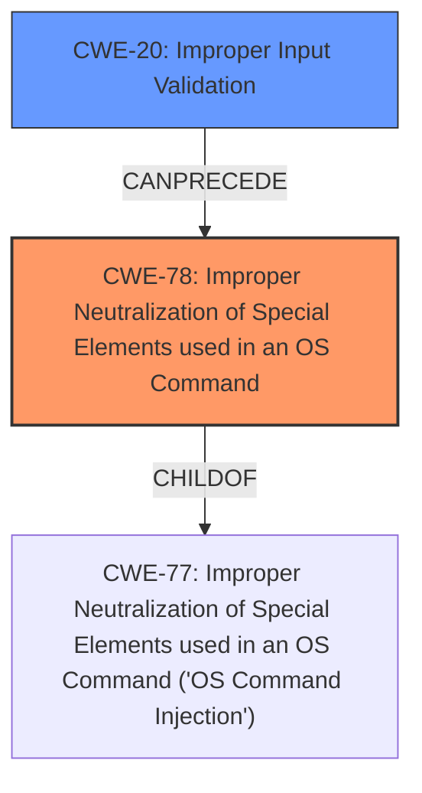

# Enhanced Analysis for CVE-2021-41163

# Summary
| CWE ID | CWE Name | Confidence | CWE Abstraction Level | CWE Vulnerability Mapping Label | CWE-Vulnerability Mapping Notes |
|---|---|---|---|---|---|
| CWE-78 | Improper Neutralization of Special Elements used in an OS Command ('OS Command Injection') | 1.0 | Base | Primary | Allowed |
| CWE-20 | Improper Input Validation | 0.7 | Class | Secondary | Discouraged |

## Evidence and Confidence

*   **Confidence Score:** 0.85
*   **Evidence Strength:** HIGH

## Relationship Analysis
The primary CWE, CWE-78 [CWE-78: Improper Neutralization of Special Elements used in an OS Command ('OS Command Injection')], is a base-level CWE and a child of CWE-77. It can also be related to CWE-184 (Incomplete List of Disallowed Inputs). The secondary CWE, CWE-20 [CWE-20: Improper Input Validation], is a class-level CWE that is discouraged, but is still relevant because the root cause includes **lack of validation**. It also can precede CWE-78 [CWE-78: Improper Neutralization of Special Elements used in an OS Command ('OS Command Injection')].



## Vulnerability Chain
The vulnerability chain starts with the **lack of validation** (CWE-20 [CWE-20: Improper Input Validation]) of the `subscribe_url` values. This **lack of validation** allows for maliciously crafted requests, leading to OS Command Injection (CWE-78 [CWE-78: Improper Neutralization of Special Elements used in an OS Command ('OS Command Injection')]) and ultimately resulting in Remote Code Execution.

## Summary of Analysis
The initial assessment, based on the vulnerability description and key phrases, points to a **lack of validation** in `subscribe_url` values as the root cause, leading to Remote Code Execution. The CVE Reference Links Content Summary confirms this, highlighting the root cause as a validation bug within the `aws-sdk-sns` library and identifying CWE-78 [CWE-78: Improper Neutralization of Special Elements used in an OS Command ('OS Command Injection')] as a relevant weakness.

The evidence from the vulnerability description is: "In affected versions maliciously crafted requests could lead to remote code execution. This resulted from a **lack of validation in subscribe_url values**." The CVE Reference Links Content Summary states, "The vulnerability is a Command Injection vulnerability (CWE-78 [CWE-78: Improper Neutralization of Special Elements used in an OS Command ('OS Command Injection')])".

The relationship graph shows how **improper input validation** can precede command injection. While CWE-20 [CWE-20: Improper Input Validation] is discouraged, it accurately represents the **lack of validation** that leads to the command injection. CWE-78 [CWE-78: Improper Neutralization of Special Elements used in an OS Command ('OS Command Injection')] is a base-level CWE, making it the more specific choice.

The selected CWEs are at the optimal level of specificity, with CWE-78 [CWE-78: Improper Neutralization of Special Elements used in an OS Command ('OS Command Injection')] accurately representing the vulnerability and CWE-20 [CWE-20: Improper Input Validation] capturing the **lack of validation** that serves as the root cause.

CWE-79 [CWE-79: Improper Neutralization of Input During Web Page Generation ('Cross-site Scripting')] was considered due to its high retriever score, but it was not selected because the vulnerability is primarily related to command injection rather than cross-site scripting. CWE-73 [CWE-73: External Control of File Name or Path] was also considered, but the vulnerability does not involve external control of file names or paths. The problem stems from improper neutralization of special elements used in an OS command.


## CWE Relationship Analysis

Current CWEs represent these abstraction levels: .


### Vulnerability Chain Analysis

**Chain starting from CWE-79:**
- 79 (Improper Neutralization of Input During Web Page Generation ('Cross-site Scripting')) - ROOT


**Chain starting from CWE-73:**
- 73 (External Control of File Name or Path) - ROOT


### CWE Relationship Diagram

```mermaid
graph TD
    classDef primary fill:#f96,stroke:#333,stroke-width:2px
    classDef secondary fill:#69f,stroke:#333
    classDef tertiary fill:#9e9,stroke:#333
```