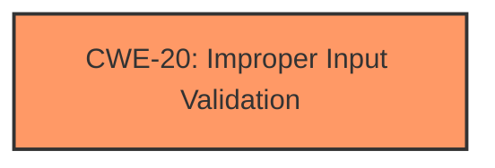

# Analysis for CVE-2021-4117

# Summary

| CWE ID | CWE Name | Confidence | CWE Abstraction Level | CWE Vulnerability Mapping Label | CWE-Vulnerability Mapping Notes |
|---|---|---|---|---|---|
| CWE-20 | CWE-20: Improper Input Validation | 1.0 | Class | Primary | Allowed |

## Evidence and Confidence

*   **Confidence Score:** 1.0
*   **Evidence Strength:** HIGH

## Relationship Analysis
The primary CWE selected is CWE-20 (**CWE-20: Improper Input Validation**), which is a Class-level CWE. While there are more specific (Base-level) CWEs related to input validation, the provided information does not give enough detail to pinpoint the exact type of input validation issue. Therefore, the Class-level CWE-20 is the most appropriate choice.

## Vulnerability Chain
The vulnerability chain starts with the **lack of input validation** on the `weight` field, which is the root cause. The potential impact includes data integrity issues, application errors, and potential for further exploitation.

## Summary of Analysis
The analysis strongly suggests **improper input validation** as the primary weakness. The commit message "Improved validation for weight fields" and the change in the database schema to enforce numeric inputs for the weight field clearly indicate that the original vulnerability stemmed from a **lack of proper validation**.

The evidence is compelling due to the clear indication of validation improvements in the commit and schema changes, confirming that the vulnerability is related to input validation.

The primary CWE match from similar CVE descriptions is CWE-20 (**CWE-20: Improper Input Validation**), which aligns with the analysis.

The selected CWE, CWE-20 (**CWE-20: Improper Input Validation**), is at the optimal level of specificity, given the available information. While more specific CWEs like CWE-1284 (**CWE-1284: Improper Validation of Specified Quantity in Input**) could be considered, the current evidence does not provide sufficient detail to confidently select a more specific Base-level CWE.

Relevant CWE Information:

# Enhanced Context (25 CWEs)

## CWE-1289: Improper Validation of Unsafe Equivalence in Input
**Abstraction Level**: Base
**Similarity Score**: 0.77
**Source**: dense
**Description**:
The product receives an input value that is used as a resource identifier or other type of reference, but it does not validate or incorrectly validates that the input is equivalent to a potentially-unsafe value.
**Why Not Used**: This CWE is too specific; the vulnerability description doesn't mention resource identifiers.

## CWE-668: Exposure of Resource to Wrong Sphere
**Abstraction Level**: Class
**Similarity Score**: 0.76
**Source**: dense
**Description**:
The product exposes a resource to the wrong control sphere, providing unintended actors with inappropriate access to the resource.
**Why Not Used**: This CWE is too high-level and doesn't directly relate to the root cause of input validation issues. The "Mapping Guidance" recommends against using this CWE when lower-level CWEs are applicable.

## CWE-41: Improper Resolution of Path Equivalence
**Abstraction Level**: Base
**Similarity Score**: 0.76
**Source**: dense
**Description**:
The product is vulnerable to file system contents disclosure through path equivalence.
**Why Not Used**: This CWE is not relevant to the vulnerability, which is about validating the weight field, not path manipulation.

## CWE-345: Insufficient Verification of Data Authenticity
**Abstraction Level**: Class
**Similarity Score**: 0.76
**Source**: dense
**Description**:
The product does not sufficiently verify the origin or authenticity of data, in a way that causes it to accept invalid data.
**Why Not Used**: While related to validation, this CWE is too broad. The issue is specifically about input validation, not general data authenticity.

## CWE-703: Improper Check or Handling of Exceptional Conditions
**Abstraction Level**: Pillar
**Similarity Score**: 0.75
**Source**: dense
**Description**:
The product does not properly anticipate or handle exceptional conditions that rarely occur during normal operation of the product.
**Why Not Used**: This CWE is too high-level (Pillar) and doesn't reflect the specific problem of input validation.

## CWE-138: Improper Neutralization of Special Elements
**Abstraction Level**: Class
**Similarity Score**: 0.75
**Source**: dense
**Description**:
The product receives input from an upstream component, but it does not neutralize or incorrectly neutralizes special elements.
**Why Not Used**: This CWE is more about sanitization, which is not the primary issue here. The main problem is that the input is not validated at all, not that it's incorrectly sanitized.

## CWE-23: Relative Path Traversal
**Abstraction Level**: Base
**Similarity Score**: 0.75
**Source**: dense
**Description**:
The product uses external input to construct a pathname without neutralizing sequences like "..".
**Why Not Used**: This CWE deals specifically with path traversal vulnerabilities, which is not the case here.

## CWE-807: Reliance on Untrusted Inputs in a Security Decision
**Abstraction Level**: Base
**Similarity Score**: 0.75
**Source**: dense
**Description**:
The product uses a protection mechanism that relies on the existence or values of an input, but the input can be modified by an untrusted actor.
**Why Not Used**: This CWE is about security decisions based on untrusted input, which is not the primary issue. The main problem is the lack of validation.

## CWE-693: Protection Mechanism Failure
**Abstraction Level**: Pillar
**Similarity Score**: 0.74
**Source**: dense
**Description**:
The product does not use or incorrectly uses a protection mechanism.
**Why Not Used**: This CWE is too high-level and doesn't specify the kind of protection failure, making it less appropriate.

## CWE-657: Violation of Secure Design Principles
**Abstraction Level**: Class
**Similarity Score**: 0.74
**Source**: dense
**Description**:
The product violates well-established principles for secure design.
**Why Not Used**: This CWE is too generic. The issue can be pinpointed to input validation and hence this is not appropriate.

## CWE-472: External Control of Assumed-Immutable Web Parameter
**Abstraction Level**: Base
**Similarity Score**: 5686.26
**Source**: sparse
**Description**:
The web application does not sufficiently verify inputs that are assumed to be immutable but are actually externally controllable, such as hidden form fields.
**Why Not Used**: This is more specific to web applications, and not applicable in the context of the evidence.

## CWE-1284: Improper Validation of Specified Quantity in Input
**Abstraction Level**: Base
**Similarity Score**: 5677.07
**Source**: sparse
**Description**:
The product receives input that is expected to specify a quantity (such as size or length), but it does not validate or incorrectly validates that the quantity has the required properties.
**Why Not Used**: While this could be a more specific match, the provided information does not explicitly state that the `weight` field is treated as a "quantity". The commit suggests improvements to the data type, so focusing on the broad concept of input validation is better.

## CWE-125: Out-of-bounds Read
**Abstraction Level**: Base
**Similarity Score**: 5576.12
**Source**: sparse
**Description**:
The product reads data past the end, or before the beginning, of the intended buffer.
**Why Not Used**: This is related to out-of-bounds memory access, not input validation.

## CWE-863: Incorrect Authorization
**Abstraction Level**: Class
**Similarity Score**: 5551.97
**Source**: sparse
**Description**:
The product performs an authorization check when an actor attempts to access a resource or perform an action, but it does not correctly perform the check.
**Why Not Used**: The vulnerability is not related to authorization checks.

## CWE-197: Numeric Truncation Error
**Abstraction Level**: Base
**Similarity Score**: 5529.61
**Source**: sparse
**Description**:
Truncation errors occur when a primitive is cast to a primitive of a smaller size and data is lost in the conversion.
**Why Not Used**: This is specific to numeric truncation errors, which is not described in the evidence.

## CWE-613: Insufficient Session Expiration
**Abstraction Level**: base
**Similarity Score**: 4.21
**Source**: graph
**Description**:
CWE-613: Insufficient Session Expiration
**Why Not Used**: This is not relevant to the described vulnerability.

## CWE-195: Signed to Unsigned Conversion Error
**Abstraction Level**: variant
**Similarity Score**: 4.04
**Source**: graph
**Description**:
CWE-195: Signed to Unsigned Conversion Error
**Why Not Used**: This is not relevant to the described vulnerability.

## CWE-190