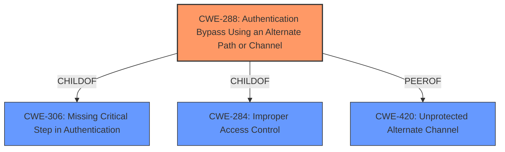

# Raw Analyzer Response for CVE-2021-41181

# Summary
| CWE ID  | CWE Name                                                     | Confidence | CWE Abstraction Level | CWE Vulnerability Mapping Label | CWE-Vulnerability Mapping Notes |
| :-------- | :----------------------------------------------------------- | :---------- | :---------------------- | :------------------------------ | :------------------------------ |
| CWE-288 | Authentication Bypass Using an Alternate Path or Channel | 0.85      | Base                    | Allowed                         | Primary CWE                     |
| CWE-862 | Missing Authorization                                        | 0.75      | Class                   | Allowed-with-Review           | Secondary Candidate             |

## Evidence and Confidence

*   **Confidence Score:** 0.80
*   **Evidence Strength:** HIGH

## Relationship Analysis

The primary relationship that influenced the CWE selection was the parent-child relationship. CWE-288 (Authentication Bypass Using an Alternate Path or Channel) is a base-level CWE, providing a more specific description of the vulnerability than its parent CWEs. CWE-288 is also a peer of CWE-420 (Unprotected Alternate Channel), indicating an alternative way the authentication bypass can occur.

## Vulnerability Chain

The vulnerability chain involves the **failure to properly detect the lockscreen state** when a call is incoming, leading to an **authentication bypass** and unauthorized access to chat messages and files. The chain is:
1.  **Root Cause:** **Improper Lockscreen State Detection**
2.  **Weakness:** **Authentication Bypass Using an Alternate Path or Channel**
3.  **Impact:** Gaining Access to User Chat Messages and Files

## Summary of Analysis

Initially, several CWEs were considered based on the vulnerability description and retriever results. The primary **weakness** lies in the application **failing to properly detect the lockscreen state during an incoming call**, which allows bypassing the intended authentication mechanism.

The selection of CWE-288 is based on the following evidence:

*   The "Vulnerability Description Key Phrases" indicates "**did not properly detect the lockscreen state when a call was incoming**" as the root **weakness**.
*   The "CVE Reference Links Content Summary" states that the application **failed to properly detect the lock screen state when an incoming call was received**.
*   The "CVE Reference Links Content Summary" states that there was a "**failure to implement proper access controls when the phone is locked but an incoming call is received.**"
*   CWE-288's description, "The product requires authentication, but the product has an alternate path or channel that does not require authentication," aligns with the scenario where the incoming call acts as an alternate channel, bypassing the lock screen authentication.

CWE-862 (Missing Authorization) was considered but deemed less appropriate because the issue is not a complete lack of authorization but rather a bypass due to the lockscreen state not being properly detected. The application has an authentication mechanism (lock screen), but it is bypassed in the specific scenario of an incoming call.

The final selection of CWE-288 is at the optimal level of specificity, as it directly addresses the authentication bypass through the alternate path of an incoming call, reflecting the root cause and mechanism of the vulnerability.

Relevant CWE Information:

# Enhanced Context (25 CWEs)
The following CWEs were identified as potentially relevant to this vulnerability:

## CWE-639: Authorization Bypass Through User-Controlled Key
**Abstraction Level**: Base
**Similarity Score**: 0.79
**Source**: dense

**Description**:
The system's authorization functionality does not prevent one user from gaining access to another user's data or record by modifying the key value identifying the data.

**Mapping Guidance**:
- Usage: Allowed
- Rationale: This CWE entry is at the Base level of abstraction, which is a preferred level of abstraction for mapping to the root causes of vulnerabilities.

## CWE-280: Improper Handling of Insufficient Permissions or Privileges 
**Abstraction Level**: Base
**Similarity Score**: 0.79
**Source**: dense

**Description**:
The product does not handle or incorrectly handles when it has insufficient privileges to access resources or functionality as specified by their permissions. This may cause it to follow unexpected code paths that may leave the product in an invalid state.

**Mapping Guidance**:
- Usage: Allowed
- Rationale: This CWE entry is at the Base level of abstraction, which is a preferred level of abstraction for mapping to the root causes of vulnerabilities.

## CWE-267: Privilege Defined With Unsafe Actions
**Abstraction Level**: Base
**Similarity Score**: 0.79
**Source**: dense

**Description**:
A particular privilege, role, capability, or right can be used to perform unsafe actions that were not intended, even when it is assigned to the correct entity.

**Mapping Guidance**:
- Usage: Allowed
- Rationale: This CWE entry is at the Base level of abstraction, which is a preferred level of abstraction for mapping to the root causes of vulnerabilities.

## CWE-274: Improper Handling of Insufficient Privileges
**Abstraction Level**: Base
**Similarity Score**: 0.78
**Source**: dense

**Description**:
The product does not handle or incorrectly handles when it has insufficient privileges to perform an operation, leading to resultant weaknesses.

**Mapping Guidance**:
- Usage: Discouraged
- Rationale: This CWE entry could be deprecated in a future version of CWE.

## CWE-266: Incorrect Privilege Assignment
**Abstraction Level**: Base
**Similarity Score**: 0.78
**Source**: dense

**Description**:
A product incorrectly assigns a privilege to a particular actor, creating an unintended sphere of control for that actor.

**Mapping Guidance**:
- Usage: Allowed
- Rationale: This CWE entry is at the Base level of abstraction, which is a preferred level of abstraction for mapping to the root causes of vulnerabilities.

## CWE-668: Exposure of Resource to Wrong Sphere
**Abstraction Level**: Class
**Similarity Score**: 0.78
**Source**: dense

**Description**:
The product exposes a resource to the wrong control sphere, providing unintended actors with inappropriate access to the resource.

**Mapping Guidance**:
- Usage: Discouraged
- Rationale: CWE-668 is high-level and is often misused as a catch-all when lower-level CWE IDs might be applicable. It is sometimes used for low-information vulnerability reports [REF-1287]. It is a level-1 Class (i.e., a child of a Pillar). It is not useful for trend analysis.

## CWE-1390: Weak Authentication
**Abstraction Level**: Class
**Similarity Score**: 0.78
**Source**: dense

**Description**:
The product uses an authentication mechanism to restrict access to specific users or identities, but the mechanism does not sufficiently prove that the claimed identity is correct.

**Mapping Guidance**:
- Usage: Allowed-with-Review
- Rationale: This CWE entry is a Class and might have Base-level children that would be more appropriate

## CWE-451: User Interface (UI) Misrepresentation of Critical Information
**Abstraction Level**: Class
**Similarity Score**: 0.77
**Source**: dense

**Description**:
The user interface (UI) does not properly represent critical information to the user, allowing the information - or its source - to be obscured or spoofed. This is often a component in phishing attacks.

**Mapping Guidance**:
- Usage: Allowed-with-Review
- Rationale: This CWE entry is a Class and might have Base-level children that would be more appropriate

## CWE-667: Improper Locking
**Abstraction Level**: Class
**Similarity Score**: 0.77
**Source**: dense

**Description**:
The product does not properly acquire or release a lock on a resource, leading to unexpected resource state changes and behaviors.

**Mapping Guidance**:
- Usage: Allowed-with-Review
- Rationale: This CWE entry is a Class and might have Base-level children that would be more appropriate

## CWE-754: Improper Check for Unusual or Exceptional Conditions
**Abstraction Level**: Class
**Similarity Score**: 0.77
**Source**: dense

**Description**:
The product does not check or incorrectly checks for unusual or exceptional conditions that are not expected to occur frequently during day to day operation of the product.

**Mapping Guidance**:
- Usage: Allowed-with-Review
- Rationale: This CWE entry is a Class and might have Base-level children that would be more appropriate