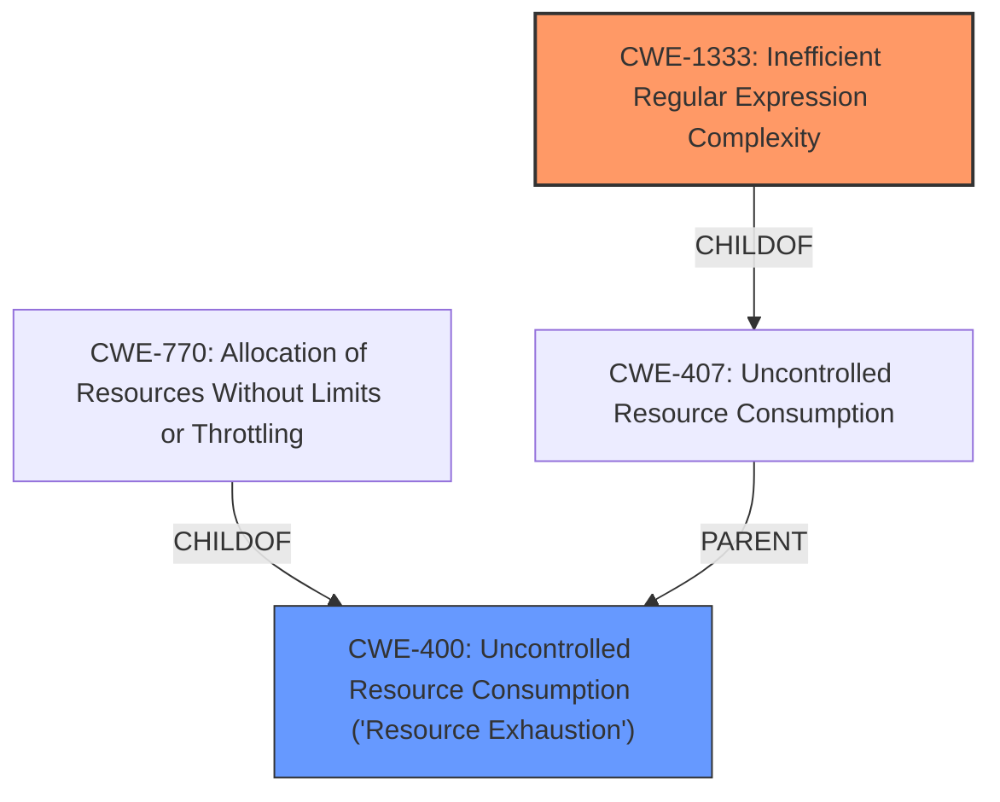

# Raw Analyzer Response for CVE-2021-41186

# Summary
| CWE ID    | CWE Name                                                  | Confidence | CWE Abstraction Level | CWE Vulnerability Mapping Label | CWE-Vulnerability Mapping Notes |
| --------- | --------------------------------------------------------- | ---------- | --------------------- | ------------------------------- | ------------------------------- |
| CWE-1333  | Inefficient Regular Expression Complexity                 | 1.0        | Base                  | Primary CWE                     | Allowed                       |
| CWE-400 | Uncontrolled Resource Consumption ('Resource Exhaustion') | 0.5        | Class                  | Secondary Candidate              | Allowed-with-Review           |

## Evidence and Confidence

*   **Confidence Score:** 1.0
*   **Evidence Strength:** HIGH

## Relationship Analysis
The primary CWE is CWE-1333, which has a ChildOf relationship with CWE-407 (Uncontrolled Resource Consumption). CWE-400 is a parent of CWE-770 which addresses Allocation of Resources Without Limits or Throttling. Given the nature of ReDoS, the resource consumption aspect (CWE-400) is a potential consequence, but the root cause is the inefficient regular expression (CWE-1333).

## Vulnerability Chain
The vulnerability chain starts with the **inefficient regular expression** (CWE-1333) which, when processing specific input, leads to excessive CPU consumption and results in a denial-of-service (DoS) condition, which falls under **Uncontrolled Resource Consumption** (CWE-400).

## Summary of Analysis
The analysis strongly indicates that CWE-1333 (Inefficient Regular Expression Complexity) is the most appropriate primary CWE for this vulnerability. The **Vulnerability Description Key Phrases** clearly states the **weakness** as "**regular expression denial of service**". The **CVE Reference Links Content Summary** also confirms the "**ReDoS vulnerability due to an inefficient regular expression**" as the root cause.

The retriever results listed CWE-1333 as the top combined result with a score of 1.0. The description of CWE-1333 perfectly matches the vulnerability: "The product uses a regular expression with an inefficient, possibly exponential worst-case computational complexity that consumes excessive CPU cycles."

CWE-400 is a potential secondary weakness, as the ReDoS leads to uncontrolled resource consumption and potential denial of service.

The final decision is based on the evidence provided in the vulnerability description and the retriever results. CWE-1333 is at the Base level of abstraction, which is the preferred level.

Relevant CWE Information:

# Enhanced Context (25 CWEs)

## CWE-23: Relative Path Traversal
CWE-23 was not selected because the vulnerability is not related to path traversal.

## CWE-41: Improper Resolution of Path Equivalence
CWE-41 was not selected because the vulnerability is not related to path equivalence.

## CWE-36: Absolute Path Traversal
CWE-36 was not selected because the vulnerability is not related to path traversal.

## CWE-59: Improper Link Resolution Before File Access ('Link Following')
CWE-59 was not selected because the vulnerability is not related to link resolution.

## CWE-73: External Control of File Name or Path
CWE-73 was not selected because the vulnerability is not related to external control of file names or paths.

## CWE-212: Improper Removal of Sensitive Information Before Storage or Transfer
CWE-212 was not selected because the vulnerability is not related to sensitive information removal.

## CWE-184: Incomplete List of Disallowed Inputs
CWE-184 was not selected because the vulnerability is not related to incomplete lists of disallowed inputs.

## CWE-668: Exposure of Resource to Wrong Sphere
CWE-668 was not selected because it is a high-level Class and more specific CWEs are available.

## CWE-24: Path Traversal: '../filedir'
CWE-24 was not selected because the vulnerability is not related to path traversal.

## CWE-427: Uncontrolled Search Path Element
CWE-427 was not selected because the vulnerability is not related to uncontrolled search path elements.

## CWE-1333: Inefficient Regular Expression Complexity
CWE-1333 was selected as the primary CWE.

## CWE-22: Improper Limitation of a Pathname to a Restricted Directory ('Path Traversal')
CWE-22 was not selected because the vulnerability is not related to path traversal.

## CWE-770: Allocation of Resources Without Limits or Throttling
CWE-770 was not selected as the primary CWE because it is a consequence of the **inefficient regular expression**, but not the root cause. It is more accurately characterized as the lack of resource throttling.

## CWE-1284: Improper Validation of Specified Quantity in Input
CWE-1284 was not selected because the vulnerability is not related to improper validation of specified quantity in input.

## CWE-617: Reachable Assertion
CWE-617 was not selected because the vulnerability is not related to reachable assertions.

## CWE-201: Insertion of Sensitive Information Into Sent Data
CWE-201 was not selected because the vulnerability is not related to insertion of sensitive information into sent data.

## CWE-770: Allocation of Resources Without Limits or Throttling
CWE-770 was not selected as the primary CWE because it is a consequence of the **inefficient regular expression**, but not the root cause. It is more accurately characterized as the lack of resource throttling.

## CWE-22: Improper Limitation of a Pathname to a Restricted Directory ('Path Traversal')
CWE-22 was not selected because the vulnerability is not related to path traversal.

## CWE-1284: Improper Validation of Specified Quantity in Input
CWE-1284 was not selected because the vulnerability is not related to improper validation of specified quantity in input.

## CWE-226: Sensitive Information in Resource Not Removed Before Reuse
CWE-226 was not selected because the vulnerability is not related to sensitive information in resource not removed before reuse.

## CWE-182: Collapse of Data into Unsafe Value
CWE-182 was not selected because the vulnerability is not related to collapse of data into unsafe value.

## CWE-187: Partial String Comparison
CWE-187 was not selected because the vulnerability is not related to partial string comparison.

## CWE-789: Memory Allocation with Excessive Size Value
CWE-789 was not selected because the vulnerability is not directly about memory allocation size, but rather the CPU consumption due to regex inefficiency.

## CWE-202: Exposure of Sensitive Information Through Data Queries
CWE-202 was not selected because the vulnerability is not related to exposure of sensitive information through data queries.

## CWE-1289: Improper Validation of Unsafe Equivalence in Input
CWE-1289 was not selected because the vulnerability is not related to improper validation of unsafe equivalence in input.