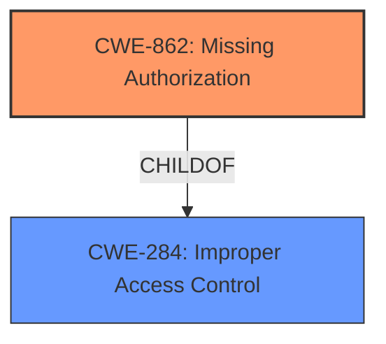

# Enhanced Analysis for CVE-2021-4119

# Summary
| CWE ID | CWE Name | Confidence | CWE Abstraction Level | CWE Vulnerability Mapping Label | CWE-Vulnerability Mapping Notes |
|---|---|---|---|---|---|
| CWE-862 | Missing Authorization | 0.9 | Base | Primary | Allowed |
| CWE-284 | Improper Access Control | 0.6 | Pillar | Secondary | Discouraged |

## Evidence and Confidence

*   **Confidence Score:** 0.9
*   **Evidence Strength:** HIGH

## Relationship Analysis
The primary CWE is CWE-862, which is a child of CWE-284. Choosing CWE-862 provides a more specific classification of the **improper access control** issue.



## Vulnerability Chain
The vulnerability chain starts with the **missing authorization** check on the `/search/users/select` endpoint, leading to unauthorized access to user details, specifically email addresses.

## Summary of Analysis
The initial assessment focused on identifying the root cause of the vulnerability. The vulnerability description explicitly mentions "**Improper Access Control**", but the CVE reference links provide more detailed information about the root cause: the `/search/users/select` endpoint lacked proper authentication and authorization checks, allowing unauthenticated users to access user email addresses. This indicates a **missing authorization** check.

Based on the evidence, the most appropriate CWE is **CWE-862: Missing Authorization**.

The evidence supporting this decision includes:

*   The vulnerability description key phrases indicating "**Improper Access Control**"
*   The CVE Reference Links Content Summary stating the endpoint "**did not enforce proper authentication or authorization checks**"
*   The CVE Reference Links Content Summary detailing that "**unauthenticated users to access user data**"

While **CWE-284: Improper Access Control** is a broader category encompassing the issue, **CWE-862: Missing Authorization** provides a more specific and accurate classification. The mapping guidance for **CWE-284** also suggests using more specific descendants like **CWE-862**.

Relevant CWE Information:

# Enhanced Context (25 CWEs)

## CWE-862: Missing Authorization

**CWE-862: Missing Authorization**

### Description

When an actor attempts to access a resource or perform an action, the product does not perform an authorization check to verify that the actor is allowed to access the resource or perform the action.

# Complete CWE Specifications

## CWE-284: Improper Access Control
**Abstraction:** Pillar
**Status:** Incomplete

### Description
The product does not restrict or incorrectly restricts access to a resource from an unauthorized actor.
**Mapping Guidance:**
**Usage:** Discouraged
**Rationale:** CWE-284 is extremely high-level, a Pillar. Its name, "Improper Access Control," is often misused in low-information vulnerability reports [REF-1287] or by active use of the OWASP Top Ten, such as "A01:2021-Broken Access Control". It is not useful for trend analysis.
**Comments:** Consider using descendants of CWE-284 that are more specific to the kind of access control involved, such as those involving authorization (Missing Authorization (CWE-862), Incorrect Authorization (CWE-863), Incorrect Permission Assignment for Critical Resource (CWE-732), etc.); authentication (Missing Authentication (CWE-306) or Weak Authentication (CWE-1390)); Incorrect User Management (CWE-286); Improper Restriction of Communication Channel to Intended Endpoints (CWE-923); etc.

## CWE-862: Missing Authorization
**Abstraction:** Base
**Status:** Draft

### Description
When an actor attempts to access a resource or perform an action, the product does not perform an authorization check to verify that the actor is allowed to access the resource or perform the action.


## CWE Relationship Analysis

Current CWEs represent these abstraction levels: .


### Vulnerability Chain Analysis

**Chain starting from CWE-732:**
- 732 (Incorrect Permission Assignment for Critical Resource) - ROOT


**Chain starting from CWE-286:**
- 286 (Incorrect User Management) - ROOT


### CWE Relationship Diagram

```mermaid
graph TD
    classDef primary fill:#f96,stroke:#333,stroke-width:2px
    classDef secondary fill:#69f,stroke:#333
    classDef tertiary fill:#9e9,stroke:#333
```