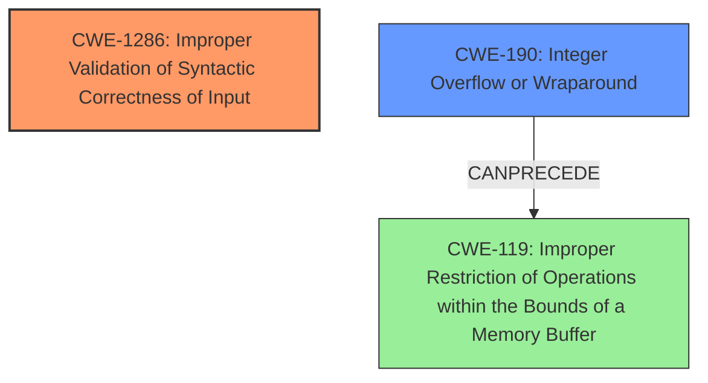

# Analysis for CVE-2021-41203

```markdown
# Summary
| CWE ID    | CWE Name                                                     | Confidence | CWE Abstraction Level | CWE Vulnerability Mapping Label | CWE-Vulnerability Mapping Notes |
| :-------- | :----------------------------------------------------------- | :--------- | :-------------------- | :------------------------------ | :------------------------------ |
| CWE-1286  | Improper Validation of Syntactic Correctness of Input        | 0.9        | Base                  | Primary                         | Allowed                         |
| CWE-190   | Integer Overflow or Wraparound                               | 0.8        | Base                  | Secondary                       | Allowed                         |

## Evidence and Confidence

*   **Confidence Score:** 0.85
*   **Evidence Strength:** HIGH

## Relationship Analysis
The primary weakness is the lack of validation of syntactic correctness of input (CWE-1286). This can lead to other issues like integer overflows (CWE-190), which are potential consequences of the initial missing validation. CWE-1286 sits on its own, while CWE-190 can precede a buffer overflow (CWE-119).



## Vulnerability Chain
The vulnerability chain starts with **missing validation for invalid file formats**, which can lead to **integer overflows**, and ultimately result in undefined behavior, segfaults, and crashes.

## Summary of Analysis
The primary issue is the **missing validation for invalid file formats**, which directly relates to **CWE-1286 (Improper Validation of Syntactic Correctness of Input)**. This is because the system expects a specific file format but doesn't validate whether the input adheres to that format. The description states: "This is because the checkpoints loading infrastructure is **missing validation for invalid file formats**."

The secondary issue is **integer overflows**, which are mentioned as a direct consequence of the **missing validation**. This corresponds to **CWE-190 (Integer Overflow or Wraparound)**.

I considered other CWEs like **CWE-824 (Access of Uninitialized Pointer)**, **CWE-1284 (Improper Validation of Specified Quantity in Input)**, **CWE-122 (Heap-based Buffer Overflow)**, **CWE-681 (Incorrect Conversion between Numeric Types)**, and **CWE-617 (Reachable Assertion)**, but they are less directly related to the root cause and more related to potential impacts or exploitation techniques. For example, a heap-based buffer overflow could be a consequence of the **integer overflow** but isn't the root cause described here.

The selected CWEs are at the optimal level of specificity, representing the core weaknesses identified in the vulnerability description.
The description also specifies that the root cause is the **missing validation for invalid file formats** which leads to **integer overflows**.

Relevant CWE Information:

# Enhanced Context (25 CWEs)
The following CWEs were identified as potentially relevant to this vulnerability:

## CWE-824: Access of Uninitialized Pointer
**Abstraction Level**: Base
**Similarity Score**: 0.76
**Source**: dense

**Description**:
The product accesses or uses a pointer that has not been initialized.

**Mapping Guidance**:
- Usage: Allowed
- Rationale: This CWE entry is at the Base level of abstraction, which is a preferred level of abstraction for mapping to the root causes of vulnerabilities.


## CWE-617: Reachable Assertion
**Abstraction Level**: Base
**Similarity Score**: 0.73
**Source**: dense

**Description**:
The product contains an assert() or similar statement that can be triggered by an attacker, which leads to an application exit or other behavior that is more severe than necessary.

**Mapping Guidance**:
- Usage: Allowed
- Rationale: This CWE entry is at the Base level of abstraction, which is a preferred level of abstraction for mapping to the root causes of vulnerabilities.


## CWE-1286: Improper Validation of Syntactic Correctness of Input
**Abstraction Level**: Base
**Similarity Score**: 0.72
**Source**: dense

**Description**:
The product receives input that is expected to be well-formed - i.e., to comply with a certain syntax - but it does not validate or incorrectly validates that the input complies with the syntax.

**Mapping Guidance**:
- Usage: Allowed
- Rationale: This CWE entry is at the Base level of abstraction, which is a preferred level of abstraction for mapping to the root causes of vulnerabilities.


## CWE-703: Improper Check or Handling of Exceptional Conditions
**Abstraction Level**: Pillar
**Similarity Score**: 0.72
**Source**: dense

**Description**:
The product does not properly anticipate or handle exceptional conditions that rarely occur during normal operation of the product.

**Mapping Guidance**:
- Usage: Discouraged
- Rationale: This CWE entry is extremely high-level, a Pillar.


## CWE-843: Access of Resource Using Incompatible Type ('Type Confusion')
**Abstraction Level**: Base
**Similarity Score**: 0.71
**Source**: dense

**Description**:
The product allocates or initializes a resource such as a pointer, object, or variable using one type, but it later accesses that resource using a type that is incompatible with the original type.

**Mapping Guidance**:
- Usage: Allowed
- Rationale: This CWE entry is at the Base level of abstraction, which is a preferred level of abstraction for mapping to the root causes of vulnerabilities.


## CWE-131: Incorrect Calculation of Buffer Size
**Abstraction Level**: Base
**Similarity Score**: 0.71
**Source**: dense

**Description**:
The product does not correctly calculate the size to be used when allocating a buffer, which could lead to a buffer overflow.

**Mapping Guidance**:
- Usage: Allowed
- Rationale: This CWE entry is at the Base level of abstraction, which is a preferred level of abstraction for mapping to the root causes of vulnerabilities.


## CWE-755: Improper Handling of Exceptional Conditions
**Abstraction Level**: Class
**Similarity Score**: 0.71
**Source**: dense

**Description**:
The product does not handle or incorrectly handles an exceptional condition.

**Mapping Guidance**:
- Usage: Discouraged
- Rationale: This CWE entry is a level-1 Class (i.e., a child of a Pillar). It might have lower-level children that would be more appropriate


## CWE-129: Improper Validation of Array Index
**Abstraction Level**: Variant
**Similarity Score**: 0.71
**Source**: dense

**Description**:
The product uses untrusted input when calculating or using an array index, but the product does not validate or incorrectly validates the index to ensure the index references a valid position within the array.

**Mapping Guidance**:
- Usage: Allowed
- Rationale: This CWE entry is at the Variant level of abstraction, which is a preferred level of abstraction for mapping to the root causes of vulnerabilities.


## CWE-754: Improper Check for Unusual or Exceptional Conditions
**Abstraction Level**: Class
**Similarity Score**: 0.71
**Source**: dense

**Description**:
The product does not check or incorrectly checks for unusual or exceptional conditions that are not expected to occur frequently during day to day operation of the product.

**Mapping Guidance**:
- Usage: Allowed-with-Review
- Rationale: This CWE entry is a Class and might have Base-level children that would be more appropriate


## CWE-681: Incorrect Conversion between Numeric Types
**Abstraction Level**: Base
**Similarity Score**: 0.70
**Source**: dense

**Description**:
When converting from one data type to another, such as long to integer, data can be omitted or translated in a way that produces unexpected values. If the resulting values are used in a sensitive context, then dangerous behaviors may occur.

**Mapping Guidance**:
- Usage: Allowed
- Rationale: This CWE entry is at the Base level of abstraction, which is a preferred level of abstraction for mapping to the root causes of vulnerabilities.


## CWE-1284: Improper Validation of Specified Quantity in Input
**Abstraction Level**: Base
**Similarity Score**: 4390.50
**Source**: sparse

**Description**:
The product receives input that is expected to specify a quantity (such as size or length), but it does not validate or incorrectly validates that the quantity has the required properties.

**Mapping Guidance**:
- Usage: Allowed
- Rationale: This CWE entry is at the Base level of abstraction, which is a preferred level of abstraction for mapping to the root causes of vulnerabilities.


## CWE-681: Incorrect Conversion between Numeric Types
**Abstraction Level**: Base

# Enhanced Query for CVE-2021-41203

# Vulnerability Description

    TensorFlow is an open source platform for machine learning. In affected versions an attacker can trigger undefined behavior, **integer overflows**, segfaults and `CHECK`-fail crashes if they can change saved checkpoints from outside of TensorFlow. This is because the checkpoints loading infrastructure is **missing validation for **invalid file formats****. The fixes will be included in TensorFlow 2.7.0. We will also cherrypick these commits on TensorFlow 2.6.1, TensorFlow 2.5.2, and TensorFlow 2.4.4, as these are also affected and still in supported range.

    # Keyphrase-Specific CWE Analysis
    This vulnerability contains multiple keyphrases that may map to different CWEs. 
    Please analyze each keyphrase separately and determine the most appropriate CWE(s) for each.

    ## ROOTCAUSE: 'missing validation for invalid file formats'

Relevant CWEs for this ROOTCAUSE:

### 1. CWE-824: Access of Uninitialized Pointer (Score: 789.50)

The product accesses or uses a pointer that has not been initialized....

### 2. CWE-1284: Improper Validation of Specified Quantity in Input (Score: 743.33)

The product receives input that is expected to specify a quantity (such as size or length), but it does not validate or incorrectly validates that the quantity has the required properties....

### 3. CWE-1286: Improper Validation of Syntactic Correctness of Input (Score: 679.90)

The product receives input that is expected to be well-formed - i.e., to comply with a certain syntax - but it does not validate or incorrectly validates that the input complies with the syntax....

### 4. CWE-122: Heap-based Buffer Overflow (Score: 645.59)

A heap overflow condition is a buffer overflow, where the buffer that can be overwritten is allocated in the heap portion of memory, generally meaning that the buffer was allocated using a routine such as malloc()....

### 5. CWE-681: Incorrect Conversion between Numeric Types (Score: 643.67)

When converting from one data type to another, such as long to integer, data can be omitted or translated in a way that produces unexpected values. If the resulting values are used in a sensitive context, then dangerous behaviors may occur....

## WEAKNESS: 'integer overflows'

Relevant CWEs for this WEAKNESS:

### 1. CWE-824: Access of Uninitialized Pointer (Score: 789.50)

The product accesses or uses a pointer that has not been initialized....

### 2. CWE-1284: Improper Validation of Specified Quantity in Input (Score: 743.33)

The product receives input that is expected to specify a quantity (such as size or length), but it does not validate or incorrectly validates that the quantity has the required properties....

### 3. CWE-122: Heap-based Buffer Overflow (Score: 645.59)

A heap overflow condition is a buffer overflow, where the buffer that can be overwritten is allocated in the heap portion of memory, generally meaning that the buffer was allocated using a routine such as malloc()....

### 4. CWE-681: Incorrect Conversion between Numeric Types (Score: 643.67)

When converting from one data type to another, such as long to integer, data can be omitted or translated in a way that produces unexpected values. If the resulting values are used in a sensitive context, then dangerous behaviors may occur....

### 5. CWE-617: Reachable Assertion (Score: 574.67)

The product contains an assert() or similar statement that can be triggered by an attacker, which leads to an application exit or other behavior that is more severe than necessary....

## WEAKNESS: 'invalid file formats'

Relevant CWEs for this WEAKNESS:

### 1. CWE-824: Access of Uninitialized Pointer (Score: 789.50)

The product accesses or uses a pointer that has not been initialized....

### 2. CWE-1284: Improper Validation of Specified Quantity in Input (Score: 743.33)

The product receives input that is expected to specify a quantity (such as size or length), but it does not validate or incorrectly validates that the quantity has the required properties....

### 3. CWE-1286: Improper Validation of Syntactic Correctness of Input (Score: 679.90)

The product receives input that is expected to be well-formed - i.e., to comply with a certain syntax - but it does not validate or incorrectly validates that the input complies with the syntax....

### 4. CWE-122: Heap-based Buffer Overflow (Score: 645.59)

A heap overflow condition is a buffer overflow, where the buffer that can be overwritten is allocated in the heap portion of memory, generally meaning that the buffer was allocated using a routine such as malloc()....

### 5. CWE-681: Incorrect Conversion between Numeric Types (Score: 643.67)

When converting from one data type to another, such as long to integer, data can be omitted or translated in a way that produces unexpected values. If the resulting values are used in a sensitive context, then dangerous behaviors may occur....

## IMPACT: 'undefined behavior'

Relevant CWEs for this IMPACT:

### 1. CWE-824: Access of Uninitialized Pointer (Score: 789.50)

The product accesses or uses a pointer that has not been initialized....

### 2. CWE-1284: Improper Validation of Specified Quantity in Input (Score: 743.33)

The product receives input that is expected to specify a quantity (such as size or length), but it does not validate or incorrectly validates that the quantity has the required properties....

### 3. CWE-122: Heap-based Buffer Overflow (Score: 645.59)

A heap overflow condition is a buffer overflow, where the buffer that can be overwritten is allocated in the heap portion of memory, generally meaning that the buffer was allocated using a routine such as malloc()....

### 4. CWE-681: Incorrect Conversion between Numeric Types (Score: 643.67)

When converting from one data type to another, such as long to integer, data can be omitted or translated in a way that produces unexpected values. If the resulting values are used in a sensitive context, then dangerous behaviors may occur....

### 5. CWE-617: Reachable Assertion (Score: 574.67)

The product contains an assert() or similar statement that can be triggered by an attacker, which leads to an application exit or other behavior that is more severe than necessary....

## IMPACT: 'segfaults'

Relevant CWEs for this IMPACT:

### 1. CWE-824: Access of Uninitialized Pointer (Score: 789.50)

The product accesses or uses a pointer that has not been initialized....

### 2. CWE-1284: Improper Validation of Specified Quantity in Input (Score: 743.33)

The product receives input that is expected to specify a quantity (such as size or length), but it does not validate or incorrectly validates that the quantity has the required properties....

### 3. CWE-122: Heap-based Buffer Overflow (Score: 645.59)

A heap overflow condition is a buffer overflow, where the buffer that can be overwritten is allocated in the heap portion of memory, generally meaning that the buffer was allocated using a routine such as malloc()....

### 4. CWE-681: Incorrect Conversion between Numeric Types (Score: 643.67)

When converting from one data type to another, such as long to integer, data can be omitted or translated in a way that produces unexpected values. If the resulting values are used in a sensitive context, then dangerous behaviors may occur....

### 5. CWE-617: Reachable Assertion (Score: 574.67)

The product contains an assert() or similar statement that can be triggered by an attacker, which leads to an application exit or other behavior that is more severe than necessary....

## IMPACT: 'CHECK-fail crashes'

Relevant CWEs for this IMPACT:

### 1. CWE-824: Access of Uninitialized Pointer (Score: 789.50)

The product accesses or uses a pointer that has not been initialized....

### 2. CWE-1284: Improper Validation of Specified Quantity in Input (Score: 743.33)

The product receives input that is expected to specify a quantity (such as size or length), but it does not validate or incorrectly validates that the quantity has the required properties....

### 3. CWE-1286: Improper Validation of Syntactic Correctness of Input (Score: 679.90)

The product receives input that is expected to be well-formed - i.e., to comply with a certain syntax - but it does not validate or incorrectly validates that the input complies with the syntax....

### 4. CWE-681: Incorrect Conversion between Numeric Types (Score: 643.67)

When converting from one data type to another, such as long to integer, data can be omitted or translated in a way that produces unexpected values. If the resulting values are used in a sensitive context, then dangerous behaviors may occur....

### 5. CWE-617: Reachable Assertion (Score: 574.67)

The product contains an assert() or similar statement that can be triggered by an attacker, which leads to an application exit or other behavior that is more severe than necessary....

## ATTACKER: 'attacker'

Relevant CWEs for this ATTACKER:

### 1. CWE-824: Access of Uninitialized Pointer (Score: 789.50)

The product accesses or uses a pointer that has not been initialized....

### 2. CWE-1284: Improper Validation of Specified Quantity in Input (Score: 743.33)

The product receives input that is expected to specify a quantity (such as size or length), but it does not validate or incorrectly validates that the quantity has the required properties....

### 3. CWE-122: Heap-based Buffer Overflow (Score: 645.59)

A heap overflow condition is a buffer overflow, where the buffer that can be overwritten is allocated in the heap portion of memory, generally meaning that the buffer was allocated using a routine such as malloc()....

### 4. CWE-681: Incorrect Conversion between Numeric Types (Score: 643.67)

When converting from one data type to another, such as long to integer, data can be omitted or translated in a way that produces unexpected values. If the resulting values are used in a sensitive context, then dangerous behaviors may occur....

### 5. CWE-617: Reachable Assertion (Score: 574.67)

The product contains an assert() or similar statement that can be triggered by an attacker, which leads to an application exit or other behavior that is more severe than necessary....

## PRODUCT: 'TensorFlow'

Relevant CWEs for this PRODUCT:

### 1. CWE-824: Access of Uninitialized Pointer (Score: 789.50)

The product accesses or uses a pointer that has not been initialized....

### 2. CWE-1284: Improper Validation of Specified Quantity in Input (Score: 743.33)

The product receives input that is expected to specify a quantity (such as size or length), but it does not validate or incorrectly validates that the quantity has the required properties....

### 3. CWE-122: Heap-based Buffer Overflow (Score: 645.59)

A heap overflow condition is a buffer overflow, where the buffer that can be overwritten is allocated in the heap portion of memory, generally meaning that the buffer was allocated using a routine such as malloc()....

### 4. CWE-681: Incorrect Conversion between Numeric Types (Score: 643.67)

When converting from one data type to another, such as long to integer, data can be omitted or translated in a way that produces unexpected values. If the resulting values are used in a sensitive context, then dangerous behaviors may occur....

### 5. CWE-617: Reachable Assertion (Score: 574.67)

The product contains an assert() or similar statement that can be triggered by an attacker, which leads to an application exit or other behavior that is more severe than necessary....

## VERSION: 'multiple versions'

Relevant CWEs for this VERSION:

### 1. CWE-824: Access of Uninitialized Pointer (Score: 789.50)

The product accesses or uses a pointer that has not been initialized....

### 2. CWE-1284: Improper Validation of Specified Quantity in Input (Score: 743.33)

The product receives input that is expected to specify a quantity (such as size or length), but it does not validate or incorrectly validates that the quantity has the required properties....

### 3. CWE-122: Heap-based Buffer Overflow (Score: 645.59)

A heap overflow condition is a buffer overflow, where the buffer that can be overwritten is allocated in the heap portion of memory, generally meaning that the buffer was allocated using a routine such as malloc()....

### 4. CWE-681: Incorrect Conversion between Numeric Types (Score: 643.67)

When converting from one data type to another, such as long to integer, data can be omitted or translated in a way that produces unexpected values. If the resulting values are used in a sensitive context, then dangerous behaviors may occur....

### 5. CWE-617: Reachable Assertion (Score: 574.67)

The product contains an assert() or similar statement that can be triggered by an attacker, which leads to an application exit or other behavior that is more severe than necessary....

## COMPONENT: 'checkpoints loading infrastructure'

Relevant CWEs for this COMPONENT:

### 1. CWE-824: Access of Uninitialized Pointer (Score: 789.50)

The product accesses or uses a pointer that has not been initialized....

### 2. CWE-1284: Improper Validation of Specified Quantity in Input (Score: 743.33)

The product receives input that is expected to specify a quantity (such as size or length), but it does not validate or incorrectly validates that the quantity has the required properties....

### 3. CWE-681: Incorrect Conversion between Numeric Types (Score: 643.67)

When converting from one data type to another, such as long to integer, data can be omitted or translated in a way that produces unexpected values. If the resulting values are used in a sensitive context, then dangerous behaviors may occur....

### 4. CWE-617: Reachable Assertion (Score: 574.67)

The product contains an assert() or similar statement that can be triggered by an attacker, which leads to an application exit or other behavior that is more severe than necessary....

### 5. CWE-663: Use of a Non-reentrant Function in a Concurrent Context (Score: 203.65)

The product calls a non-reentrant function in a concurrent context in which a competing code sequence (e.g. thread or signal handler) may have an opportunity to call the same function or otherwise influence its state....


    # Analysis Instructions
    1. For each keyphrase, identify the most appropriate CWE(s) that represent the weakness.
    2. Consider how the different keyphrases might relate to each other in the vulnerability chain.
    3. Provide a final determination of primary CWE(s) and any secondary CWEs.
    4. Format your response using the standard analysis template.

    Please analyze how these different weaknesses interact and provide a comprehensive CWE classification.
    