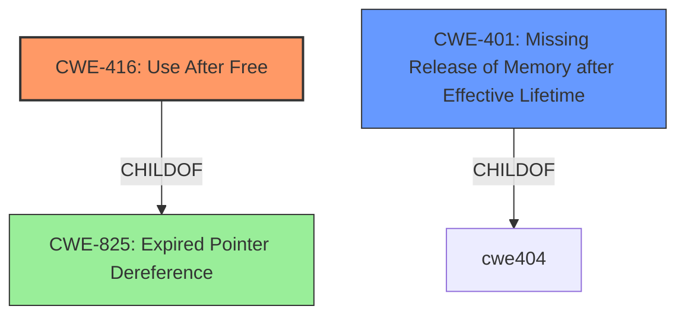

# Raw Analyzer Response for CVE-2021-41220

# Summary
| CWE ID  | CWE Name                                                     | Confidence | CWE Abstraction Level | CWE Vulnerability Mapping Label | CWE-Vulnerability Mapping Notes |
| :-------- | :----------------------------------------------------------- | :--------- | :---------------------- | :------------------------------ | :------------------------------ |
| CWE-416   | Use After Free                                               | 0.9        | Variant               | Allowed                         | Primary CWE                     |
| CWE-401   | Missing Release of Memory after Effective Lifetime         | 0.8        | Variant               | Allowed                         | Secondary Candidate             |

## Evidence and Confidence

*   **Confidence Score:** 0.85
*   **Evidence Strength:** HIGH

## Relationship Analysis
The primary weakness is a Use After Free (CWE-416), which is a variant of a more general class related to resource management. The memory leak (CWE-401) is a related but distinct issue.

## Vulnerability Chain
The vulnerability chain consists of:
1.  **Root Cause:** **Asynchronous computation** leading to incorrect state management
2.  **Weakness 1:** Use-after-free (CWE-416) due to accessing moved-from objects.
3.  **Weakness 2:** Memory leak (CWE-401) due to missing memory release.
4.  **Impact:** Crashes, `std::bad_alloc` exceptions, memory leaks, and undefined behavior.

## Summary of Analysis
The analysis indicates a primary weakness of CWE-416 Use After Free, with a secondary weakness of CWE-401 Missing Release of Memory after Effective Lifetime. This is based on the vulnerability description indicating both a **memory leak and a use after free** in the `CollectiveReduceV2` implementation. The root cause is the **asynchronous computation** that leads to incorrect state management and accessing objects after they have been moved from.

The "CVE Reference Links Content Summary" explicitly states: "The vulnerability stems from a use-after-free and memory leak in the asynchronous implementation of `CollectiveReduceV2` in TensorFlow. This occurs because the `done` callback is moved from using `std::move()`, but it is still accessed later."

CWE-416 is chosen because it directly addresses the **use after free** condition.
CWE-401 is chosen because it directly addresses the **memory leak** condition.

Other CWEs considered but not used:
*   CWE-824 Access of Uninitialized Pointer: While plausible, the core issue isn't an uninitialized pointer, but rather using a pointer after the memory has been freed or the object has been moved.
*   CWE-681 Incorrect Conversion between Numeric Types: Not relevant to the vulnerability.
*   CWE-1284 Improper Validation of Specified Quantity in Input: Not relevant to the vulnerability.
*   CWE-415 Double Free: While a double free could occur due to memory corruption from the use-after-free, the initial use-after-free is the primary issue.
* CWE-787 Out-of-bounds Write, CWE-123 Write-what-where Condition, CWE-125 Out-of-bounds Read: These are all memory corruption issues that could potentially result from a use-after-free, but the primary issue is using memory after it has been freed, thus CWE-416.
* CWE-170 Improper Null Termination, CWE-190 Integer Overflow or Wraparound, CWE-128 Wrap-around Error, CWE-129 Improper Validation of Array Index: These are not relevant to the vulnerability.

Relevant CWE Information:

# Enhanced Context (25 CWEs)

## CWE-401: Missing Release of Memory after Effective Lifetime
**Abstraction Level**: Variant
**Similarity Score**: 1.00
**Source**: alternate_terms

**Description**:
The product does not sufficiently track and release allocated memory after it has been used, which slowly consumes remaining memory.

**Mapping Guidance**:
- Usage: Allowed
- Rationale: This CWE entry is at the Variant level of abstraction, which is a preferred level of abstraction for mapping to the root causes of vulnerabilities.

## CWE-824: Access of Uninitialized Pointer
**Abstraction Level**: Base
**Similarity Score**: 0.629
**Source**: sparse

**Description**:
The product accesses or uses a pointer that has not been initialized.

**Mapping Guidance**:
- Usage: Allowed
- Rationale: This CWE entry is at the Base level of abstraction, which is a preferred level of abstraction for mapping to the root causes of vulnerabilities.

## CWE-681: Incorrect Conversion between Numeric Types
**Abstraction Level**: Base
**Similarity Score**: 0.602
**Source**: sparse

**Description**:
When converting from one data type to another, such as long to integer, data can be omitted or translated in a way that produces unexpected values. If the resulting values are used in a sensitive context, then dangerous behaviors may occur.

**Mapping Guidance**:
- Usage: Allowed
- Rationale: This CWE entry is at the Base level of abstraction, which is a preferred level of abstraction for mapping to the root causes of vulnerabilities.

## CWE-1284: Improper Validation of Specified Quantity in Input
**Abstraction Level**: Base
**Similarity Score**: 0.569
**Source**: sparse

**Description**:
The product receives input that is expected to specify a quantity (such as size or length), but it does not validate or incorrectly validates that the quantity has the required properties.

**Mapping Guidance**:
- Usage: Allowed
- Rationale: This CWE entry is at the Base level of abstraction, which is a preferred level of abstraction for mapping to the root causes of vulnerabilities.

## CWE-674: Uncontrolled Recursion
**Abstraction Level**: Class
**Similarity Score**: 0.555
**Source**: sparse

**Description**:
The product does not properly control the amount of recursion that takes place,  consuming excessive resources, such as allocated memory or the program stack.

**Mapping Guidance**:
- Usage: Allowed-with-Review
- Rationale: This CWE entry is a Class and might have Base-level children that would be more appropriate

## CWE-415: Double Free
**Abstraction Level**: Variant
**Similarity Score**: 0.456
**Source**: dense

**Description**:
The product calls free() twice on the same memory address, potentially leading to modification of unexpected memory locations.

**Mapping Guidance**:
- Usage: Allowed
- Rationale: This CWE entry is at the Variant level of abstraction, which is a preferred level of abstraction for mapping to the root causes of vulnerabilities.

## CWE-123: Write-what-where Condition
**Abstraction Level**: base
**Similarity Score**: 0.002
**Source**: graph

**Description**:
CWE-123: Write-what-where Condition

**Mapping Guidance**:
- Usage: Allowed
- Rationale: This CWE entry is at the Base level of abstraction, which is a preferred level of abstraction for mapping to the root causes of vulnerabilities.

## CWE-617: Reachable Assertion
**Abstraction Level**: Base
**Similarity Score**: 0.544
**Source**: sparse

**Description**:
The product contains an assert() or similar statement that can be triggered by an attacker, which leads to an application exit or other behavior that is more severe than necessary.

**Mapping Guidance**:
- Usage: Allowed
- Rationale: This CWE entry is at the Base level of abstraction, which is a preferred level of abstraction for mapping to the root causes of vulnerabilities.

## CWE-122: Heap-based Buffer Overflow
**Abstraction Level**: Variant
**Similarity Score**: 0.526
**Source**: sparse

**Description**:
A heap overflow condition is a buffer overflow, where the buffer that can be overwritten is allocated in the heap portion of memory, generally meaning that the buffer was allocated using a routine such as malloc().

**Mapping Guidance**:
- Usage: Allowed
- Rationale: This CWE entry is at the Variant level of abstraction, which is a preferred level of abstraction for mapping to the root causes of vulnerabilities.

## CWE-663: Use of a Non-reentrant Function in a Concurrent Context
**Abstraction Level**: Base
**Similarity Score**: 0.516
**Source**: sparse

**Description**:
The product calls a non-reentrant function in a concurrent context in which a competing code sequence (e.g. thread or signal handler