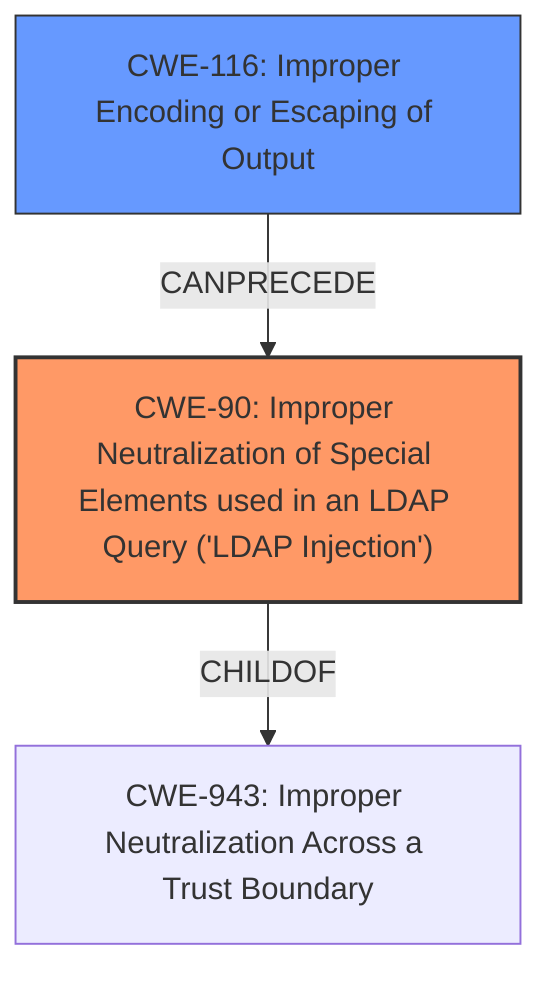

# Enhanced Analysis for CVE-2021-41232

# Summary
| CWE ID | CWE Name | Confidence | CWE Abstraction Level | CWE Vulnerability Mapping Label | CWE-Vulnerability Mapping Notes |
|---|---|---|---|---|---|
| CWE-90 | Improper Neutralization of Special Elements used in an LDAP Query ('LDAP Injection') | 1.0 | Base | Allowed | Primary CWE |
| CWE-116 | Improper Encoding or Escaping of Output | 0.7 | Class | Allowed-with-Review | Secondary Candidate |

## Evidence and Confidence

*   **Confidence Score:** 0.85
*   **Evidence Strength:** HIGH

## Relationship Analysis
The primary relationship impacting the decision is the hierarchical relationship between CWE-90 and its parent CWEs. The vulnerability description clearly indicates an **LDAP injection** issue due to **improper neutralization** of special elements within an LDAP query. This aligns perfectly with the definition of CWE-90, a Base level CWE. While CWE-116, **Improper Encoding or Escaping of Output**, is also relevant, it's a class level CWE and represents a more general case of the root cause. The relationship between CWE-116 and CWE-90 is that improper encoding can lead to LDAP injection.



## Vulnerability Chain
The vulnerability chain starts with the **improper encoding/escaping** of the username (CWE-116), which leads to the **LDAP Injection** vulnerability (CWE-90). The impact of the LDAP injection is the potential to read, modify, or delete sensitive information from the directory service.
  - Root Cause: **Improper encoding/escaping** of username (CWE-116).
  - Weakness: **LDAP Injection** (CWE-90) due to missing sanitization of user-provided input in LDAP queries.
  - Impact: Ability to read, modify, or delete sensitive information from the LDAP directory service.

## Summary of Analysis
The initial analysis focused on identifying the root cause of the vulnerability. The vulnerability description key phrases include "**LDAP injection**" which strongly suggests CWE-90. The CVE Reference Links Content Summary confirms that the root cause is the construction of LDAP search filters using user-provided input without proper sanitization. The application directly incorporates the username into the LDAP filter string, creating an **LDAP Injection** vulnerability (CWE-90).

The retriever results also strongly support CWE-90 as the primary CWE.

CWE-116 was considered because **improper encoding** is a common cause of injection vulnerabilities. However, CWE-90 is a more specific description of the actual vulnerability, representing the specific type of injection occurring.

The selection of CWE-90 is at the optimal level of specificity, as it precisely describes the vulnerability and is a Base level CWE. The mapping guidance for CWE-90 explicitly allows its usage and states that it is at a preferred level of abstraction for mapping to the root causes of vulnerabilities.
The evidence is: "The provided username is not properly escaped."

Relevant CWE Information:

# Enhanced Context (25 CWEs)

## CWE-90: Improper Neutralization of Special Elements used in an LDAP Query ('LDAP Injection')
**Abstraction:** Base
**Status:** Draft

### Description
The product constructs all or part of an LDAP query using externally-influenced input from an upstream component, but it does not neutralize or incorrectly neutralizes special elements that could modify the intended LDAP query when it is sent to a downstream component.


## CWE Relationship Analysis

Current CWEs represent these abstraction levels: .


### Vulnerability Chain Analysis

**Chain starting from CWE-90:**
- 90 (Improper Neutralization of Special Elements used in an LDAP Query ('LDAP Injection')) - ROOT


**Chain starting from CWE-116:**
- 116 (Improper Encoding or Escaping of Output) - ROOT


### CWE Relationship Diagram

```mermaid
graph TD
    classDef primary fill:#f96,stroke:#333,stroke-width:2px
    classDef secondary fill:#69f,stroke:#333
    classDef tertiary fill:#9e9,stroke:#333
```