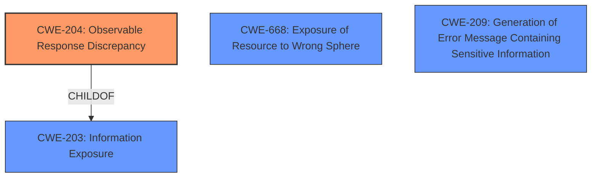

# Analysis for CVE-2021-41239

# Summary
| CWE ID | CWE Name | Confidence | CWE Abstraction Level | CWE Vulnerability Mapping Label | CWE-Vulnerability Mapping Notes |
|---|---|---|---|---|---|
| **CWE-204** | Observable Response Discrepancy | 0.8 | Base | Allowed | Primary CWE |
| CWE-668 | Exposure of Resource to Wrong Sphere | 0.5 | Class | Discouraged | Secondary Candidate |
| CWE-209 | Generation of Error Message Containing Sensitive Information | 0.4 | Base | Allowed | Secondary Candidate |

## Evidence and Confidence

*   **Confidence Score:** 0.8
*   **Evidence Strength:** HIGH

## Relationship Analysis
The primary CWE selected is CWE-204 (Observable Response Discrepancy), which is a Base-level CWE. It's related to CWE-203 (Information Exposure), but is more specific, as it focuses on discrepancies in responses that reveal internal state. The retriever also listed CWE-668, a Class-level CWE that is too broad, and CWE-209, which isn't quite applicable, as it pertains to explicit error messages rather than response discrepancies.

## Vulnerability Chain
The vulnerability chain starts with the **User Status API did not consider the user enumeration settings**, leading to a situation where an attacker can **enumerate other users**. This results in **privacy violation**, as user information is exposed when it should be restricted. Thus, the chain is: **Improper Configuration** -> **User Enumeration** -> **Information Exposure/Privacy Violation**.

## Summary of Analysis
The initial analysis focused on the fact that the User Status API was leaking information about other users. The key evidence is: "User Status API did not consider the user enumeration settings by the administrator. This allowed a user to **enumerate other users** on the instance, even when user listings where disabled."

The retriever results suggested CWE-209 (Generation of Error Message Containing Sensitive Information), CWE-863 (Incorrect Authorization), and CWE-639 (Authorization Bypass Through User-Controlled Key). However, the vulnerability isn't about generating error messages with sensitive info (CWE-209). While authorization is related, the core issue is about revealing information due to the API's behavior based on configuration settings. The best fit from the provided options is CWE-204 (Observable Response Discrepancy) because the application's response differs based on whether the user enumeration settings are respected, leading to information exposure. While it's not a perfect fit, it captures the essence of the vulnerability.

CWE-204 is at the Base level of abstraction, which is preferred. It is more specific than its parent CWE-203 (Information Exposure), which is a Class.

The other suggestions were considered but deemed less appropriate:

*   CWE-668 (Exposure of Resource to Wrong Sphere) is too high-level and doesn't accurately describe the specific weakness.
*   CWE-863 (Incorrect Authorization) implies a failure in the authorization process, which isn't the primary issue here. The problem is the API revealing information it shouldn't.
*   CWE-639 (Authorization Bypass Through User-Controlled Key) is also related to authorization but focuses on manipulating keys to access other users' data, which isn't the case here.

Therefore, CWE-204 is the most appropriate CWE for this vulnerability, with a confidence score of 0.8.

Relevant CWE Information:

# Enhanced Context (25 CWEs)
The following CWEs were identified as potentially relevant to this vulnerability:

## CWE-41: Improper Resolution of Path Equivalence
**Abstraction Level**: Base
**Similarity Score**: 0.79
**Source**: dense

**Description**:
The product is vulnerable to file system contents disclosure through path equivalence. Path equivalence involves the use of special characters in file and directory names. The associated manipulations are intended to generate multiple names for the same object.

**Mapping Guidance**:
- Usage: Allowed
- Rationale: This CWE entry is at the Base level of abstraction, which is a preferred level of abstraction for mapping to the root causes of vulnerabilities.

## CWE-668: Exposure of Resource to Wrong Sphere
**Abstraction Level**: Class
**Similarity Score**: 0.79
**Source**: dense

**Description**:
The product exposes a resource to the wrong control sphere, providing unintended actors with inappropriate access to the resource.

**Mapping Guidance**:
- Usage: Discouraged
- Rationale: CWE-668 is high-level and is often misused as a catch-all when lower-level CWE IDs might be applicable. It is sometimes used for low-information vulnerability reports [REF-1287]. It is a level-1 Class (i.e., a child of a Pillar). It is not useful for trend analysis.

## CWE-345: Insufficient Verification of Data Authenticity
**Abstraction Level**: Class
**Similarity Score**: 0.79
**Source**: dense

**Description**:
The product does not sufficiently verify the origin or authenticity of data, in a way that causes it to accept invalid data.

**Mapping Guidance**:
- Usage: Discouraged
- Rationale: This CWE entry is a level-1 Class (i.e., a child of a Pillar). It might have lower-level children that would be more appropriate

## CWE-639: Authorization Bypass Through User-Controlled Key
**Abstraction Level**: Base
**Similarity Score**: 0.79
**Source**: dense

**Description**:
The system's authorization functionality does not prevent one user from gaining access to another user's data or record by modifying the key value identifying the data.

**Mapping Guidance**:
- Usage: Allowed
- Rationale: This CWE entry is at the Base level of abstraction, which is a preferred level of abstraction for mapping to the root causes of vulnerabilities.

## CWE-212: Improper Removal of Sensitive Information Before Storage or Transfer
**Abstraction Level**: Base
**Similarity Score**: 0.79
**Source**: dense

**Description**:
The product stores, transfers, or shares a resource that contains sensitive information, but it does not properly remove that information before the product makes the resource available to unauthorized actors.

**Mapping Guidance**:
- Usage: Allowed
- Rationale: This CWE entry is at the Base level of abstraction, which is a preferred level of abstraction for mapping to the root causes of vulnerabilities.

## CWE-209: Generation of Error Message Containing Sensitive Information
**Abstraction Level**: Base
**Similarity Score**: 0.79
**Source**: dense

**Description**:
The product generates an error message that includes sensitive information about its environment, users, or associated data.

**Mapping Guidance**:
- Usage: Allowed
- Rationale: This CWE entry is at the Base level of abstraction, which is a preferred level of abstraction for mapping to the root causes of vulnerabilities.

## CWE-204: Observable Response Discrepancy
**Abstraction Level**: Base
**Similarity Score**: 0.79
**Source**: dense

**Description**:
The product provides different responses to incoming requests in a way that reveals internal state information to an unauthorized actor outside of the intended control sphere.

**Mapping Guidance**:
- Usage: Allowed
- Rationale: This CWE entry is at the Base level of abstraction, which is a preferred level of abstraction for mapping to the root causes of vulnerabilities.

## CWE-295: Improper Certificate Validation
**Abstraction Level**: Base
**Similarity Score**: 0.79
**Source**: dense

**Description**:
The product does not validate, or incorrectly validates, a certificate.

**Mapping Guidance**:
- Usage: Allowed
- Rationale: This CWE entry is at the Base level of abstraction, which is a preferred level of abstraction for mapping to the root causes of vulnerabilities.

## CWE-754: Improper Check for Unusual or Exceptional Conditions
**Abstraction Level**: Class
**Similarity Score**: 0.79
**Source**: dense

**Description**:
The product does not check or incorrectly checks for unusual or exceptional conditions that are not expected to occur frequently during day to day operation of the product.

**Mapping Guidance**:
- Usage: Allowed-with-Review
- Rationale: This CWE entry is a Class and might have Base-level children that would be more appropriate

## CWE-1390: Weak Authentication
**Abstraction Level**: Class
**Similarity Score**: 0.79
**Source**: dense

**Description**:
The product uses an authentication