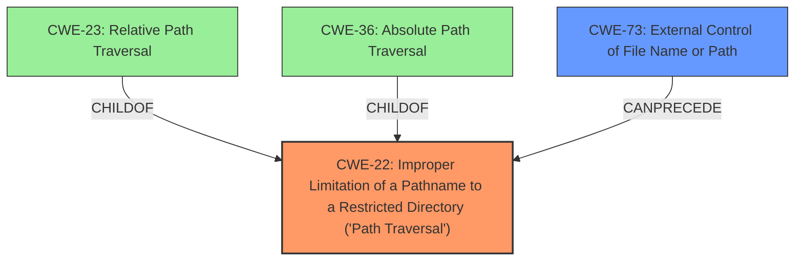

# Raw Analyzer Response for CVE-2021-41242

# Summary
| CWE ID | CWE Name | Confidence | CWE Abstraction Level | CWE Vulnerability Mapping Label | CWE-Vulnerability Mapping Notes |
|---|---|---|---|---|---|
| CWE-22 | Improper Limitation of a Pathname to a Restricted Directory ('Path Traversal') | 1.0 | Base | Primary | Allowed |
| CWE-73 | External Control of File Name or Path | 0.7 | Base | Secondary | Allowed |

## Evidence and Confidence

*   **Confidence Score:** 0.9
*   **Evidence Strength:** HIGH

## Relationship Analysis
The primary weakness is **CWE-22 Improper Limitation of a Pathname to a Restricted Directory ('Path Traversal')**, which is a base-level CWE. **CWE-73 External Control of File Name or Path** is a related weakness because the vulnerability description mentions that the product allows user input to control or influence paths or file names that are used in filesystem operations. **CWE-23 Relative Path Traversal** and **CWE-36 Absolute Path Traversal** are children of **CWE-22** but the description doesn't explicitly state whether relative or absolute path traversal is being used; therefore, **CWE-22** is more appropriate.

## Vulnerability Chain
The vulnerability chain starts with external control of the filename/path (**CWE-73**), leading to improper limitation of pathname to a restricted directory (**CWE-22**), which results in arbitrary file write.

## Summary of Analysis
The initial assessment identified **CWE-22 Improper Limitation of a Pathname to a Restricted Directory ('Path Traversal')** as the primary weakness due to the **path traversal** vulnerability described. The vulnerability description states, "By providing a filename that contains a relative path as a parameter in some REST methods, it is possible to create directory structures and write files anywhere on the target system." The CVE Reference Links Content Summary further confirms this by stating, "The primary weakness is the lack of proper sanitization or validation of the filename parameter in REST API calls. This allows an attacker to manipulate the file path and write files outside the intended directory." This clearly indicates a path traversal vulnerability.

**CWE-73 External Control of File Name or Path** was considered as a secondary CWE because the product allows user input to influence file names or paths, which is a prerequisite for the path traversal. However, the core issue is the improper limitation of the pathname, making **CWE-22** the primary weakness.

The retriever results also support **CWE-22** as the top candidate. The mapping guidance for **CWE-22** states that it is at the Base level of abstraction, which is the preferred level.

The selected CWEs are at the optimal level of specificity, with **CWE-22** accurately representing the core **path traversal** vulnerability and **CWE-73** representing the external control aspect.

Relevant CWE Information:
- **CWE-22: Improper Limitation of a Pathname to a Restricted Directory ('Path Traversal')**
- **CWE-73: External Control of File Name or Path**