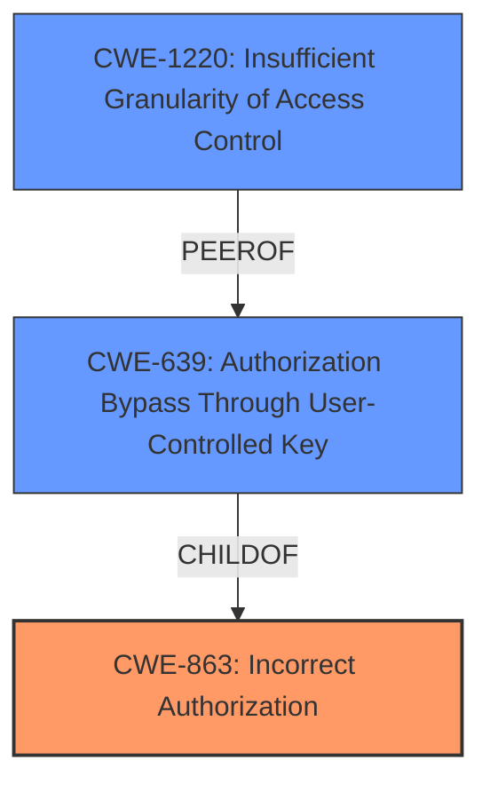

# Enhanced Analysis for CVE-2021-41244

# Summary
| CWE ID  | CWE Name                                                           | Confidence | CWE Abstraction Level | CWE Vulnerability Mapping Label | CWE-Vulnerability Mapping Notes |
| :-------- | :----------------------------------------------------------------- | :--------- | :-------------------- | :------------------------------ | :------------------------------ |
| CWE-863   | Incorrect Authorization                                            | 0.9        | Class                 | Primary                         | Allowed-with-Review           |
| CWE-639   | Authorization Bypass Through User-Controlled Key                | 0.7        | Base                  | Secondary                       | Allowed                       |
| CWE-1220 | Insufficient Granularity of Access Control                     | 0.6        | Base                  | Secondary                       | Allowed                       |

## Evidence and Confidence

*   **Confidence Score:** 0.8
*   **Evidence Strength:** HIGH

## Relationship Analysis
The primary CWE is CWE-863, which represents an **incorrect authorization**. CWE-639, Authorization Bypass Through User-Controlled Key, is a child of CWE-863 and represents a more specific case where the authorization bypass occurs through a user-controlled key. CWE-1220, Insufficient Granularity of Access Control, is also related as the **fine-grained access control** was intended to provide more specific access controls, but it failed to do so. The abstraction levels influenced the selection: CWE-863 is a class, while CWE-639 and CWE-1220 are base. CWE-863 was chosen as primary as it captures the general **incorrect authorization** issue while CWE-639 and CWE-1220 provide more specific details.



## Vulnerability Chain
The vulnerability chain starts with a **flawed implementation of fine-grained access control**, leading to **incorrect authorization** and ultimately allowing users with Organization Admin roles to access and manipulate user roles in other organizations.
  - **Root Cause:** **Flawed implementation of fine-grained access control**
  - **Weakness:** **Incorrect Authorization** (CWE-863)
  - **Impact:** Unauthorized access and manipulation of user roles in other organizations.

## Summary of Analysis
The initial analysis identified CWE-863 as the primary weakness due to the **incorrect authorization** mechanism. The retriever results and vulnerability description key phrases both point to this. The vulnerability description specifically mentions that "admins are able to access users from other organizations", indicating an authorization problem. CWE-639 and CWE-1220 are also relevant because the **incorrect authorization** occurs through user-controlled keys and the access control lacks sufficient granularity. The final selection is based on the evidence from the vulnerability description, the retriever results, and the relationship analysis. The selected CWEs are at the optimal level of specificity, with CWE-863 capturing the general issue and CWE-639 and CWE-1220 providing more specific details.

Relevant CWE Information:

**CWE-863: Incorrect Authorization**

The vulnerability description states that "admins are able to access users from other organizations," directly aligning with the description of CWE-863. The **incorrect authorization** allows users to perform actions they should not be allowed to perform. The security implication is unauthorized access and modification of user roles, which can lead to information exposure, denial of service, and other problems.
The "Mapping Guidance" for CWE-863 suggests that it's a Class and might have Base-level children that would be more appropriate. CWE-639 and CWE-1220 are more specific and were considered.

**CWE-639: Authorization Bypass Through User-Controlled Key**

This CWE is related because the Organization Admin role effectively acts as a key that is used to access user data. The vulnerability allows this key to be used across organizations, bypassing the intended authorization controls. This is an Authorization Bypass Through User-Controlled Key, as the "Organization Admin" role acts as a key. The security implications include unauthorized access to sensitive data and the ability to modify user roles, potentially leading to privilege escalation and other security breaches. The content states that "organization admins can list, add, remove and update users roles in another organization, where they do not have organization admin role."

**CWE-1220: Insufficient Granularity of Access Control**

The vulnerability exploits the lack of granularity in the access control mechanism. The fine-grained access control was intended to provide more specific permissions, but it failed to prevent Organization Admins from accessing users in other organizations. The fact that this vulnerability exists with **fine-grained access control** enabled is an indication of **insufficient granularity of access control**.

**CWEs Not Used and Why:**

*   CWE-610: Externally Controlled Reference to a Resource in Another Sphere was considered but not used as it is more suited for cases where an external input directly controls a reference to a resource. While related, the core of this vulnerability is an **incorrect authorization** check, not the external control of a resource reference.
*   CWE-285: Improper Authorization was considered but not used because CWE-863: Incorrect Authorization is a more specific child of CWE-285.
*   CWE-267: Privilege Defined With Unsafe Actions was considered, but it is not the most accurate representation of the vulnerability. While the "Organization Admin" privilege is involved, the issue is primarily with the **incorrect authorization** check that allows this privilege to be used across organizations.
*   CWE-306: Missing Authentication for Critical Function was not considered, as there is authentication; the problem is with the authorization after authentication.
*   CWE-1390: Weak Authentication was not considered because the authentication itself is not weak. The issue lies in the **incorrect authorization** after a user is authenticated.


## CWE Relationship Analysis

Current CWEs represent these abstraction levels: .


### Vulnerability Chain Analysis

**Chain starting from CWE-306:**
- 306 (Missing Authentication for Critical Function) - ROOT


**Chain starting from CWE-285:**
- 285 (Improper Authorization) - ROOT


### CWE Relationship Diagram

```mermaid
graph TD
    classDef primary fill:#f96,stroke:#333,stroke-width:2px
    classDef secondary fill:#69f,stroke:#333
    classDef tertiary fill:#9e9,stroke:#333
```