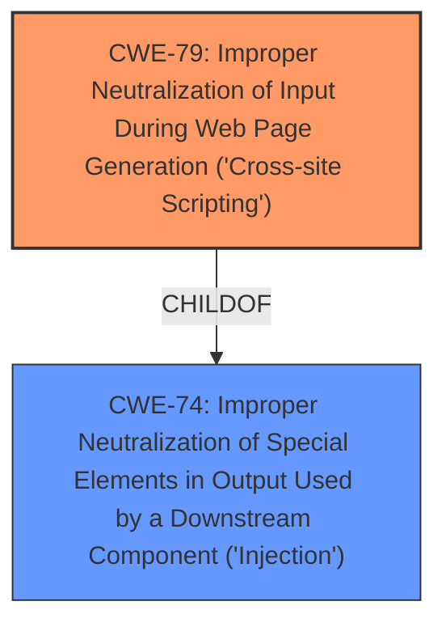

# Raw Analyzer Response for CVE-2021-41248

# Summary
| CWE ID | CWE Name | Confidence | CWE Abstraction Level | CWE Vulnerability Mapping Label | CWE-Vulnerability Mapping Notes |
|---|---|---|---|---|---|
| CWE-79 | Improper Neutralization of Input During Web Page Generation ('Cross-site Scripting') | 1.0 | Base | Allowed | Primary CWE |

## Evidence and Confidence

*   **Confidence Score:** 1.0
*   **Evidence Strength:** HIGH

## Relationship Analysis
The primary relationship impacting the decision is the parent-child relationship where CWE-79 is a base CWE that describes the improper neutralization of input. There are other Class CWEs above CWE-79, such as CWE-74, but CWE-79 is more descriptive.

## Vulnerability Chain
The vulnerability chain starts with **malicious GraphQL type names** not being neutralized. This leads to a **cross-site scripting** vulnerability which results in code injection.

## Summary of Analysis
The initial analysis and the refined understanding from the evidence, relationship analysis, and mapping guidance all point towards CWE-79 as the most appropriate classification.

The vulnerability is a **cross-site scripting** (XSS) issue caused by the improper handling of GraphQL schema introspection responses containing **malicious GraphQL type names**. The application fails to neutralize or escape these type names before rendering them in the UI, leading to code injection.

The vulnerability description clearly states that "All versions of graphiql older than graphiql@1.4.7 are vulnerable to compromised HTTP schema introspection responses or schema prop values with **malicious GraphQL type names**, exposing a dynamic XSS attack surface that can allow code injection on operation autocomplete."

The CVE Reference Links Content Summary confirms the root cause and weakness: "The vulnerability stems from the `graphiql` application's improper handling of GraphQL schema introspection responses or schema prop values. Specifically, it fails to sanitize or escape **malicious GraphQL type names** when rendering them in the UI, leading to a dynamic XSS attack surface." The summary explicitly mentions that the core issue is an XSS vulnerability.

The retriever results list CWE-79 as the top match, with a high similarity score. CWE-79's description states: "The product does not neutralize or incorrectly neutralizes user-controllable input before it is placed in output that is used as a web page that is served to other users." This aligns perfectly with the vulnerability details.

The relationship analysis shows that CWE-79 is a base CWE, which is the preferred level of abstraction. The mapping guidance for CWE-79 states that it is "Allowed" and that the description should be carefully read to ensure it is an appropriate fit, which it is in this case.

Based on the vulnerability description and supporting evidence, selecting CWE-79 is at the optimal level of specificity because the description includes an XSS vulnerability.

Other CWEs Considered:

*   CWE-74: Improper Neutralization of Special Elements in Output Used by a Downstream Component ('Injection') - While this is a parent of CWE-79, it's a higher-level class that is too broad. CWE-79 is more specific to XSS.
*   CWE-943: Improper Neutralization of Special Elements in Data Query Logic - This is related to data query logic, which is not the primary issue here. The vulnerability is about rendering malicious data in a web page.
*   CWE-918: Server-Side Request Forgery (SSRF) - This could be relevant if the application was making requests to untrusted URLs, but the primary issue is the rendering of malicious data, not the request itself.
*   CWE-1321: Improperly Controlled Modification of Object Prototype Attributes ('Prototype Pollution') - While there might be some overlap in the attack vector, the primary issue is not prototype pollution, but the lack of output sanitization leading to XSS.