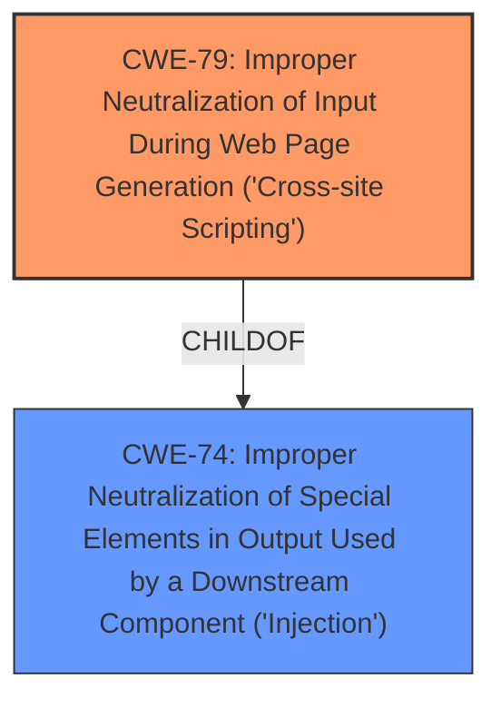

# Enhanced Analysis for CVE-2021-41249

# Summary
| CWE ID | CWE Name | Confidence | CWE Abstraction Level | CWE Vulnerability Mapping Label | CWE-Vulnerability Mapping Notes |
|---|---|---|---|---|---|
| CWE-79 | Improper Neutralization of Input During Web Page Generation ('Cross-site Scripting') | 1.0 | Base | Allowed | Primary CWE |

## Evidence and Confidence

*   **Confidence Score:** 1.0
*   **Evidence Strength:** HIGH

## Relationship Analysis
The primary relationship that influenced the decision was the ChildOf relationship between CWE-79 and CWE-74 (Improper Neutralization of Special Elements in Output Used by a Downstream Component ('Injection')). However, CWE-79 is more specific and directly addresses the XSS nature of the vulnerability, making it a better fit than the more general CWE-74. There were no relevant chain relationships to consider.



## Vulnerability Chain
The vulnerability chain starts with **improper input sanitization**, leading to **cross-site scripting**, and ultimately resulting in code injection.

## Summary of Analysis
The primary weakness described in the vulnerability is **Cross-site scripting (XSS)** due to **improper input sanitization**. The vulnerability description explicitly mentions that the `graphql-playground-react` component is vulnerable to XSS due to insecure handling of user-controlled input in GraphQL schema introspection responses or schema prop values. This aligns perfectly with the description of CWE-79, "Improper Neutralization of Input During Web Page Generation ('Cross-site Scripting')". The vulnerability allows attackers to inject malicious JavaScript code into the GraphQL Playground interface by providing a compromised GraphQL schema with malicious type names, leading to potential exfiltration of user credentials, data, or disruption of systems.

The evidence supporting this decision is strong. The "Vulnerability Description Key Phrases" section highlights "**improper input sanitization**" and "**cross-site scripting**" as key elements. The "CVE Reference Links Content Summary" section further supports this, stating that the root cause is due to the component using `innerHTML` to render type names in HTML without proper escaping and that the component used two separate libraries to render Markdown, one of which (`marked`) recommended using a separate HTML sanitizer if its input is untrusted. The root_cause from "CVE Reference Links Content Summary" states: "The `graphql-playground-react` component used `innerHTML` to render type names in HTML without proper escaping. Additionally, the component used two separate libraries to render Markdown, one of which (`marked`) recommended using a separate HTML sanitizer if its input is untrusted."

CWE-79 is a Base level CWE, which is the preferred level of abstraction. The MITRE mapping guidance for CWE-79 states that its usage is "Allowed" and that "This CWE entry is at the Base level of abstraction, which is a preferred level of abstraction for mapping to the root causes of vulnerabilities." This confirms that CWE-79 is the most appropriate CWE for this vulnerability.

**Other CWEs Considered and Rejected:**

*   **CWE-943: Improper Neutralization of Special Elements in Data Query Logic:** While the vulnerability involves GraphQL, which can be used for data querying, the core issue is not within the data query logic itself but rather in the rendering of the GraphQL schema in the web page. Therefore, CWE-943 is not the most appropriate choice.
*   **CWE-1321: Improperly Controlled Modification of Object Prototype Attributes ('Prototype Pollution'):** While prototype pollution may be a related vector for XSS, the evidence points to direct improper sanitization in web page generation, making CWE-79 a more direct and suitable mapping.

Relevant CWE Information:

# Enhanced Context (25 CWEs)
The following CWEs were identified as potentially relevant to this vulnerability:

## CWE-74: Improper Neutralization of Special Elements in Output Used by a Downstream Component ('Injection')
**Abstraction Level**: Class
**Similarity Score**: 0.76
**Source**: dense

**Description**:
The product constructs all or part of a command, data structure, or record using externally-influenced input from an upstream component, but it does not neutralize or incorrectly neutralizes special elements that could modify how it is parsed or interpreted when it is sent to a downstream component.

**Mapping Guidance**:
- Usage: Discouraged
- Rationale: CWE-74 is high-level and often misused when lower-level weaknesses are more appropriate.

## CWE-1289: Improper Validation of Unsafe Equivalence in Input
**Abstraction Level**: Base
**Similarity Score**: 0.76
**Source**: dense

**Description**:
The product receives an input value that is used as a resource identifier or other type of reference, but it does not validate or incorrectly validates that the input is equivalent to a potentially-unsafe value.

**Mapping Guidance**:
- Usage: Allowed
- Rationale: This CWE entry is at the Base level of abstraction, which is a preferred level of abstraction for mapping to the root causes of vulnerabilities.

## CWE-138: Improper Neutralization of Special Elements
**Abstraction Level**: Class
**Similarity Score**: 0.75
**Source**: dense

**Description**:
The product receives input from an upstream component, but it does not neutralize or incorrectly neutralizes special elements that could be interpreted as control elements or syntactic markers when they are sent to a downstream component.

**Mapping Guidance**:
- Usage: Discouraged
- Rationale: This CWE entry is a level-1 Class (i.e., a child of a Pillar). It might have lower-level children that would be more appropriate

## CWE-41: Improper Resolution of Path Equivalence
**Abstraction Level**: Base
**Similarity Score**: 0.75
**Source**: dense

**Description**:
The product is vulnerable to file system contents disclosure through path equivalence. Path equivalence involves the use of special characters in file and directory names. The associated manipulations are intended to generate multiple names for the same object.

**Mapping Guidance**:
- Usage: Allowed
- Rationale: This CWE entry is at the Base level of abstraction, which is a preferred level of abstraction for mapping to the root causes of vulnerabilities.

## CWE-668: Exposure of Resource to Wrong Sphere
**Abstraction Level**: Class
**Similarity Score**: 0.75
**Source**: dense

**Description**:
The product exposes a resource to the wrong control sphere, providing unintended actors with inappropriate access to the resource.

**Mapping Guidance**:
- Usage: Discouraged
- Rationale: CWE-668 is high-level and is often misused as a catch-all when lower-level CWE IDs might be applicable. It is sometimes used for low-information vulnerability reports [REF-1287]. It is a level-1 Class (i.e., a child of a Pillar). It is not useful for trend analysis.

## CWE-407: Inefficient Algorithmic Complexity
**Abstraction Level**: Class
**Similarity Score**: 0.75
**Source**: dense

**Description**:
An algorithm in a product has an inefficient worst-case computational complexity that may be detrimental to system performance and can be triggered by an attacker, typically using crafted manipulations that ensure that the worst case is being reached.

**Mapping Guidance**:
- Usage: Allowed-with-Review
- Rationale: This CWE entry is a Class and might have Base-level children that would be more appropriate

## CWE-799: Improper Control of Interaction Frequency
**Abstraction Level**: Class
**Similarity Score**: 0.75
**Source**: dense

**Description**:
The product does not properly limit the number or frequency of interactions that it has with an actor, such as the number of incoming requests.

**Mapping Guidance**:
- Usage: Allowed-with-Review
- Rationale: This CWE entry is a Class and might have Base-level children that would be more appropriate

## CWE-184: Incomplete List of Disallowed Inputs
**Abstraction Level**: Base
**Similarity Score**: 0.75
**Source**: dense

**Description**:
The product implements a protection mechanism that relies on a list of inputs (or properties of inputs) that are not allowed by policy or otherwise require other action to neutralize before additional processing takes place, but the list is incomplete.

**Mapping Guidance**:
- Usage: Allowed
- Rationale: This CWE entry is at the Base level of abstraction, which is a preferred level of abstraction for mapping to the root causes of vulnerabilities.

## CWE-405: Asymmetric Resource Consumption (Amplification)
**Abstraction Level**: Class
**Similarity Score**: 0.74
**Source**: dense

**Description**:
The product does not properly control situations in which an adversary can cause the product to consume or produce excessive resources without requiring the adversary to invest equivalent work or otherwise prove authorization, i.e., the adversary's influence is "asymmetric."


## CWE Relationship Analysis

Current CWEs represent these abstraction levels: .


### Vulnerability Chain Analysis

**Chain starting from CWE-79:**
- 79 (Improper Neutralization of Input During Web Page Generation ('Cross-site Scripting')) - ROOT


**Chain starting from CWE-943:**
- 943 (Improper Neutralization of Special Elements in Data Query Logic) - ROOT


### CWE Relationship Diagram

```mermaid
graph TD
    classDef primary fill:#f96,stroke:#333,stroke-width:2px
    classDef secondary fill:#69f,stroke:#333
    classDef tertiary fill:#9e9,stroke:#333
```