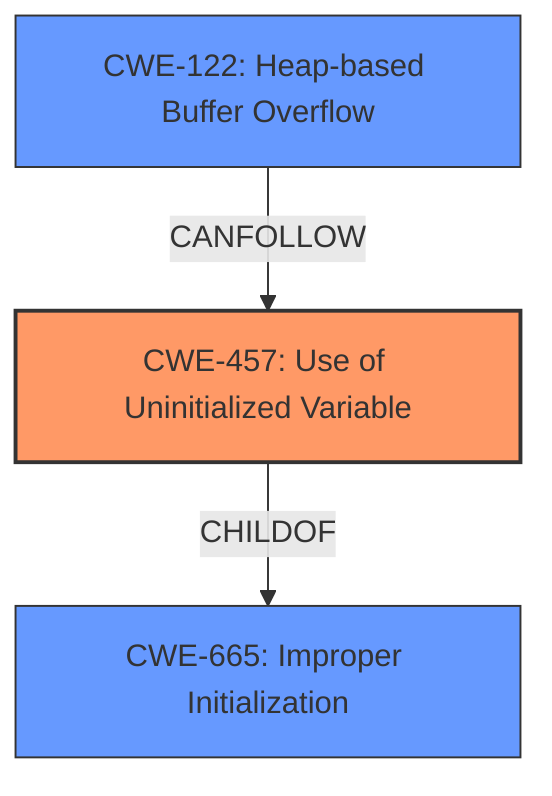

# Raw Analyzer Response for CVE-2021-41253

# Summary
| CWE ID | CWE Name | Confidence | CWE Abstraction Level | CWE Vulnerability Mapping Label | CWE-Vulnerability Mapping Notes |
|---|---|---|---|---|---|
| CWE-457 | Use of Uninitialized Variable | 0.9 | Variant | Allowed | Primary CWE - Reflects the root cause of the vulnerability. |
| CWE-122 | Heap-based Buffer Overflow | 0.8 | Base | Allowed | Secondary CWE - Represents the direct consequence of the uninitialized variable. |

## Evidence and Confidence

*   **Confidence Score:** 0.85
*   **Evidence Strength:** HIGH

## Relationship Analysis
The primary weakness is CWE-457 **Use of Uninitialized Variable**, a variant of **CWE-665 Improper Initialization**. Because of the **improper initialization**, the secondary weakness that follows is **CWE-122 Heap-based Buffer Overflow**. The **improper initialization** leads to incorrect size calculations when appending untrusted data using zycore string functions. This directly results in a **heap buffer overflow** when the calculated size is insufficient, leading to memory corruption.

## Vulnerability Chain
The vulnerability chain begins with **CWE-457 Use of Uninitialized Variable**. This **missing initialization** leads to **incorrect size calculations** during string appending operations. The **incorrect calculations** then result in **CWE-122 Heap-based Buffer Overflow** when untrusted data is appended, culminating in heap memory corruption.

## Summary of Analysis
The initial assessment identified **CWE-457 Use of Uninitialized Variable** as the primary weakness due to the **improper initialization** of the string object within the formatter buffer. This aligns with the **root_cause** identified in the CVE Reference Links Content Summary. The subsequent **heap buffer overflow** is then classified as **CWE-122 Heap-based Buffer Overflow**.

The relationship graph shows that **CWE-457** is a child of **CWE-665**, and **CWE-122** can follow **CWE-457**, indicating the sequence of events in the vulnerability.

The selection of **CWE-457** is at the optimal level of specificity because it directly addresses the coding error (**missing initialization**) that led to the vulnerability. While **CWE-665 Improper Initialization** is a parent class, **CWE-457** provides a more precise characterization of the weakness.

The evidence from the vulnerability description and the CVE Reference Links Content Summary strongly supports this assessment. The vulnerability description key phrases "rootcause: **improper initialization**" and "weakness: **heap buffer overflow**" directly correlate with the selected CWEs.

Relevant CWE Information:

# Enhanced Context (25 CWEs)
The following CWEs were identified as potentially relevant to this vulnerability:

## CWE-226: Sensitive Information in Resource Not Removed Before Reuse
**Abstraction Level**: Base
**Similarity Score**: 0.75
**Source**: dense

**Description**:
The product releases a resource such as memory or a file so that it can be made available for reuse, but it does not clear or "zeroize" the information contained in the resource before the product performs a critical state transition or makes the resource available for reuse by other entities.

**Mapping Guidance**:
- Usage: Allowed
- Rationale: This CWE entry is at the Base level of abstraction, which is a preferred level of abstraction for mapping to the root causes of vulnerabilities.
- **NOT USED:** This CWE focuses on the reuse of resources *after* they've been released, whereas the current vulnerability is about the *initial* state of a resource.

## CWE-131: Incorrect Calculation of Buffer Size
**Abstraction Level**: Base
**Similarity Score**: 0.74
**Source**: dense

**Description**:
The product does not correctly calculate the size to be used when allocating a buffer, which could lead to a buffer overflow.

**Mapping Guidance**:
- Usage: Allowed
- Rationale: This CWE entry is at the Base level of abstraction, which is a preferred level of abstraction for mapping to the root causes of vulnerabilities.
- **NOT USED:** The root cause is not in the calculation itself, but in the state of the variables used in the calculation.

## CWE-457: Use of Uninitialized Variable
**Abstraction Level**: Variant
**Similarity Score**: 0.74
**Source**: dense

**Description**:
The code uses a variable that has not been initialized, leading to unpredictable or unintended results.

**Mapping Guidance**:
- Usage: Allowed
- Rationale: This CWE entry is at the Variant level of abstraction, which is a preferred level of abstraction for mapping to the root causes of vulnerabilities.

## CWE-404: Improper Resource Shutdown or Release
**Abstraction Level**: Class
**Similarity Score**: 0.74
**Source**: dense

**Description**:
The product does not release or incorrectly releases a resource before it is made available for re-use.

**Mapping Guidance**:
- Usage: Allowed-with-Review
- Rationale: This CWE entry is a Class and might have Base-level children that would be more appropriate
- **NOT USED:** This CWE is about shutdown or release, not the initial state.

## CWE-909: Missing Initialization of Resource
**Abstraction Level**: Class
**Similarity Score**: 0.74
**Source**: dense

**Description**:
The product does not initialize a critical resource.

**Mapping Guidance**:
- Usage: Allowed-with-Review
- Rationale: This CWE entry is a Class and might have Base-level children that would be more appropriate
- **NOT USED:** This is a more general class; **CWE-457** is more specific.

## CWE-405: Asymmetric Resource Consumption (Amplification)
**Abstraction Level**: Class
**Similarity Score**: 0.73
**Source**: dense

**Description**:
The product does not properly control situations in which an adversary can cause the product to consume or produce excessive resources without requiring the adversary to invest equivalent work or otherwise prove authorization, i.e., the adversary's influence is "asymmetric."

**Mapping Guidance**:
- Usage: Allowed-with-Review
- Rationale: This CWE entry is a Class and might have Base-level children that would be more appropriate
- **NOT USED:** This CWE is not relevant to the current vulnerability.

## CWE-667: Improper Locking
**Abstraction Level**: Class
**Similarity Score**: 0.73
**Source**: dense

**Description**:
The product does not properly acquire or release a lock on a resource, leading to unexpected resource state changes and behaviors.

**Mapping Guidance**:
- Usage: Allowed-with-Review
- Rationale: This CWE entry is a Class and might have Base-level children that would be more appropriate
- **NOT USED:** This CWE is not relevant to the current vulnerability.

## CWE-125: Out-of-bounds Read
**Abstraction Level**: Base
**Similarity Score**: 0.73
**Source**: dense

**Description**:
The product reads data past the end, or before the beginning, of the intended buffer.

**Mapping Guidance**:
- Usage: Allowed
- Rationale: This CWE entry is at the Base level of abstraction, which is a preferred level of abstraction for mapping to the root causes of vulnerabilities.
- **NOT USED:** This CWE is about reading out of bounds, which is not the primary issue here.

## CWE-665: Improper Initialization
**Abstraction Level**: Class
**Similarity Score**: 0.73
**Source**: dense

**Description**:
The product does not initialize or incorrectly initializes a resource, which might leave the resource in an unexpected state when it is accessed or used.

**Mapping Guidance**:
- Usage: Discouraged
- Rationale: This CWE entry is a level-1 Class (i.e., a child of a Pillar). It might have lower-level children that would be more appropriate
- **NOT USED:** **CWE-457** is a more specific child.

## CWE-191: Integer Underflow (Wrap or Wraparound)
**Abstraction Level**: Base
**Similarity Score**: 0.73
**Source**: dense

**Description**:
The product subtracts one value from another, such that the result is less than the minimum allowable integer value, which produces a value that is not equal to the correct result.

**Mapping Guidance**:
- Usage: Allowed
- Rationale: This CWE entry is at the Base level of abstraction, which is a preferred level of abstraction for mapping to the root causes of vulnerabilities.
- **NOT USED:** This CWE