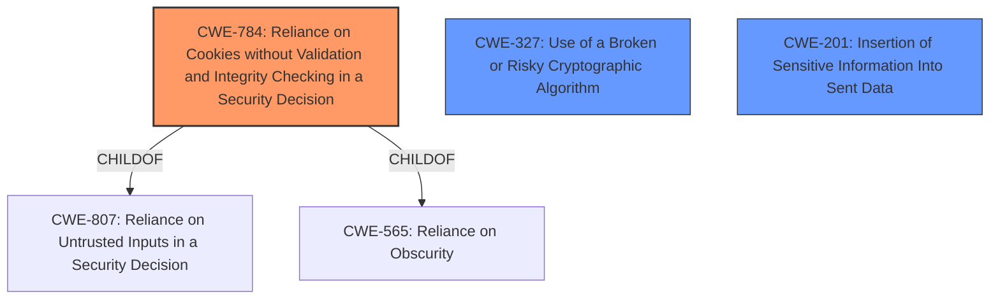

# Analysis Report for CVE-2021-41263

# Vulnerability Analysis Report: CVE-2021-41263

## Description


## Analysis (with Relationship Data)

# Summary
| CWE ID | CWE Name | Confidence | CWE Abstraction Level | CWE Vulnerability Mapping Label | CWE-Vulnerability Mapping Notes |
|---|---|---|---|---|---|
| **CWE-784** | **Reliance on Cookies without Validation and Integrity Checking in a Security Decision** | 0.9 | Variant | Allowed | Primary CWE |
| CWE-327 | Use of a Broken or Risky Cryptographic Algorithm | 0.7 | Class | Allowed-with-Review | Secondary Candidate |
| CWE-201 | Insertion of Sensitive Information Into Sent Data | 0.6 | Base | Allowed | Secondary Candidate |

## Evidence and Confidence

*   **Confidence Score:** 0.8
*   **Evidence Strength:** HIGH

## Relationship Analysis
The primary CWE, CWE-784, is a Variant of CWE-807 (Reliance on Untrusted Inputs in a Security Decision) and CWE-565 (Reliance on Obscurity). The vulnerability involves the application's reliance on cookies without proper validation and integrity checks, leading to potential security breaches. CWE-327, a Class, is a potential secondary CWE as the vulnerability involves improper handling of cryptographic elements (cookies). CWE-201, a Base CWE, could be a tertiary candidate if the cookie information is considered sensitive and is being improperly inserted into sent data. The abstraction levels influenced the choice, preferring the more specific Variant (CWE-784) over the broader Class (CWE-327).



## Vulnerability Chain
The vulnerability chain starts with the **improper handling of cookie salts** in `rails_multisite`, leading to the possibility of cookie reuse across different sites.

**Root Cause:** **Lack of proper cookie isolation** using per-hostname salts.
**Weakness:** **Re-use of cookies** on different sites due to **missing validation and integrity checking** (CWE-784).
**Impact:** Potential for attacker to impersonate users or gain unauthorized access.

## Summary of Analysis
The primary assessment is based on the provided vulnerability description and CVE Reference Links Content Summary, which highlights that the `rails_multisite` gem does not properly vary cookie salts on a per-hostname basis. This leads to the potential reuse of cookies across different sites, thus allowing an attacker to impersonate users.

> Vulnerability Description Key Phrases:
> -   **weakness:** **re-use cookies on different sites within a multi-site Rails application**

> CVE Reference Links Content Summary:
> -   **Insecure Cookie Handling:** Reusing the same cookie salts across different sites in a multi-site application using `rails_multisite` and Rails' signed/encrypted cookies.
> -   **Lack of Site Isolation:** The failure to properly isolate cookies between different sites.

The selection of CWE-784 is based on the fact that the application relies on cookies for security decisions (such as authentication or authorization), but it **does not properly validate and verify the integrity** of these cookies across multiple sites. The retriever results also support this selection, with CWE-784 being a relevant hit.

CWE-327 was considered because the **improper handling of salts** could be seen as a broken or risky cryptographic practice. However, the primary issue is not the algorithm itself but the way it's being used in a multi-site context.

CWE-201 was considered as well, given that cookies contain sensitive information and **allowing their re-use could be viewed as inserting sensitive information** into data sent to another site.

The decision to classify this vulnerability as CWE-784 is at the optimal level of specificity because it directly addresses the core issue of relying on cookies without proper validation and integrity checking in a multi-site environment. The evidence supports this choice, and the relationship analysis confirms that it is more specific than broader classifications like CWE-807.


## CWE Relationship Analysis

Current CWEs represent these abstraction levels: .


### Vulnerability Chain Analysis

**Chain starting from CWE-201:**
- 201 (Insertion of Sensitive Information Into Sent Data) - ROOT


**Chain starting from CWE-784:**
- 784 (Reliance on Cookies without Validation and Integrity Checking in a Security Decision) - ROOT


### CWE Relationship Diagram

```mermaid
graph TD
    classDef primary fill:#f96,stroke:#333,stroke-width:2px
    classDef secondary fill:#69f,stroke:#333
    classDef tertiary fill:#9e9,stroke:#333
```


*Report generated on 2025-04-01 23:21:05*
