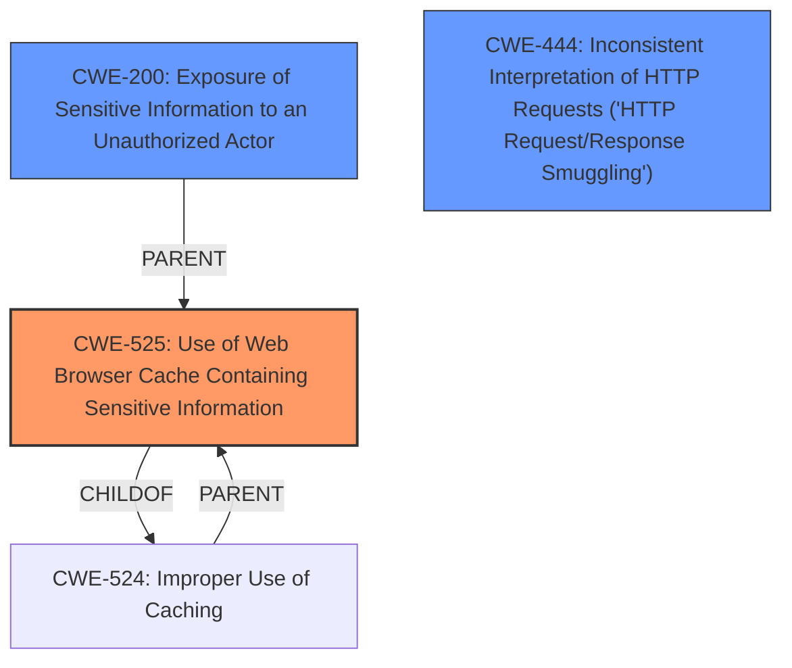

# Enhanced Analysis for CVE-2021-41271

# Summary
| CWE ID  | CWE Name                                                                 | Confidence | CWE Abstraction Level | CWE Vulnerability Mapping Label | CWE-Vulnerability Mapping Notes |
| :-------- | :----------------------------------------------------------------------- | :--------- | :---------------------- | :------------------------------ | :------------------------------ |
| CWE-525   | Use of Web Browser Cache Containing Sensitive Information              | 0.9        | Variant                 | Primary CWE                     | Allowed                       |
| CWE-200   | Exposure of Sensitive Information to an Unauthorized Actor             | 0.6        | Class                   | Secondary                       | Discouraged                   |
| CWE-444   | Inconsistent Interpretation of HTTP Requests ('HTTP Request/Response Smuggling') | 0.4        | Base                    | Secondary                       | Allowed                       |

## Evidence and Confidence

*   **Confidence Score:** 0.9
*   **Evidence Strength:** HIGH

## Relationship Analysis
The primary CWE, CWE-525, is a variant of CWE-524, indicating a more specific type of caching issue. While CWE-200 is a parent of CWE-201 and CWE-538, it's a broader classification and not the most precise fit here. CWE-444 indicates a request smuggling issue, which is related to the root cause, but the primary concern is the caching of sensitive information. The abstraction levels guided selection towards CWE-525 as the most specific variant.



## Vulnerability Chain
The chain of events starts with a **maliciously crafted request** which leads to an **error response**. Due to the **lack of proper Cache-Control headers**, this error response is cached by intermediate proxies, ultimately resulting in a **loss of confidentiality** for some content.

## Summary of Analysis
Initially, the analysis focused on the **loss of confidentiality** impact, potentially leading to a broad CWE like CWE-200. However, the key phrase and the "CVE Reference Links Content Summary" points to the root cause being the **lack of proper `Cache-Control` headers** which allowed intermediate proxies to cache the error responses.
The detailed description in the "CVE Reference Links Content Summary" section, particularly the fix involving adding `Cache-Control: private, max-age=0, must-revalidate` confirms this. This aligned well with the description of CWE-525: Use of Web Browser Cache Containing Sensitive Information, which is a variant and thus more specific. The retriever results listed CWE-525 as the top candidate.

I considered CWE-444, Inconsistent Interpretation of HTTP Requests, because the vulnerability description mentions "maliciously crafted request could cause an error". However, the core of the problem is not the interpretation of the request, but rather the caching of the response. Therefore, CWE-444 is less appropriate.

I considered CWE-200, Exposure of Sensitive Information to an Unauthorized Actor, because the impact of the vulnerability is "loss of confidentiality for some content". However, CWE-200 is a class-level CWE and is discouraged for use when more specific CWEs are available. The root cause is the improper caching, not the exposure of information directly.

The evidence supporting CWE-525 is strong, given the focus on caching mechanisms and the provided fix. Therefore, CWE-525 is the primary CWE.

Relevant CWE Information:

# Enhanced Context (25 CWEs)

## CWE-525: Use of Web Browser Cache Containing Sensitive Information
**Abstraction Level**: Variant
**Similarity Score**: 0.77
**Source**: dense

**Description**:
The web application does not use an appropriate caching policy that specifies the extent to which each web page and associated form fields should be cached.

## CWE-200: Exposure of Sensitive Information to an Unauthorized Actor
**Abstraction Level**: Class
**Similarity Score**: 6110.08
**Source**: sparse

**Description**:
The product exposes sensitive information to an actor that is not explicitly authorized to have access to that information.

## CWE-444: Inconsistent Interpretation of HTTP Requests ('HTTP Request/Response Smuggling')
**Abstraction Level**: Base
**Similarity Score**: 6245.44
**Source**: sparse

**Description**:
The product acts as an intermediary HTTP agent
         (such as a proxy or firewall) in the data flow between two
         entities such as a client and server, but it does not
         interpret malformed HTTP requests or responses in ways that
         are consistent with how the messages will be processed by
         those entities that are at the ultimate destination.


## CWE Relationship Analysis

Current CWEs represent these abstraction levels: .


### Vulnerability Chain Analysis

**Chain starting from CWE-201:**
- 201 (Insertion of Sensitive Information Into Sent Data) - ROOT


**Chain starting from CWE-444:**
- 444 (Inconsistent Interpretation of HTTP Requests ('HTTP Request/Response Smuggling')) - ROOT


### CWE Relationship Diagram

```mermaid
graph TD
    classDef primary fill:#f96,stroke:#333,stroke-width:2px
    classDef secondary fill:#69f,stroke:#333
    classDef tertiary fill:#9e9,stroke:#333
```