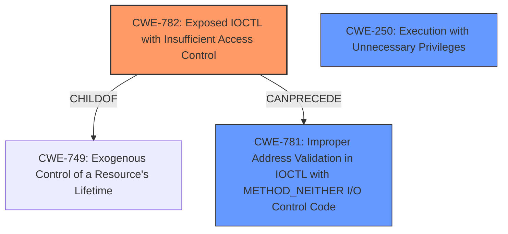

# Raw Analyzer Response for CVE-2021-41285

# Summary
| CWE ID    | CWE Name                                               | Confidence | CWE Abstraction Level | CWE Vulnerability Mapping Label | CWE-Vulnerability Mapping Notes |
| :-------- | :----------------------------------------------------- | :--------- | :-------------------- | :------------------------------ | :------------------------------ |
| CWE-782   | Exposed IOCTL with Insufficient Access Control       | 0.95       | Variant               | Allowed                       | Primary CWE |
| CWE-781   | Improper Address Validation in IOCTL with METHOD_NEITHER I/O Control Code | 0.80      | Variant               | Allowed                       | Secondary CWE |
| CWE-250   | Execution with Unnecessary Privileges       | 0.75       | Base               | Allowed                       | Secondary CWE |

## Evidence and Confidence

*   **Confidence Score:** 0.90
*   **Evidence Strength:** HIGH

## Relationship Analysis
The primary CWE is CWE-782, which identifies the root cause of the vulnerability: an exposed IOCTL without proper access control. This is a Variant level CWE, providing a specific classification. CWE-782 is a child of CWE-749 (Exogenous Control of a Resource's Lifetime), but since the issue is directly related to the IOCTL exposure, CWE-782 is more appropriate. CWE-782 can precede CWE-781 (Improper Address Validation in IOCTL with METHOD_NEITHER I/O Control Code), which is also relevant given the driver's apparent lack of input validation for IOCTL parameters. Additionally, CWE-250 (Execution with Unnecessary Privileges) captures the essence of a low-privileged user gaining elevated access due to the driver's flaws.

## Vulnerability Chain
The vulnerability chain begins with the **exposed IOCTLs** (CWE-782) in the `MODAPI.sys` driver. Because they have **insufficient access controls**, low-privileged users can send requests to these IOCTLs and perform privileged operations. The driver **lacks proper input validation** (CWE-781) and **allows operations with unnecessary privileges** (CWE-250), such as direct physical memory access via `MmMapIoSpace` and MSR read/write operations. The consequence is a **privilege escalation** to `NT AUTHORITY\SYSTEM`, enabling arbitrary code execution and system instability.

## Summary of Analysis
My assessment is primarily based on the provided "CVE Reference Links Content Summary," which offers detailed insight into the root cause and weaknesses of the vulnerability. The most compelling evidence is the driver's direct exposure of privileged operations to unprivileged users through IOCTLs, mapping physical memory into user-space, and enabling MSR and I/O port access.

The relationships between CWEs strongly influenced my selection. CWE-782 is the primary weakness because it directly addresses the issue of **exposed IOCTLs with insufficient access control**. The fact that CWE-782 can precede CWE-781 and is related to CWE-250 further solidifies its relevance.

I opted for CWE-782 (Variant) because it is more specific than its parent, CWE-749, accurately representing the vulnerability's nature. While CWE-285 (Improper Authorization) and CWE-269 (Improper Privilege Management) were considered, they are too high-level and don't capture the specific flaw. CWE-119 (Improper Restriction of Operations within the Bounds of a Memory Buffer) was considered but is a very general case.

Ultimately, CWE-782, CWE-781, and CWE-250 offer the most accurate and comprehensive classification of the vulnerability, reflecting both the root cause and the immediate consequences of the driver's design flaws.

Relevant CWE Information:
*   **CWE-782 (Exposed IOCTL with Insufficient Access Control):** This is the primary CWE because the vulnerability stems from the driver exposing IOCTLs without properly restricting access. The description of CWE-782 directly aligns with the vulnerability: "The product implements an IOCTL with functionality that should be restricted, but it does not properly enforce access control for the IOCTL." The security implication is that attackers can invoke privileged operations that should be restricted, potentially leading to code execution or privilege escalation.
*   **CWE-781 (Improper Address Validation in IOCTL with METHOD_NEITHER I/O Control Code):** This is a secondary CWE because it highlights the specific vulnerability related to address validation within IOCTLs using METHOD_NEITHER. The description "The product does not validate incoming addresses in METHOD_NEITHER IOCTLs in Windows environments" aligns with the driver's apparent lack of input validation. The vulnerability can lead to buffer overflows and similar attacks. This CWE is a child of CWE-1285 (Improperly Controlled Modification of Object Flags).
*   **CWE-250 (Execution with Unnecessary Privileges):** This is a secondary CWE because the driver performs operations with higher privileges than necessary, allowing low-privileged users to gain elevated access. The description "The product performs an operation at a privilege level that is higher than the minimum level required" aligns with the driver granting excessive privileges to IOCTL callers. This weakness can create new vulnerabilities or amplify the consequences of existing ones.

CWEs considered but not used:
*   CWE-367 (Time-of-check Time-of-use (TOCTOU) Race Condition): While race conditions could potentially exist, the primary issue is the direct exposure of privileged operations, making CWE-782 more relevant.
*   CWE-285 (Improper Authorization): Too high-level and doesn't capture the specific IOCTL exposure issue.
*   CWE-119 (Improper Restriction of Operations within the Bounds of a Memory Buffer): While memory corruption is a possible consequence, the root cause is the IOCTL exposure and insufficient access control, making CWE-782 more appropriate.
*   CWE-863 (Incorrect Authorization): While authorization is part of the problem, the main issue is the insufficient access control for IOCTLs.
*   CWE-20 (Improper Input Validation): Input validation is part of the problem, but the insufficient access control for IOCTLs makes CWE-782 more appropriate.