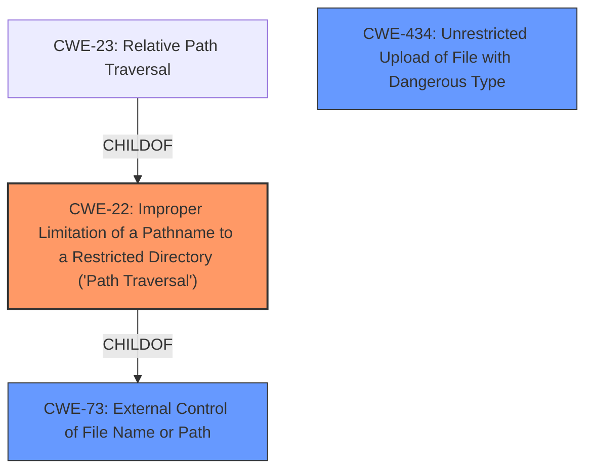

# Enhanced Analysis for CVE-2021-41290

# Summary
| CWE ID | CWE Name | Confidence | CWE Abstraction Level | CWE Vulnerability Mapping Label | CWE-Vulnerability Mapping Notes |
|---|---|---|---|---|---|
| CWE-22 | Improper Limitation of a Pathname to a Restricted Directory ('Path Traversal') | 1.0 | Base | Allowed | Primary CWE |
| CWE-434 | Unrestricted Upload of File with Dangerous Type | 0.8 | Base | Allowed | Secondary Candidate |
| CWE-73 | External Control of File Name or Path | 0.7 | Base | Allowed | Secondary Candidate |

## Evidence and Confidence

*   **Confidence Score:** 0.9
*   **Evidence Strength:** HIGH

## Relationship Analysis
The primary CWE is CWE-22, which represents the **path traversal** aspect of the vulnerability. This is further supported by the fact that CWE-22 has a child CWE of CWE-23, Relative Path Traversal, which more specifically describes the use of sequences like ".." to escape restricted directories. CWE-73 is a parent of CWE-22 and represents the broader category of external control of file names or paths, it is related to the path traversal aspect of the vulnerability. CWE-434 is related to the file write aspect of the vulnerability. The selection of CWE-22 as the primary CWE is based on its direct relevance to the **path traversal** vulnerability described.



## Vulnerability Chain
The vulnerability chain starts with the **lack of authentication**, leading to the **external control of file names or paths**, which then leads to **improper limitation of a pathname to a restricted directory** (path traversal), and finally results in the **arbitrary file write** and **potential for arbitrary code execution**.

## Summary of Analysis
The initial analysis identified several potential CWEs based on the vulnerability description and retriever results. The description highlights an **arbitrary file write** and **path traversal** vulnerability, leading to arbitrary code execution. The retriever results suggested CWE-22, CWE-23, CWE-94, CWE-434 and CWE-73.

The final decision favors CWE-22 as the primary CWE because it directly addresses the **path traversal** aspect of the vulnerability. CWE-434 (Unrestricted Upload of File with Dangerous Type) is considered a secondary candidate because the vulnerability involves writing arbitrary files. CWE-73 (External Control of File Name or Path) is also a relevant secondary CWE, as the vulnerability involves external control over file paths.

The selection of these CWEs is based on the evidence provided in the vulnerability description, the retriever results, and the relationships between the CWEs. The final selections are at the optimal level of specificity, accurately representing the root cause of the vulnerability.

Relevant CWE Information:

# Enhanced Context (25 CWEs)

## CWE-73: External Control of File Name or Path
**Abstraction Level**: Base
**Similarity Score**: 0.79
**Source**: dense

**Description**:
The product allows user input to control or influence paths or file names that are used in filesystem operations.

**Mapping Guidance**:
- Usage: Allowed
- Rationale: This CWE entry is at the Base level of abstraction, which is a preferred level of abstraction for mapping to the root causes of vulnerabilities.

## CWE-22: Improper Limitation of a Pathname to a Restricted Directory ('Path Traversal')
**Abstraction Level**: Base
**Similarity Score**: 7050.29
**Source**: sparse

**Description**:
The product uses external input to construct a pathname that is intended to identify a file or directory that is located underneath a restricted parent directory, but the product does not properly neutralize special elements within the pathname that can cause the pathname to resolve to a location that is outside of the restricted directory.

**Mapping Guidance**:
- Usage: Allowed
- Rationale: This CWE entry is at the Base level of abstraction, which is a preferred level of abstraction for mapping to the root causes of vulnerabilities.

## CWE-434: Unrestricted Upload of File with Dangerous Type
**Abstraction Level**: base
**Similarity Score**: 5.03
**Source**: graph

**Description**:
CWE-434: Unrestricted Upload of File with Dangerous Type

**Mapping Guidance**:
- Usage: Allowed
- Rationale: This CWE entry is at the Base level of abstraction, which is a preferred level of abstraction for mapping to the root causes of vulnerabilities.

## CWE-22: Improper Limitation of a Pathname to a Restricted Directory ('Path Traversal')

**CWE-22** accurately represents the **path traversal** aspect of the vulnerability, where an attacker can manipulate the file path to write to arbitrary locations. The vulnerability description states: "ECOA BAS controller suffers from an **arbitrary file write** and **path traversal** vulnerability." This directly supports the selection of CWE-22.
*   **Security Implications:** Allows attackers to write files outside the intended directory.
*   **Relationship:** ChildOf CWE-73
*   **Primary/Secondary:** Primary
*   **Mapping Guidance:** Allowed

## CWE-434: Unrestricted Upload of File with Dangerous Type

**CWE-434** is relevant because the vulnerability involves an **arbitrary file write**, suggesting that the system may not properly restrict the types of files being written.
*   **Security Implications:** Allows attackers to upload and write dangerous file types, potentially leading to code execution.
*   **Relationship:** PeerOf CWE-430
*   **Primary/Secondary:** Secondary
*   **Mapping Guidance:** Allowed

## CWE-73: External Control of File Name or Path

**CWE-73** is relevant because the attacker can control the file path, which is a prerequisite for both the **path traversal** (CWE-22) and **arbitrary file write** (CWE-434).
*   **Security Implications:** Allows attackers to control file names and paths, leading to unauthorized access or modification of files.
*   **Relationship:** ParentOf CWE-22
*   **Primary/Secondary:** Secondary
*   **Mapping Guidance:** Allowed


## CWE Relationship Analysis

Current CWEs represent these abstraction levels: .


### Vulnerability Chain Analysis

**Chain starting from CWE-73:**
- 73 (External Control of File Name or Path) - ROOT


**Chain starting from CWE-22:**
- 22 (Improper Limitation of a Pathname to a Restricted Directory ('Path Traversal')) - ROOT


### CWE Relationship Diagram

```mermaid
graph TD
    classDef primary fill:#f96,stroke:#333,stroke-width:2px
    classDef secondary fill:#69f,stroke:#333
    classDef tertiary fill:#9e9,stroke:#333
```