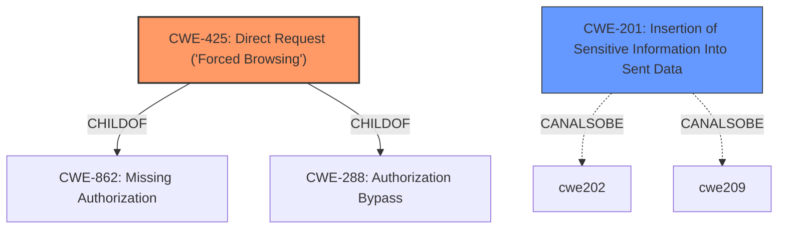

# Raw Analyzer Response for CVE-2021-41301

# Summary
| CWE ID | CWE Name | Confidence | CWE Abstraction Level | CWE Vulnerability Mapping Label | CWE-Vulnerability Mapping Notes |
|---|---|---|---|---|---|
| CWE-425 | Direct Request ('Forced Browsing') | 0.8 | Base | Allowed | Primary CWE |
| CWE-201 | Insertion of Sensitive Information Into Sent Data | 0.6 | Base | Allowed | Secondary Candidate |

## Evidence and Confidence

*   **Confidence Score:** 0.7
*   **Evidence Strength:** MEDIUM

## Relationship Analysis
The primary relationship that influenced the decision was the ChildOf relationship where CWE-425 is a child of CWE-862 (Missing Authorization) and CWE-288 (Authorization Bypass). This suggests a more specific type of authorization issue. CWE-425's base level abstraction aligns well with identifying a root cause. CWE-201 has a peer relationship (CanAlsoBe) with CWE-202 (Exposure of Sensitive Information Through Data Queries) and CWE-209 (Generation of Error Message Containing Sensitive Information), suggesting alternative ways sensitive data might be exposed. The chosen CWEs are at the base level, providing a detailed representation of the vulnerability.

## Vulnerability Chain
The vulnerability chain starts with the **lack of proper authorization checks** (CWE-425), leading to the **disclosure of sensitive configuration information** (CWE-201), which in turn enables **authentication bypass, privilege escalation, and full system access**.

## Summary of Analysis
The initial analysis focused on the **configuration disclosure** vulnerability, where direct object references using HTTP GET requests expose sensitive information. The retriever results suggested CWE-639 (Authorization Bypass Through User-Controlled Key), CWE-522 (Insufficiently Protected Credentials), and CWE-306 (Missing Authentication for Critical Function). However, CWE-425 (Direct Request ('Forced Browsing')) emerged as the most fitting primary CWE because it directly addresses the scenario where the application **fails to enforce authorization on restricted URLs**, scripts, or files.

The key phrase "**configuration disclosure**" in the Vulnerability Description aligns with CWE-425, where an unauthenticated attacker can access sensitive configuration files through direct HTTP GET requests. This aligns with the **weakness** being due to the **lack of adequate authorization** on these resources, as highlighted by the "CVE Reference Links Content Summary".

CWE-201 (Insertion of Sensitive Information Into Sent Data) is considered as a secondary CWE, as the configuration files themselves contain sensitive information that should not be directly exposed. The decision is also based on the evidence from the Vulnerability Description: "This will enable the unauthenticated attacker to remotely disclose sensitive information and help her in authentication bypass, privilege escalation and full system access."

The choice of CWE-425 is made because the vulnerability stems from the application's failure to adequately enforce authorization, allowing direct access to sensitive resources. This is more precise than generic authorization bypass or missing authentication.

Relevant CWE Information:

# Enhanced Context (25 CWEs)

## CWE-1220: Insufficient Granularity of Access Control
**Abstraction Level**: Base
**Similarity Score**: 0.76
**Source**: dense
This CWE was not selected because the vulnerability is more directly related to a complete lack of authorization checks rather than the granularity of existing controls.

## CWE-639: Authorization Bypass Through User-Controlled Key
**Abstraction Level**: Base
**Similarity Score**: 0.75
**Source**: dense
While authorization bypass is an impact, the root cause is more specifically the lack of authorization enforcement on the resource itself (CWE-425). Therefore this was not chosen as primary.

## CWE-807: Reliance on Untrusted Inputs in a Security Decision
**Abstraction Level**: Base
**Similarity Score**: 0.75
**Source**: dense
This CWE does not fit well as the vulnerability is not about relying on untrusted inputs, but about directly accessing resources without proper authorization.

## CWE-274: Improper Handling of Insufficient Privileges
**Abstraction Level**: Base
**Similarity Score**: 0.75
**Source**: dense
This CWE is not relevant because the issue is not about handling insufficient privileges but about the lack of authorization checks altogether.

## CWE-668: Exposure of Resource to Wrong Sphere
**Abstraction Level**: Class
**Similarity Score**: 0.75
**Source**: dense
This CWE is too general. The issue is more specifically related to direct access without authorization rather than a broad exposure issue.

## CWE-653: Improper Isolation or Compartmentalization
**Abstraction Level**: Class
**Similarity Score**: 0.75
**Source**: dense
This CWE is not applicable because the vulnerability is not related to isolation or compartmentalization issues.

## CWE-280: Improper Handling of Insufficient Permissions or Privileges
**Abstraction Level**: Base
**Similarity Score**: 0.74
**Source**: dense
Similar to CWE-274, this CWE is not relevant because the issue is not about handling insufficient permissions but about the lack of authorization checks.

## CWE-799: Improper Control of Interaction Frequency
**Abstraction Level**: Class
**Similarity Score**: 0.74
**Source**: dense
This CWE is not applicable as the vulnerability is not related to interaction frequency.

## CWE-664: Improper Control of a Resource Through its Lifetime
**Abstraction Level**: Pillar
**Similarity Score**: 0.74
**Source**: dense
This CWE is too general and high-level. It does not accurately represent the specific vulnerability of direct access without authorization.

## CWE-472: External Control of Assumed-Immutable Web Parameter
**Abstraction Level**: Base
**Similarity Score**: 0.74
**Source**: dense
This CWE is not applicable as the vulnerability is not related to external control of assumed-immutable web parameters.

## CWE-1390: Weak Authentication
**Abstraction Level**: Class
**Similarity Score**: 5279.08
**Source**: sparse
This CWE is not the primary issue, as the vulnerability allows unauthenticated access to configuration files directly.

## CWE-285: Improper Authorization
**Abstraction Level**: Class
**Similarity Score**: 5275.98
**Source**: sparse
This CWE is too general, as the vulnerability stems from direct requests to restricted resources.

## CWE-522: Insufficiently Protected Credentials
**Abstraction Level**: Class
**Similarity Score**: 0.258
This CWE is not the primary issue, though the configuration files may contain credentials. The root cause is the lack of authorization.

## CWE-306: Missing Authentication for Critical Function
**Abstraction Level**: Base
**Similarity Score**: 0.254
This CWE is a close contender, but CWE-425 more specifically addresses the direct request to protected resources.

## CWE-863: Incorrect Authorization
**Abstraction Level**: Class
**Similarity Score**: 0.246
This CWE is too general, as the vulnerability stems from direct requests to restricted resources.

## CWE-529: Exposure of Access Control List Files to an Unauthorized Control Sphere
**Abstraction Level**: Variant
**Similarity Score**: 0.553
This CWE is too specific. The vulnerability is not necessarily about exposing ACL files, but rather about unauthorized access to configuration files.