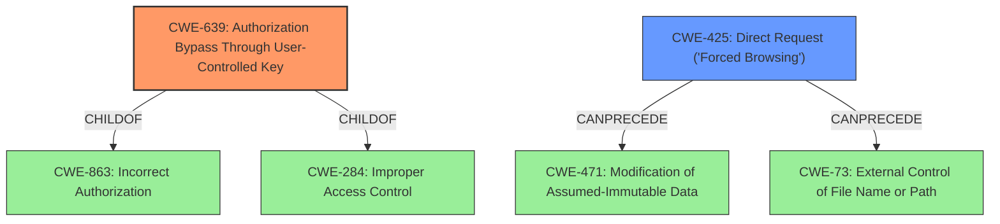

# Raw Analyzer Response for CVE-2021-41305

# Summary
| CWE ID | CWE Name | Confidence | CWE Abstraction Level | CWE Vulnerability Mapping Label | CWE-Vulnerability Mapping Notes |
|---|---|---|---|---|---|
| CWE-639 | Authorization Bypass Through User-Controlled Key | 1.0 | Base | Allowed | Primary CWE |
| CWE-425 | Direct Request ('Forced Browsing') | 0.7 | Base | Allowed | Secondary Candidate |

## Evidence and Confidence

*   **Confidence Score:** 0.9
*   **Evidence Strength:** HIGH

## Relationship Analysis
The primary CWE selected is CWE-639, which is a Base level CWE. It is a child of CWE-863 (Incorrect Authorization) and CWE-284 (Improper Access Control). CWE-425 (Direct Request) is a peer of CWE-471 (Modification of Assumed-Immutable Data) and has chain relationships with CWE-73 (External Control of File Name or Path). The base level of CWE-639 aligns well with the vulnerability description, indicating a specific authorization bypass issue. The relationships highlight the authorization context and potential for related file or path manipulation vulnerabilities.

## Vulnerability Chain
The vulnerability chain starts with an **Insecure Direct Object Reference (IDOR)** (CWE-639), allowing unauthorized access to resources. This leads to information disclosure, where an attacker can view names of private projects and filters.

## Summary of Analysis
The initial analysis strongly pointed towards an **Insecure Direct Object Reference (IDOR)**, which aligns with CWE-639 (Authorization Bypass Through User-Controlled Key). The vulnerability description explicitly mentions the **rootcause** as **Insecure Direct Object References (IDOR)** in the Average Number of Times in Status Gadget, leading to unauthorized viewing of private project and filter names. The evidence from the "CVE Reference Links Content Summary" section reinforces this, highlighting that the gadget allows access to project and filter names using direct object references without proper authorization checks.

The retriever results further support this by listing CWE-639 as the top candidate. CWE-425 (Direct Request ('Forced Browsing')) was considered as a secondary candidate because the vulnerability allows bypassing authorization checks to directly access resources.

The selection of CWE-639 is at the optimal level of specificity as it directly addresses the **rootcause** of the **IDOR** vulnerability.
CWE-639's description matches the vulnerability: "The system's authorization functionality does not prevent one user from gaining access to another user's data or record by modifying the key value identifying the data." This directly reflects the vulnerability where attackers can view names of private projects and filters by manipulating object references.

CWE-425 was considered because it highlights the ability to bypass authorization and directly request restricted resources. However, CWE-639 is more specific to the **rootcause** of the **IDOR** and is therefore the primary CWE.

Relevant CWE Information:

# Enhanced Context (25 CWEs)
The following CWEs were identified as potentially relevant to this vulnerability:

## CWE-639: Authorization Bypass Through User-Controlled Key
**Abstraction Level**: Base
**Similarity Score**: 0.77
**Source**: dense

**Description**:
The system's authorization functionality does not prevent one user from gaining access to another user's data or record by modifying the key value identifying the data.

**Mapping Guidance**:
- Usage: Allowed
- Rationale: This CWE entry is at the Base level of abstraction, which is a preferred level of abstraction for mapping to the root causes of vulnerabilities.

## CWE-425: Direct Request ('Forced Browsing')
**Abstraction Level**: Base
**Similarity Score**: 6636.23
**Source**: sparse

**Description**:
The web application does not adequately enforce appropriate authorization on all restricted URLs, scripts, or files.

**Mapping Guidance**:
- Usage: Allowed
- Rationale: This CWE entry is at the Base level of abstraction, which is a preferred level of abstraction for mapping to the root causes of vulnerabilities.

## CWE-639: Authorization Bypass Through User-Controlled Key
| CWE ID | CWE Name | Confidence | CWE Abstraction Level | CWE Vulnerability Mapping Label | CWE-Vulnerability Mapping Notes |
|---|---|---|---|---|---|
| CWE-639 | Authorization Bypass Through User-Controlled Key | 1.0 | Base | Allowed | Primary CWE |
| CWE-425 | Direct Request ('Forced Browsing') | 0.7 | Base | Allowed | Secondary Candidate |

## Evidence and Confidence

*   **Confidence Score:** 0.9
*   **Evidence Strength:** HIGH

## Relationship Analysis
The primary CWE selected is CWE-639, which is a Base level CWE. It is a child of CWE-863 (Incorrect Authorization) and CWE-284 (Improper Access Control). CWE-425 (Direct Request) is a peer of CWE-471 (Modification of Assumed-Immutable Data) and has chain relationships with CWE-73 (External Control of File Name or Path). The base level of CWE-639 aligns well with the vulnerability description, indicating a specific authorization bypass issue. The relationships highlight the authorization context and potential for related file or path manipulation vulnerabilities.

## Vulnerability Chain
The vulnerability chain starts with an **Insecure Direct Object Reference (IDOR)** (CWE-639), allowing unauthorized access to resources. This leads to information disclosure, where an attacker can view names of private projects and filters.

## Summary of Analysis
The initial analysis strongly pointed towards an **Insecure Direct Object Reference (IDOR)**, which aligns with CWE-639 (Authorization Bypass Through User-Controlled Key). The vulnerability description explicitly mentions the **rootcause** as **Insecure Direct Object References (IDOR)** in the Average Number of Times in Status Gadget, leading to unauthorized viewing of private project and filter names. The evidence from the "CVE Reference Links Content Summary" section reinforces this, highlighting that the gadget allows access to project and filter names using direct object references without proper authorization checks.

The retriever results further support this by listing CWE-639 as the top candidate. CWE-425 (Direct Request ('Forced Browsing')) was considered as a secondary candidate because the vulnerability allows bypassing authorization checks to directly access resources.

The selection of CWE-639 is at the optimal level of specificity as it directly addresses the **rootcause** of the **IDOR** vulnerability.
CWE-639's description matches the vulnerability: "The system's authorization functionality does not prevent one user from gaining access to another user's data or record by