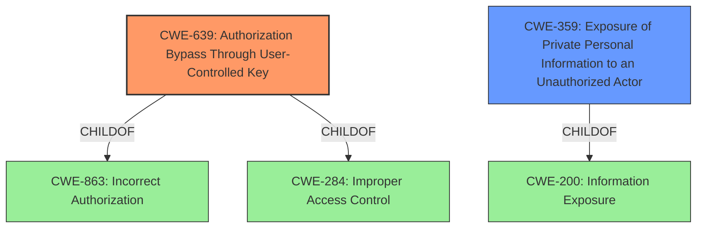

# Analysis Report for CVE-2021-41306

# Vulnerability Analysis Report: CVE-2021-41306

## Description


## Analysis (with Relationship Data)

# Summary
| CWE ID | CWE Name | Confidence | CWE Abstraction Level | CWE Vulnerability Mapping Label | CWE-Vulnerability Mapping Notes |
|---|---|---|---|---|---|
| CWE-639 | Authorization Bypass Through User-Controlled Key | 1.0 | Base | Allowed | Primary CWE. The vulnerability description explicitly mentions **Insecure Direct Object References (IDOR)** which aligns directly with the description of CWE-639. |
| CWE-359 | Exposure of Private Personal Information to an Unauthorized Actor | 0.7 | Base | Allowed | Secondary CWE. The vulnerability results in viewing "private project and filter names", constituting exposure of private information. |

## Evidence and Confidence

*   **Confidence Score:** 0.9
*   **Evidence Strength:** HIGH

## Relationship Analysis
The primary CWE, CWE-639, is a Base level CWE, providing a specific description of the **IDOR** vulnerability. It is related to higher-level Class CWEs like CWE-863 (Incorrect Authorization) and CWE-284 (Improper Access Control), indicating a more general category of authorization issues. CWE-359, while a reasonable secondary classification, is related to CWE-200 (Information Exposure), indicating a more general information disclosure issue.



## Vulnerability Chain
The vulnerability chain starts with the **Insecure Direct Object References (IDOR)**, leading to the ability for anonymous attackers to view private project and filter names, effectively resulting in information disclosure.

Root Cause: **Insecure Direct Object References (IDOR)** (CWE-639)
Impact: Viewing of private project and filter names (CWE-359)

## Summary of Analysis
The initial analysis focused on the **Insecure Direct Object References (IDOR)** mentioned in the vulnerability description. The provided information strongly suggests that CWE-639 is the most appropriate primary CWE. The vulnerability allows anonymous remote attackers to view private project and filter names, which directly aligns with the CWE-639 description: "The system's authorization functionality does not prevent one user from gaining access to another user's data or record by modifying the key value identifying the data."

Supporting Evidence:
- Vulnerability Description Key Phrases: "**rootcause:** **Insecure Direct Object References (IDOR)**"
- CVE Reference Links Content Summary: "**Root cause of vulnerability**: An Insecure Direct Object References (IDOR) vulnerability exists in the Average Time in Status Gadget. The vulnerability allows anonymous users to view the names of private projects and filters, which should be restricted."

The retriever results also ranked CWE-639 as the top candidate.

CWE-359 is a reasonable secondary CWE because the impact is the exposure of private information, but the root cause is the **IDOR**.

Other considered CWEs:
- CWE-863 (Incorrect Authorization) and CWE-285 (Improper Authorization): These are higher-level Class CWEs that describe authorization issues in general. While relevant, they are less specific than CWE-639, which accurately captures the **IDOR** nature of the vulnerability.
- CWE-425 (Direct Request ('Forced Browsing')): This CWE involves inadequate enforcement of authorization on restricted URLs. While there may be some overlap, the **IDOR** aspect is more prominent in this vulnerability.
- CWE-306 (Missing Authentication for Critical Function): This CWE focuses on the lack of authentication. While the vulnerability is exploitable by anonymous users, the root cause is the **IDOR** rather than the missing authentication itself. The application is missing authorization.

The final selection of CWE-639 as the primary CWE is based on its direct alignment with the **IDOR** vulnerability and its Base level of specificity. CWE-359 is added as a secondary CWE to capture the information disclosure aspect of the impact.


## CWE Relationship Analysis

Current CWEs represent these abstraction levels: .


### Vulnerability Chain Analysis

**Chain starting from CWE-306:**
- 306 (Missing Authentication for Critical Function) - ROOT


**Chain starting from CWE-284:**
- 284 (Improper Access Control) - ROOT


### CWE Relationship Diagram

```mermaid
graph TD
    classDef primary fill:#f96,stroke:#333,stroke-width:2px
    classDef secondary fill:#69f,stroke:#333
    classDef tertiary fill:#9e9,stroke:#333
```


*Report generated on 2025-04-02 03:24:44*
