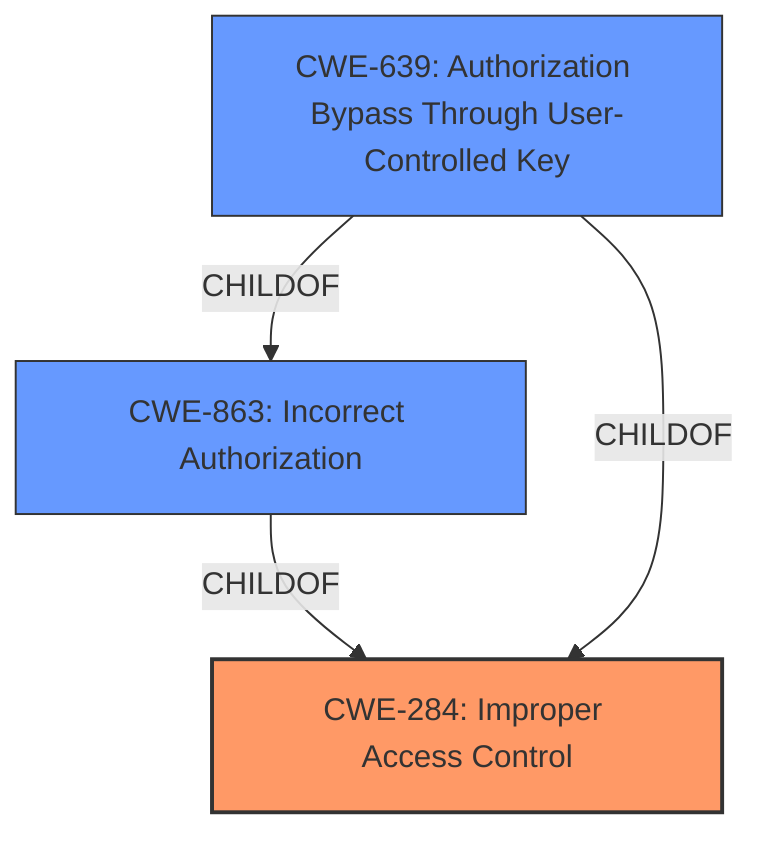

# Raw Analyzer Response for CVE-2021-41308

# Summary
| CWE ID | CWE Name | Confidence | CWE Abstraction Level | CWE Vulnerability Mapping Label | CWE-Vulnerability Mapping Notes |
|---|---|---|---|---|---|
| CWE-284 | Improper Access Control | 0.8 | Pillar | Primary | Discouraged |
| CWE-863 | Incorrect Authorization | 0.7 | Class | Secondary | Allowed-with-Review |
| CWE-639 | Authorization Bypass Through User-Controlled Key | 0.6 | Base | Secondary | Allowed |

## Evidence and Confidence

*   **Confidence Score:** 0.8
*   **Evidence Strength:** HIGH

## Relationship Analysis
The primary CWE is CWE-284, which is a Pillar, making it very general. CWE-863 is a child of CWE-284 and represents an authorization check performed incorrectly. CWE-639 is a child of CWE-863 and CWE-284. The relationships guide us from general to more specific, but the provided information suggests that the access control is broken, not necessarily involving a user-controlled key.

## Vulnerability Chain
The chain of events is as follows:
1.  **Root Cause:** **Broken Access Control** (`ReplicationSettings!default.jspa` endpoint)
2.  **Weakness:** Authenticated non-administrator users can edit File Replication settings.
3.  **Impact:** Remote attackers can modify File Replication settings.

## Summary of Analysis
The initial assessment points to **broken access control** as the primary issue. The description indicates that an authenticated non-administrator user can edit File Replication settings, which they should not be able to do.

The vulnerability description states: "Affected versions of Atlassian Jira Server and Data Center allow authenticated yet non-administrator remote attackers to edit the File Replication settings via a **Broken Access Control** vulnerability in the `ReplicationSettings!default.jspa` endpoint."

The **Vulnerability Description Key Phrases** section highlights:

*   **rootcause:** **broken access control**
*   **impact:** edit File Replication settings

The **CVE Reference Links Content Summary** confirms:

*   **Root cause of vulnerability:** **Broken Access Control** in the `ReplicationSettings!default.jspa` endpoint.
*   **Weaknesses/vulnerabilities present:** Non-administrator users can edit File Replication settings.

Given this evidence, the primary CWE is CWE-284 **Improper Access Control**, as it is the overarching issue. However, CWE-284 is a Pillar, and the mapping guidance discourages its use, suggesting more specific descendants.

CWE-863 **Incorrect Authorization** is a child of CWE-285 and represents a more specific case where authorization checks are performed incorrectly. This seems to fit the description, as there's likely an authorization check in place that is failing to prevent non-administrators from editing the settings.

CWE-639 **Authorization Bypass Through User-Controlled Key** is another possible candidate, but it's less likely since the description doesn't explicitly mention user-controlled keys being the method of bypass.

Given that CWE-284 is discouraged, I'll mark it as the primary CWE but note that it's discouraged. I'll include CWE-863 and CWE-639 as secondary candidates.

Relevant CWE Information:

**CWE-284: Improper Access Control**
*   Abstraction: Pillar
*   Description: The product does not restrict or incorrectly restricts access to a resource from an unauthorized actor.
*   Mapping Guidance: Discouraged because it's a high-level Pillar and often misused.

**CWE-863: Incorrect Authorization**
*   Abstraction: Class
*   Description: The product performs an authorization check when an actor attempts to access a resource or perform an action, but it does not correctly perform the check.
*   Mapping Guidance: Allowed-with-Review because it's a Class and might have Base-level children that would be more appropriate

**CWE-639: Authorization Bypass Through User-Controlled Key**
*   Abstraction: Base
*   Description: The system's authorization functionality does not prevent one user from gaining access to another user's data or record by modifying the key value identifying the data.
*   Mapping Guidance: Allowed.