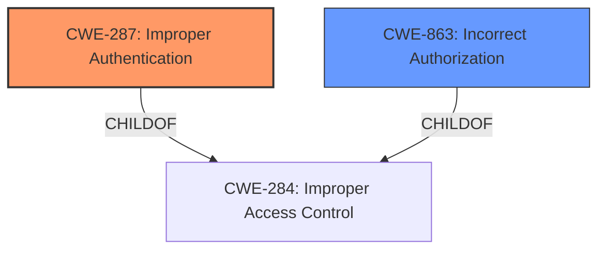

# Analysis Report for CVE-2021-41311

# Vulnerability Analysis Report: CVE-2021-41311

## Description


## Analysis (with Relationship Data)

# Summary
| CWE ID | CWE Name | Confidence | CWE Abstraction Level | CWE Vulnerability Mapping Label | CWE-Vulnerability Mapping Notes |
|---|---|---|---|---|---|
| CWE-287 | Improper Authentication | 0.8 | Class | Primary | Discouraged, but selected due to the **broken authentication** root cause. Lower-level CWEs are preferable, but not enough information is present to select a more specific one. |
| CWE-863 | Incorrect Authorization | 0.6 | Class | Secondary | Allowed-with-Review. This is a secondary weakness given the attacker is a revoked administrator that is not supposed to have authorization. |

## Evidence and Confidence

*   **Confidence Score:** 0.7
*   **Evidence Strength:** MEDIUM

## Relationship Analysis
The primary relationship influencing the CWE selection is the parent-child relationship between CWE-284 (Improper Access Control) and both CWE-287 (Improper Authentication) and CWE-863 (Incorrect Authorization).
CWE-287 and CWE-863 are both children of CWE-284, which represents a broad category of access control issues. Given the stated **rootcause** of **broken authentication**, CWE-287 is chosen as the primary weakness.
CWE-863, while a possible option, is treated as secondary because authorization is happening but the authentication is broken first.



## Vulnerability Chain
The vulnerability chain starts with **broken authentication**, leading to the ability to modify project Users & Roles settings.
1.  **Root Cause:** **Broken Authentication** (CWE-287)
2.  **Resulting Impact:** Ability to modify project Users & Roles settings due to Incorrect Authorization (CWE-863).

## Summary of Analysis
The initial assessment focused on identifying the **root cause** of the vulnerability, which is described as a **broken authentication** issue.
The selection of CWE-287 is directly supported by the "Vulnerability Description Key Phrases" which lists "**rootcause:** **broken authentication**".
The fact that an administrator account that has been revoked can still access resources points to an authorization issue, making CWE-863 a secondary concern.
The primary driver in the selection process was the evidence in the vulnerability description indicating **broken authentication** as the **root cause**.
The CWEs chosen are at the Class level due to limited information. Ideally, a more specific CWE would be chosen if more details were available.

Relevant CWE Information:

*   **CWE-287: Improper Authentication** - The product does not sufficiently prove that the claim is correct. This aligns with the description of a **broken authentication** vulnerability where revoked administrator accounts are still able to access resources.
*   **CWE-863: Incorrect Authorization** - The product performs an authorization check, but it does not correctly perform the check. This aligns with the description where, even though the administrator's access has been revoked, they are still able to modify project Users & Roles settings.

Other CWEs considered but not used:

*   CWE-639: Authorization Bypass Through User-Controlled Key: Although authorization is bypassed, the **root cause** is not directly related to a user-controlled key. The issue stems from the **broken authentication** mechanism.
*   CWE-425: Direct Request ('Forced Browsing'): While forced browsing could be a contributing factor, the primary issue is the **broken authentication** allowing the initial access.
*   CWE-306: Missing Authentication for Critical Function: Authentication is present, but **broken**. Thus CWE-287 is more applicable than CWE-306, which describes the *absence* of authentication.


## CWE Relationship Analysis

Current CWEs represent these abstraction levels: .


### Vulnerability Chain Analysis

**Chain starting from CWE-306:**
- 306 (Missing Authentication for Critical Function) - ROOT


**Chain starting from CWE-284:**
- 284 (Improper Access Control) - ROOT


### CWE Relationship Diagram

```mermaid
graph TD
    classDef primary fill:#f96,stroke:#333,stroke-width:2px
    classDef secondary fill:#69f,stroke:#333
    classDef tertiary fill:#9e9,stroke:#333
```


*Report generated on 2025-04-02 01:40:20*
