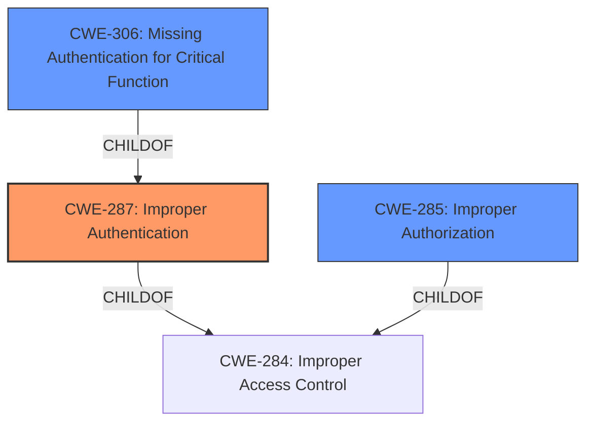

# Enhanced Analysis for CVE-2021-41312

# Summary
| CWE ID | CWE Name | Confidence | CWE Abstraction Level | CWE Vulnerability Mapping Label | CWE-Vulnerability Mapping Notes |
|---|---|---|---|---|---|
| CWE-287 | Improper Authentication | 1 | Class | Primary | Discouraged |
| CWE-306 | Missing Authentication for Critical Function | 0.75 | Base | Secondary | Allowed |
| CWE-285 | Improper Authorization | 0.5 | Class | Secondary | Discouraged |

## Evidence and Confidence

*   **Confidence Score:** 0.85
*   **Evidence Strength:** HIGH

## Relationship Analysis
The primary CWE identified is CWE-287, **Improper Authentication**, which is a Class-level CWE. The vulnerability description clearly states "**Improper Authentication**" as the root cause. CWE-287 is a child of CWE-284 (Improper Access Control), indicating a broader category. Since CWE-287 is a Class, the guidance suggests considering its children for a more specific match. One of its children, CWE-306 (Missing Authentication for Critical Function), is a Base-level CWE and a strong candidate. CWE-285 (Improper Authorization) is also a child of CWE-284 and represents a related but distinct weakness.



## Vulnerability Chain
The vulnerability chain starts with the **Improper Authentication** (CWE-287). This leads to an attacker being able to enable and disable Issue Collectors on Jira Service Management projects. The chain is as follows:

1.  **Improper Authentication (CWE-287):** The system insufficiently proves the claimed identity of a user.
2.  **Authorization Bypass:** Due to the authentication issue, the attacker bypasses authorization checks.
3.  **Impact:** Enable and disable Issue Collectors on Jira Service Management projects.

## Summary of Analysis
Initially, the vulnerability description explicitly indicates "**Improper Authentication**" as the root cause, making CWE-287 a strong candidate. The CVE Reference Links Content Summary reinforces this by stating "Root cause of vulnerability: Improper Authentication vulnerability". However, the mapping guidance for CWE-287 discourages its use and suggests considering children like CWE-306 (Missing Authentication for Critical Function).

CWE-306 is a reasonable fit because a user whose access has been revoked should not be able to perform any actions, suggesting that authentication is either missing or insufficient. This is further supported by the fact that the attacker *had* their access revoked, implying that they should no longer be authenticated.

CWE-285 (Improper Authorization) is also considered because the vulnerability allows a user with revoked access to perform actions they should not be authorized to perform. However, the root cause is more closely tied to the authentication process, making authorization a secondary concern.

The final decision is to use CWE-287 as the primary weakness due to the explicit mention in the vulnerability description, but also to include CWE-306 as a secondary weakness since the user's revoked access implies a lack of proper authentication for the specific function being exploited. CWE-285 is also included as a secondary weakness since the root cause allows for authorization bypass.

These CWEs are at an appropriate level of specificity, with CWE-306 being a Base-level CWE and CWE-287 and CWE-285 being Class-level CWEs.

Relevant CWE Information:

# Enhanced Context (25 CWEs)
The following CWEs were identified as potentially relevant to this vulnerability:

## CWE-303: Incorrect Implementation of Authentication Algorithm
**Abstraction Level**: Base
**Similarity Score**: 0.76
**Source**: dense

**Description**:
The requirements for the product dictate the use of an established authentication algorithm, but the implementation of the algorithm is incorrect.

**Mapping Guidance**:
- Usage: Allowed
- Rationale: This CWE entry is at the Base level of abstraction, which is a preferred level of abstraction for mapping to the root causes of vulnerabilities.

**Why Not Used:** This CWE is not used because the vulnerability description does not provide any information about the specific authentication algorithm used or its implementation. The issue is more general, related to the **improper authentication** itself.

## CWE-639: Authorization Bypass Through User-Controlled Key
**Abstraction Level**: Base
**Similarity Score**: 0.76
**Source**: dense

**Description**:
The system's authorization functionality does not prevent one user from gaining access to another user's data or record by modifying the key value identifying the data.

**Mapping Guidance**:
- Usage: Allowed
- Rationale: This CWE entry is at the Base level of abstraction, which is a preferred level of abstraction for mapping to the root causes of vulnerabilities.

**Why Not Used:** This CWE is not used because the vulnerability description does not mention any user-controlled keys being manipulated to bypass authorization. The issue is primarily related to **improper authentication**, not the manipulation of keys.

## CWE-807: Reliance on Untrusted Inputs in a Security Decision
**Abstraction Level**: Base
**Similarity Score**: 0.76
**Source**: dense

**Description**:
The product uses a protection mechanism that relies on the existence or values of an input, but the input can be modified by an untrusted actor in a way that bypasses the protection mechanism.

**Mapping Guidance**:
- Usage: Allowed
- Rationale: This CWE entry is at the Base level of abstraction, which is a preferred level of abstraction for mapping to the root causes of vulnerabilities.

**Why Not Used:** This CWE is not used because the vulnerability description does not suggest that the security decision relies on untrusted inputs. The core issue is **improper authentication**, which allows a revoked user to still perform actions.

## CWE-1390: Weak Authentication
**Abstraction Level**: Class
**Similarity Score**: 0.75
**Source**: dense

**Description**:
The product uses an authentication mechanism to restrict access to specific users or identities, but the mechanism does not sufficiently prove that the claimed identity is correct.

**Mapping Guidance**:
- Usage: Allowed-with-Review
- Rationale: This CWE entry is a Class and might have Base-level children that would be more appropriate

**Why Not Used:** While **Weak Authentication** is related to **Improper Authentication**, the description suggests an authentication mechanism exists but is insufficient. The vulnerability description does not provide enough detail to determine if the authentication is weak or simply improperly implemented after access revocation. Therefore, CWE-287 is more appropriate as a starting point.

## CWE-274: Improper Handling of Insufficient Privileges
**Abstraction Level**: Base
**Similarity Score**: 0.75
**Source**: dense

**Description**:
The product does not handle or incorrectly handles when it has insufficient privileges to perform an operation, leading to resultant weaknesses.

**Mapping Guidance**:
- Usage: Discouraged
- Rationale: This CWE entry could be deprecated in a future version of CWE.

**Why Not Used:** This CWE is not used because the vulnerability description focuses on the **improper authentication** of a revoked user, rather than the handling of insufficient privileges. The problem lies in the user being able to perform actions despite their access being revoked.

## CWE-1289: Improper Validation of Unsafe Equivalence in Input
**Abstraction Level**: Base
**Similarity Score**: 0.74
**Source**: dense

**Description**:
The product receives an input value that is used as a resource identifier or other type of reference, but it does not validate or incorrectly validates that the input is equivalent to a potentially-unsafe value.

**Mapping Guidance**:
- Usage: Allowed
- Rationale: This CWE entry is at the Base level of abstraction, which is a preferred level of abstraction for mapping to the root causes of vulnerabilities.

**Why Not Used:** This CWE is not used because the vulnerability description does not provide information about unsafe equivalences or input validation issues. The primary concern is **improper authentication** and subsequent authorization bypass.

## CWE-472: External Control of Assumed-Immutable Web Parameter
**Abstraction Level**: Base
**Similarity Score**: 0.74
**Source**: dense

**Description**:
The web application does not sufficiently verify inputs that are assumed to be immutable but are actually externally controllable, such as hidden form fields.

**Mapping Guidance**:
- Usage: Allowed
- Rationale: This CWE entry is at the Base level of abstraction, which is a preferred level of abstraction for mapping to the root causes of vulnerabilities


## CWE Relationship Analysis

Current CWEs represent these abstraction levels: .


### Vulnerability Chain Analysis

**Chain starting from CWE-306:**
- 306 (Missing Authentication for Critical Function) - ROOT


**Chain starting from CWE-303:**
- 303 (Incorrect Implementation of Authentication Algorithm) - ROOT


### CWE Relationship Diagram

```mermaid
graph TD
    classDef primary fill:#f96,stroke:#333,stroke-width:2px
    classDef secondary fill:#69f,stroke:#333
    classDef tertiary fill:#9e9,stroke:#333
```