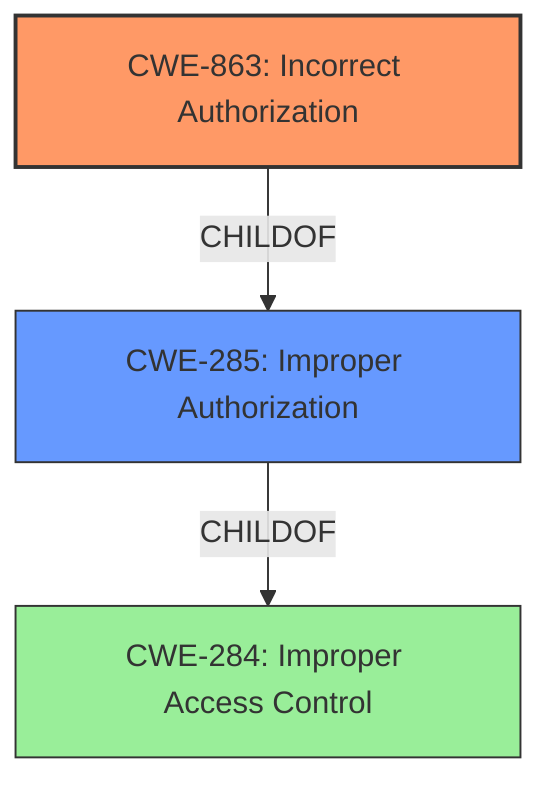

# Analysis for CVE-2021-41313

# Summary
| CWE ID    | CWE Name                     | Confidence | CWE Abstraction Level | CWE Vulnerability Mapping Label | CWE-Vulnerability Mapping Notes |
| :-------- | :--------------------------- | :--------- | :-------------------- | :------------------------------ | :------------------------------ |
| CWE-863   | Incorrect Authorization       | 0.9        | Class               | Primary                         | Allowed-with-Review             |
| CWE-285   | Improper Authorization        | 0.7        | Class               | Secondary                       | Discouraged                     |
| CWE-284   | Improper Access Control       | 0.6        | Pillar              | Secondary                       | Discouraged                     |

## Evidence and Confidence

*   **Confidence Score:** 0.9
*   **Evidence Strength:** HIGH

## Relationship Analysis
The analysis focuses on hierarchical relationships, primarily the parent-child relationship between CWE-284, CWE-285, and CWE-863. The decision involved selecting the most specific CWE that accurately reflects the **Improper Authorization** vulnerability. While CWE-284 is a high-level "Pillar", the retriever results suggest CWE-285 and CWE-863. The descriptions of these are very similar, but the vulnerability description indicates there *was* an authorization check, but it was incorrect, making CWE-863 more suitable than CWE-285 because it states "The product performs an authorization check when an actor attempts to access a resource or perform an action, but it does not correctly perform the check.".

## Vulnerability Chain
The vulnerability chain starts with the **Improper Authorization** (**ROOT CAUSE**), leading to authenticated non-admin users being able to edit email batch configurations (**IMPACT**). The chain is: **Improper Authorization** -> Edit email batch configurations.

## Summary of Analysis
The initial assessment focused on identifying the most accurate CWE based on the vulnerability description, which indicated an **Improper Authorization** issue. The retriever results provided several candidate CWEs, including CWE-284, CWE-285, CWE-863, and others. After reviewing the descriptions and relationships, CWE-863 was chosen as the primary CWE because it best describes the **WEAKNESS**: an authorization check exists but is performed incorrectly. This is supported by the vulnerability description's key phrase "**Improper Authorization**" and the CVE reference links content summary, which states that the root cause is an **improper authorization** vulnerability. CWE-285 was considered but deemed less specific because it covers cases where no authorization check is performed at all. CWE-284 is a high-level pillar and is discouraged. The final selection of CWE-863 is at the optimal level of specificity, as it accurately captures the nature of the vulnerability based on the available evidence.

Relevant CWE Information:

# Enhanced Context (25 CWEs)
The following CWEs were identified as potentially relevant to this vulnerability:

## CWE-639: Authorization Bypass Through User-Controlled Key
**Abstraction Level**: Base
**Similarity Score**: 0.76
**Source**: dense

**Description**:
The system's authorization functionality does not prevent one user from gaining access to another user's data or record by modifying the key value identifying the data.

**Mapping Guidance**:
- Usage: Allowed
- Rationale: This CWE entry is at the Base level of abstraction, which is a preferred level of abstraction for mapping to the root causes of vulnerabilities.

CWE-639 was not selected, because it describes authorization bypass via modification of a user-controlled key, which is not the case here. There is no evidence to suggest the authorization bypass involves modifying a key.

## CWE-274: Improper Handling of Insufficient Privileges
**Abstraction Level**: Base
**Similarity Score**: 0.75
**Source**: dense

**Description**:
The product does not handle or incorrectly handles when it has insufficient privileges to perform an operation, leading to resultant weaknesses.

**Mapping Guidance**:
- Usage: Discouraged
- Rationale: This CWE entry could be deprecated in a future version of CWE.

CWE-274 was not selected because it describes handling insufficient privileges, which is not the main focus of this vulnerability. The vulnerability is about incorrect authorization logic, not the handling of insufficient privileges.

## CWE-807: Reliance on Untrusted Inputs in a Security Decision
**Abstraction Level**: Base
**Similarity Score**: 0.74
**Source**: dense

**Description**:
The product uses a protection mechanism that relies on the existence or values of an input, but the input can be modified by an untrusted actor in a way that bypasses the protection mechanism.

**Mapping Guidance**:
- Usage: Allowed
- Rationale: This CWE entry is at the Base level of abstraction, which is a preferred level of abstraction for mapping to the root causes of vulnerabilities.

CWE-807 was not selected because there is no information about the reliance on untrusted inputs in a security decision.

## CWE-280: Improper Handling of Insufficient Permissions or Privileges
**Abstraction Level**: Base
**Similarity Score**: 0.74
**Source**: dense

**Description**:
The product does not handle or incorrectly handles when it has insufficient privileges to access resources or functionality as specified by their permissions. This may cause it to follow unexpected code paths that may leave the product in an invalid state.

**Mapping Guidance**:
- Usage: Allowed
- Rationale: This CWE entry is at the Base level of abstraction, which is a preferred level of abstraction for mapping to the root causes of vulnerabilities.

CWE-280 was not selected for similar reasons to CWE-274.

## CWE-1220: Insufficient Granularity of Access Control
**Abstraction Level**: Base
**Similarity Score**: 0.74
**Source**: dense

**Description**:
The product implements access controls via a policy or other feature with the intention to disable or restrict accesses (reads and/or writes) to assets in a system from untrusted agents. However, implemented access controls lack required granularity, which renders the control policy too broad because it allows accesses from unauthorized agents to the security-sensitive assets.

**Mapping Guidance**:
- Usage: Allowed
- Rationale: This CWE entry is at the Base level of abstraction, which is a preferred level of abstraction for mapping to the root causes of vulnerabilities.

CWE-1220 was not selected because the evidence provided doesn't indicate insufficient granularity of access control.

## CWE-303: Incorrect Implementation of Authentication Algorithm
**Abstraction Level**: Base
**Similarity Score**: 0.74
**Source**: dense

**Description**:
The requirements for the product dictate the use of an established authentication algorithm, but the implementation of the algorithm is incorrect.

**Mapping Guidance**:
- Usage: Allowed
- Rationale: This CWE entry is at the Base level of abstraction, which is a preferred level of abstraction for mapping to the root causes of vulnerabilities.

CWE-303 was not selected because the vulnerability is about **Improper Authorization**, not about authentication.

## CWE-472: External Control of Assumed-Immutable Web Parameter
**Abstraction Level**: Base
**Similarity Score**: 0.73
**Source**: dense

**Description**:
The web application does not sufficiently verify inputs that are assumed to be immutable but are actually externally controllable, such as hidden form fields.

**Mapping Guidance**:
- Usage: Allowed
- Rationale: This CWE entry is at the Base level of abstraction, which is a preferred level of abstraction for mapping to the root causes of vulnerabilities.

CWE-472 was not selected because the vulnerability doesn't appear to be related to the external control of assumed-immutable web parameters.

## CWE-1390: Weak Authentication
**Abstraction Level**: Class
**Similarity Score**: 0.73
**Source**: dense

**Description**:
The product uses an authentication mechanism to restrict access to specific users or identities, but the mechanism does not sufficiently prove that the claimed identity is correct.

**Mapping Guidance**:
- Usage: Allowed-with-Review
- Rationale: This CWE entry is a Class and might have Base-level children that would be more appropriate

CWE-1390 was not selected because the vulnerability is about **Improper Authorization**, not about authentication.

## CWE-276: Incorrect Default Permissions
**Abstraction Level**: Base
**Similarity Score**: 0.73
**Source**: dense

**Description**:
During installation, installed file permissions are set to allow anyone to modify those files.

**Mapping Guidance**:
- Usage: Allowed
- Rationale: This CWE