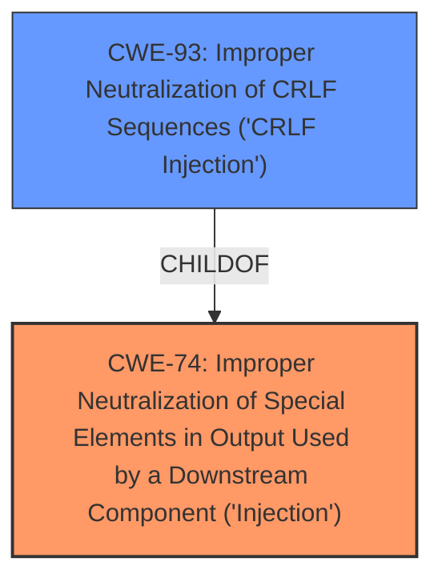

# Raw Analyzer Response for CVE-2021-41314

# Summary
| CWE ID | CWE Name | Confidence | CWE Abstraction Level | CWE Vulnerability Mapping Label | CWE-Vulnerability Mapping Notes |
|---|---|---|---|---|---|
| CWE-74 | Improper Neutralization of Special Elements in Output Used by a Downstream Component ('Injection') | 0.7 | Class | Primary | Allowed-with-Review |
| CWE-93 | Improper Neutralization of CRLF Sequences ('CRLF Injection') | 0.6 | Base | Secondary | Allowed |

## Evidence and Confidence

*   **Confidence Score:** 0.65
*   **Evidence Strength:** MEDIUM

## Relationship Analysis
The primary relationship considered was the parent-child relationship between CWE-74 (Class) and its potential children. CWE-93 is a child of CWE-74 and represents a specific type of injection involving CRLF sequences.

## Vulnerability Chain
The vulnerability chain begins with the **injection in the web UIs password field**, which allows an attacker to create (or overwrite) a file with specific content. This then leads to admin session crafting and therefore gaining full web UI admin privileges by an unauthenticated attacker.

CWE-74 (Injection) -> Session Hijacking -> Privilege Escalation

## Summary of Analysis
The initial assessment considered the **injection** aspect in the web UI's password field. The evidence directly points to an **injection** vulnerability, making CWE-74 a strong candidate. The more specific form of **injection** appears to be related to how the username and password are being handled, specifically with regards to newline characters, which supports the inclusion of CWE-93.

The retriever results also suggest considering CWE-93 for CRLF Injection.

The final decision is to select CWE-74 as the primary CWE because it is a general **injection** issue. Adding CWE-93 as a secondary CWE helps describe the specifics of the **injection**, that the **injection** occurs due to improper handling of CRLF sequences.

Relevant CWE Information:

# Enhanced Context (25 CWEs)
The following CWEs were identified as potentially relevant to this vulnerability:

## CWE-74: Improper Neutralization of Special Elements in Output Used by a Downstream Component ('Injection')
**Abstraction Level**: Class
**Similarity Score**: 0.75
**Source**: dense

**Description**:
The product constructs all or part of a command, data structure, or record using externally-influenced input from an upstream component, but it does not neutralize or incorrectly neutralizes special elements that could modify how it is parsed or interpreted when it is sent to a downstream component.

**Mapping Guidance**:
- Usage: Discouraged
- Rationale: CWE-74 is high-level and often misused when lower-level weaknesses are more appropriate.

## CWE-93: Improper Neutralization of CRLF Sequences ('CRLF Injection')
**Abstraction Level**: Base
**Similarity Score**: 4.33
**Source**: graph

**Description**:
CWE-93: Improper Neutralization of CRLF Sequences ('CRLF Injection')

**Mapping Guidance**:
- Usage: Allowed
- Rationale: This CWE entry is at the Base level of abstraction, which is a preferred level of abstraction for mapping to the root causes of vulnerabilities.

**Relationships**:
- PARENTOF -> CWE-113
- CANPRECEDE -> CWE-117
- CHILDOF -> CWE-74
- PARENTOF -> CWE-93
- CANALSOBE -> CWE-93

## CWE-74: Improper Neutralization of Special Elements in Output Used by a Downstream Component ('Injection')
**Technical Explanation for CWE-74:**
The vulnerability is caused by the **injection in the web UIs password field**. This aligns with CWE-74, where the product doesn't neutralize special elements in externally-influenced input, leading to unintended modifications in the downstream component.

**Security Implications and Potential Impact:**
The impact is significant, leading to the ability to create or overwrite files and ultimately gain full web UI admin privileges by an unauthenticated attacker. This matches the broader implications of CWE-74, which can lead to code execution, data modification, or system compromise.

**Parent-Child Relationships and Chain Patterns:**
CWE-74 is a higher-level class. The more specific weakness is the improper handling of CRLF sequences which matches the CWE-93.

**Primary or Secondary Weakness:**
CWE-74 is the primary weakness, representing the general **injection** issue.

**MITRE Mapping Guidance Influence:**
CWE-74 is typically discouraged, favoring more specific weaknesses. However, in this case, it serves as a good starting point to classify the overall **injection** problem.

**CWE-93: Improper Neutralization of CRLF Sequences ('CRLF Injection')**
**Technical Explanation for CWE-93:**
The vulnerability description and the CVE reference link content summary both mention the lack of proper sanitization of newline characters. The reference summary states, "Newline Injection: In the authentication process, user input is directly inserted into a file without proper sanitization, leading to file structure manipulation." This directly aligns with CWE-93, where the product does not neutralize CRLF sequences from inputs.

**Security Implications and Potential Impact:**
By exploiting the lack of CRLF neutralization, an attacker can manipulate the file structure and craft fake sessions. This leads to session hijacking and privilege escalation, as detailed in the vulnerability description.

**Parent-Child Relationships and Chain Patterns:**
CWE-93 is a child of CWE-74. The chain involves the **injection** of CRLF sequences, leading to file manipulation and session hijacking.

**Primary or Secondary Weakness:**
CWE-93 is a secondary weakness, providing more specific information about the type of **injection** occurring.

**MITRE Mapping Guidance Influence:**
CWE-93 is ALLOWED and is at the base level, which is a preferred level of abstraction.

**CWEs Considered But Not Used:**
- CWE-78 (Improper Neutralization of Special Elements used in an OS Command ('OS Command Injection')): While command execution is possible post-authentication, the initial vulnerability is not directly related to OS command **injection**.
- CWE-79 (Improper Neutralization of Input During Web Page Generation ('Cross-site Scripting')): The vulnerability does not directly involve the **injection** of scripts into web pages served to other users.
- CWE-22 (Improper Limitation of a Pathname to a Restricted Directory ('Path Traversal')): This CWE was not selected because the core issue is not about restricting pathnames but about **injection** and session manipulation.
- CWE-306 (Missing Authentication for Critical Function): While the vulnerability leads to bypassing authentication, the root cause is not the absence of authentication itself but the **injection** vulnerability that allows crafting fake sessions.